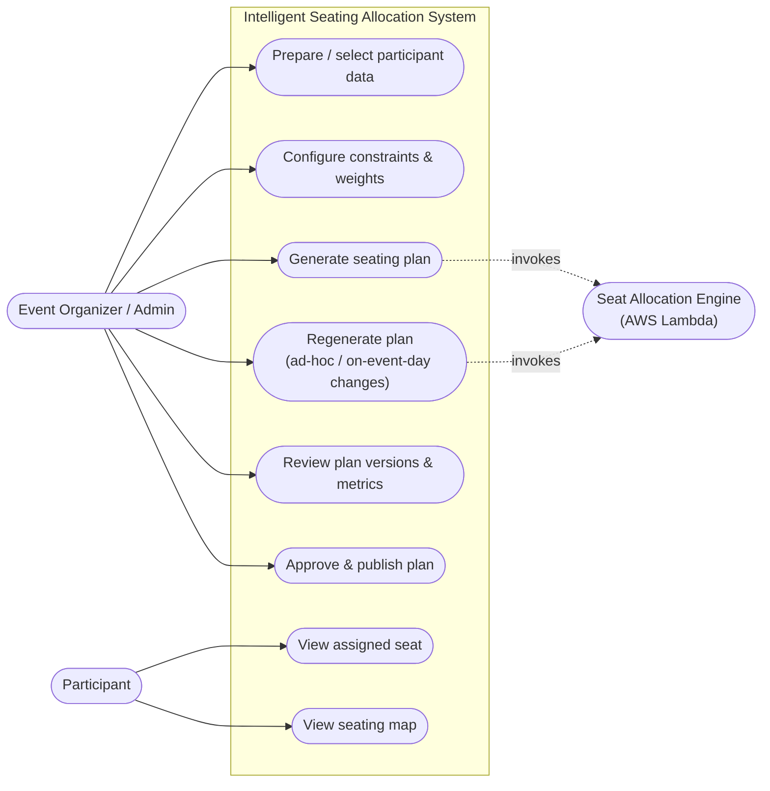
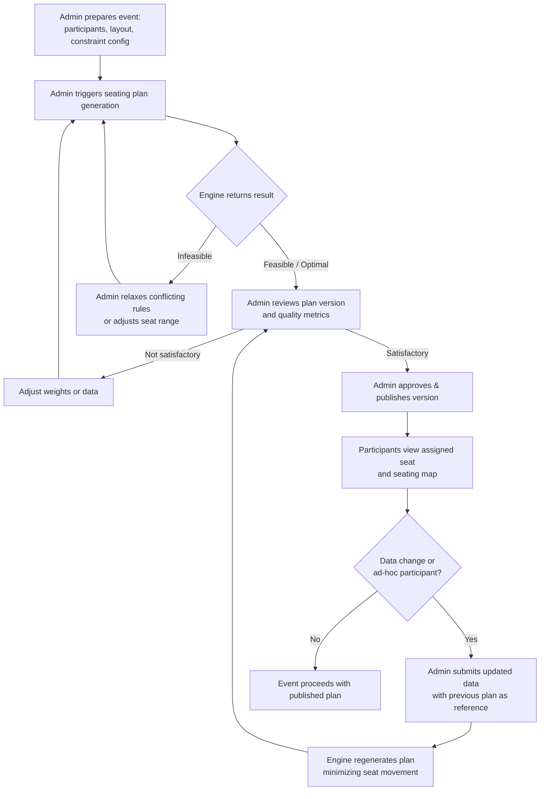
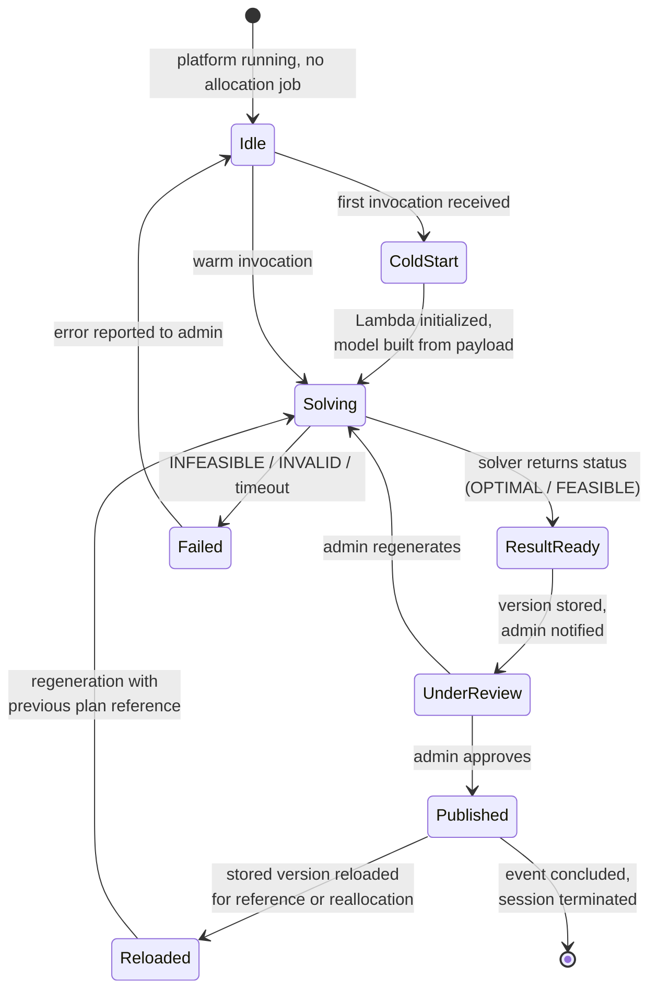
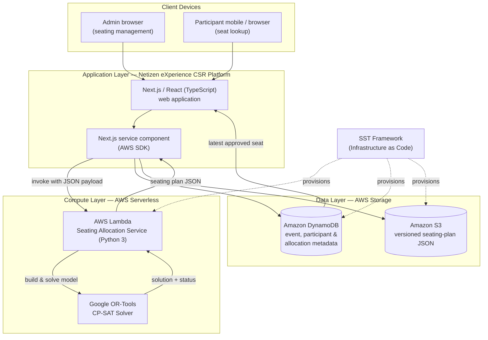
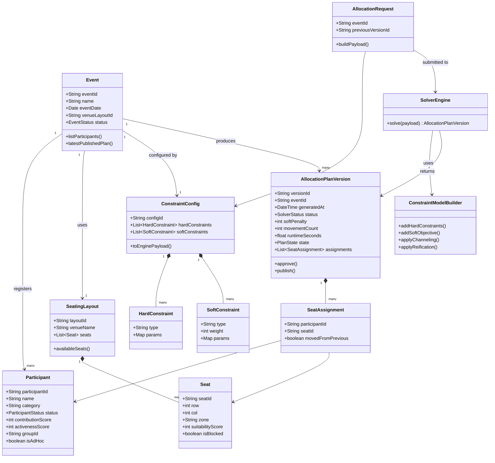
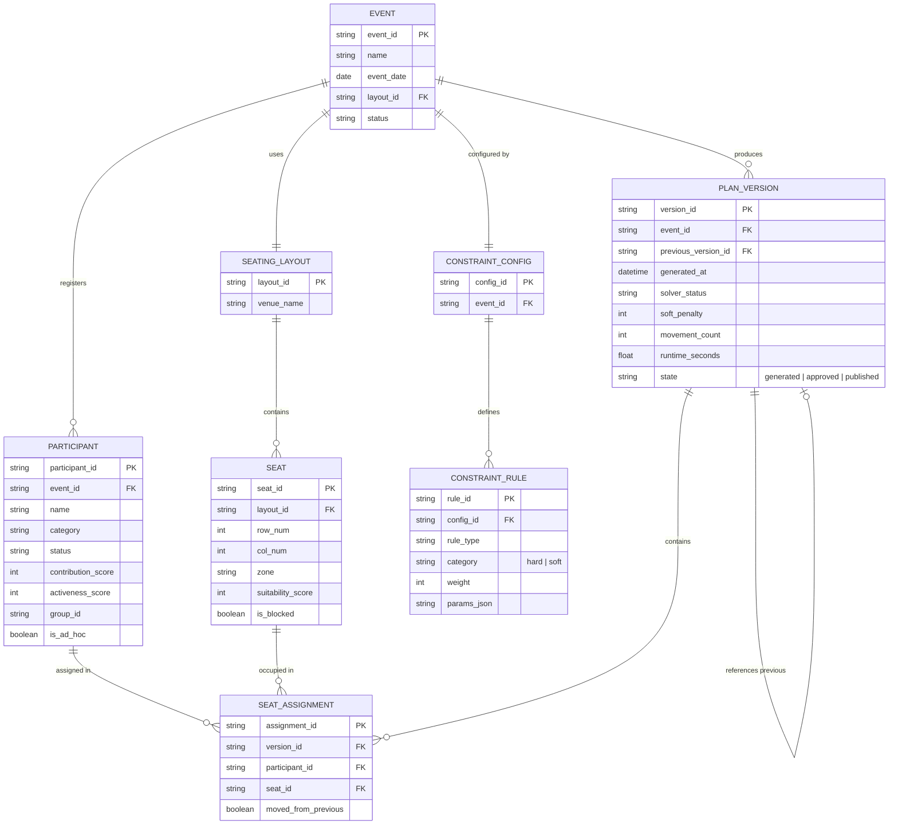
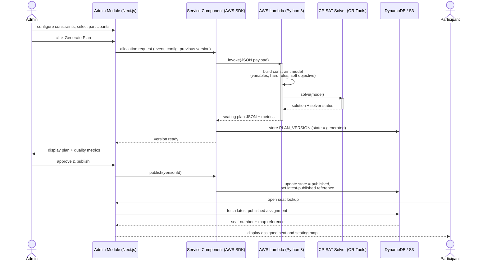
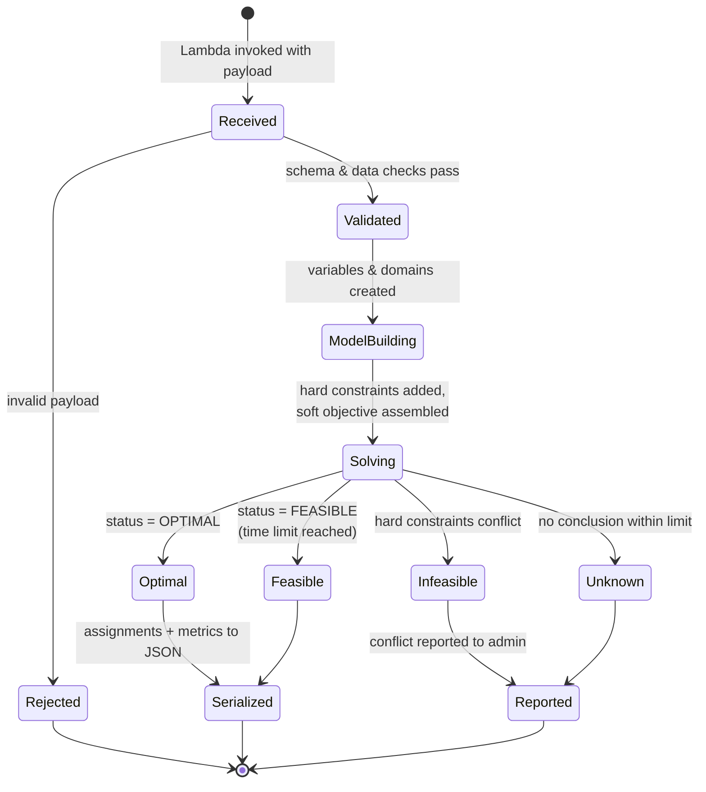
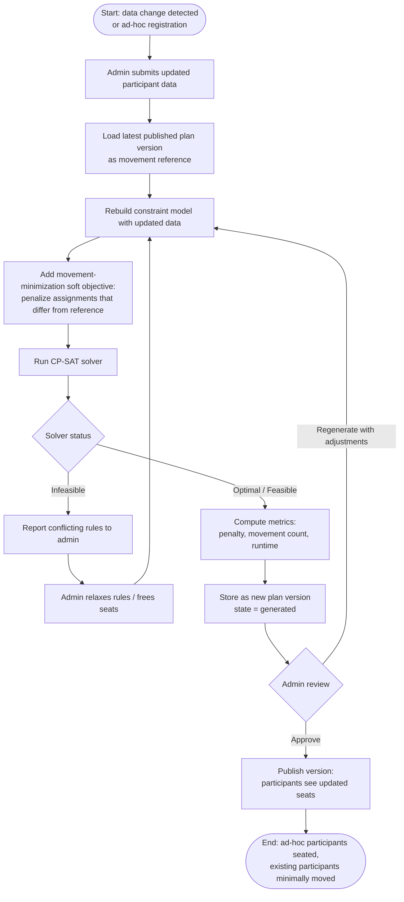

# Intelligent Automated Seating Allocation System for Large-Scale Assemblies using Configurable Constraint Optimization

**Final Year Project — Planning Phase Interim Report**
**Industry Collaborator:** Netizen eXperience
**Case Study Organization:** Petaling Jaya Kwan Inn Teng (PJKIT)

---

## Abstract

Seating allocation for large-scale assembly events is a multi-criteria combinatorial problem in which participants must be matched to a limited set of seats while simultaneously satisfying event-specific rules concerning participant category, priority and contribution score, activeness, grouping, status eligibility, and venue restrictions. Despite the computational difficulty of this problem, many event organizers — including Petaling Jaya Kwan Inn Teng (PJKIT), the case-study organization of this project — continue to rely on manual allocation methods such as spreadsheets, printed charts, and PDF listings. These methods do not scale: as participant numbers grow toward the 100–200 attendees typical of PJKIT community assemblies, manual allocation becomes slow, inconsistent between allocators, difficult to justify, and prone to errors, duplications, and rework, while participants face queues and confusion when retrieving their assigned seats on the event day.

This Final Year Project proposes an intelligent, configurable, constraint-based seating allocation system. The core contribution is a seating allocation engine that models real-world event rules as a Constraint Optimization Problem (COP), distinguishing mandatory hard constraints from weighted soft constraints, and solves the resulting model using the Google OR-Tools CP-SAT solver. The engine is designed as a Python 3 function deployed on AWS Lambda and invoked with JSON payloads from the existing Corporate Social Responsibility (CSR) event-management platform developed by the industry collaborator, Netizen eXperience. Surrounding the engine, the project scope includes an admin-side seat allocation management module with versioned publishing, a participant-facing seat lookup, configurable constraint-based allocation, and dynamic reallocation focused on ad-hoc participants and controlled on-event-day regeneration that minimizes unnecessary seat movement.

A literature review comparing manual, first-come-first-served, random, greedy, genetic-algorithm, integer-programming, and constraint-programming approaches justifies the selection of CP-SAT, which supports hard rules, weighted preferences, conditional logic, and explicit solver status reporting. A white-space analysis of existing systems — manual charts, Cvent, PerfectTablePlan, and WeddingWire/Zola — demonstrates that no reviewed solution combines configurable profile-based allocation, constraint-based optimization, controlled dynamic reallocation, and participant-facing lookup within a single workflow. The methodology chapter details the Agile SCRUM working arrangement adopted with Netizen eXperience, the business-level and technical design of the system expressed through use case, flow, state, architecture, class, entity-relationship, sequence, and activity diagrams, the methods and technologies employed, and the preliminary work completed to date, including a site visit to PJKIT, stakeholder requirement gathering, a drafted constraint listing, and a proof-of-concept solver now under development. The report concludes with the expected outcomes and the plan of work through December 2026.

**Keywords:** seating allocation, constraint optimization, CP-SAT, Google OR-Tools, AWS Lambda, constraint satisfaction, event management

---

## Chapter 1: Introduction

### 1.1 Background of Study

Large-scale assembly events — community gatherings, ceremonies, prize presentations, and religious or cultural assemblies — routinely require organizers to decide where each participant will sit. Although the task appears administrative, it is in fact a multi-criteria combinatorial assignment problem. Every participant must be matched to exactly one seat drawn from a limited seating layout, and each assignment must simultaneously respect a collection of interacting rules: participants of particular categories may need to be placed in particular zones; participants with higher priority or contribution scores may deserve more favorable seats; family members or delegation groups may need to sit adjacently; certain seats may be blocked or reserved; and only participants of eligible status may be seated at all. The number of possible ordered assignments grows explosively with scale — allocating 100 participants into 160 available seats yields on the order of 160!/(160−100)! possible arrangements — which places exhaustive checking far beyond human capability and renders naive enumeration computationally impractical even for machines (Rossi et al., 2006).

The case-study organization of this project, Petaling Jaya Kwan Inn Teng (PJKIT), organizes large annual community events attended by approximately 100 to 200 participants per event. PJKIT's current seating workflow is representative of manual practice across many event organizers. Participant records are maintained in spreadsheets; seating plans are prepared by hand with reference to printed venue charts; and the finalized allocation is disseminated through printed lists or PDF documents displayed or distributed at the venue. Seating decisions at PJKIT are not arbitrary: they depend on community-specific attributes such as a participant's contribution score, activeness in community activities, category, and status, together with grouping expectations for families attending together. Balancing these attributes by hand, for well over one hundred attendees, requires the allocator to hold many competing considerations in mind at once.

The consequences of continuing with this manual workflow, in the absence of the system proposed by this project, are concrete and compounding. First, allocation quality degrades as scale increases: two different committee members allocating the same event would produce two different plans, and neither plan can be objectively justified against the community's stated priority rules, exposing the organizer to perceptions of unfairness. Second, the preparation process consumes disproportionate volunteer time in the weeks before each event, and any late change — an absence, a substitution, a newly registered ad-hoc participant — forces error-prone rework of a nearly finished plan; each manual revision risks introducing duplicate seat assignments or orphaned participants, and revised printed lists quickly become inconsistent with one another. Third, on the event day itself, participants must locate their seats by searching printed lists or asking staff, producing queues at entrances, delayed event starts, and a poor participant experience, particularly for elderly attendees. For PJKIT — and for any comparable organizer — these consequences translate into operational strain on volunteers, reputational risk within the community the events are meant to serve, and a standing barrier to growing event attendance beyond what manual methods can absorb.

Commercial event tooling has not closed this gap. As the literature review in Chapter 2 establishes, existing systems such as Cvent, PerfectTablePlan, and WeddingWire/Zola each address fragments of the problem — chart drawing, proximity preferences, or chart sharing — but none provides a configurable rule layer over domain-specific participant attributes, none performs genuine constraint-based optimization with measurable allocation quality, and none supports a controlled regeneration workflow with participant-facing publication. The shared understanding that emerges from this background is therefore that a real organizer, facing a computationally hard allocation problem at growing scale, remains dependent on manual methods whose failure modes are well understood and repeatedly experienced. This shared understanding is consolidated into the three problem statements that follow.

This project is undertaken in collaboration with Netizen eXperience, a software company that develops and operates a Corporate Social Responsibility (CSR) event-management platform used to manage events and participants, including those of PJKIT. Netizen eXperience has assigned a Tech Lead as the industry supervisor for this project, providing technical guidance and acting as the intermediary through which real use-case data, workflow details, and seating rules are collected from PJKIT stakeholders. The seating allocation system proposed in this project is therefore designed from the outset for integration into a production platform serving a real organizer, rather than as a standalone academic prototype.

### 1.2 Problem Statement

Three problems, drawn directly from the background above and validated against the PJKIT workflow, define the pain points this project resolves. Left unaddressed, each problem leads directly to the consequences described in Section 1.1 — unjustifiable and inconsistent seating decisions, operationally disruptive rework near the event day, and participant-facing friction at the venue.

**Problem Statement 1: Inconsistency and inefficiency in multi-criteria manual seating allocation.** Manual allocation requires the organizer to weigh many participant attributes simultaneously — contribution or priority score, activeness, category, status, and group membership — against a constrained seating layout. The process is slow, does not scale with participant numbers, produces different outcomes depending on who performs it, and yields plans whose quality cannot be measured or defended against the organizer's own stated rules.

**Problem Statement 2: High operational disruption and lack of controlled dynamic reallocation mechanisms.** Participant data changes close to, and on, the event day: participants withdraw, substitutes attend in their place, groups change composition, statuses are updated, and ad-hoc participants register late and still require seats. Existing manual practice offers no controlled mechanism to regenerate a seating plan that accommodates such changes while preserving the stability of the already-communicated plan; wholesale manual revision disrupts many unaffected participants and multiplies the risk of duplicated or outdated seat records.

**Problem Statement 3: Communication bottlenecks and inefficiencies in participant seat retrieval.** Participants currently retrieve their assigned seats from printed lists, PDF listings, or by asking event staff. This organizer-driven dissemination creates queues at the venue, provides no guarantee that a participant is reading the latest approved plan, and offers no self-service channel through which a participant can confirm their seat before or during the event.

### 1.3 Objectives

The objectives of this study derive directly from the three problem statements and specify what the project builds, solves, and achieves.

**Objective 1.** To design and develop an intelligent seating allocation engine that generates rule-consistent, priority-aware seating plans from participant profiles, seating layouts, and configurable event rules, by modelling the allocation task as a Constraint Optimization Problem with hard constraints and weighted soft constraints solved using the Google OR-Tools CP-SAT solver — thereby resolving the inconsistency and inefficiency of manual multi-criteria allocation (Problem Statement 1).

**Objective 2.** To support controlled dynamic reallocation upon participant data changes, in which an updated seating plan is regenerated as a new reviewable version that accommodates ad-hoc participants and on-event-day changes while minimizing unnecessary seat movement relative to the previously published plan — thereby resolving the operational disruption of uncontrolled manual revision (Problem Statement 2).

**Objective 3.** To provide a participant-facing seat lookup channel through which participants can retrieve their assigned seat number and consult the seating map from the latest organizer-approved published plan — thereby resolving the seat-retrieval bottleneck at the venue (Problem Statement 3).

### 1.4 Scope of Study

The scope of this project comprises five modules, of which the first — the design and development of the constraint-programming solver function — constitutes the principal technical and research contribution. The scope as defined below represents the workload to be completed by December 2026.

**1.4.1 Seat Allocation Engine/Service Development.** The primary scope is the design and development of the seat allocation engine. The engine receives structured input — participant profiles, seating layout, constraint configuration, and previous allocation data where applicable — and generates a seating allocation result. Real-world event rules are modelled as programmable constraint expressions: hard constraints represent mandatory rules that every valid plan must satisfy, while weighted soft constraints represent preferences to be optimized. The engine's output includes participant-to-seat assignments together with evaluation indicators comprising solver status, hard-constraint satisfaction, soft-constraint penalty, movement count, and runtime. This module is the core research contribution because it determines how a seating plan can be generated systematically from participant profiles and modelled event constraints.

**1.4.2 Admin-Side Seat Allocation Management Module.** The system includes an admin-side management module through which the event organizer operates the engine: preparing or selecting participant data, configuring seating-related settings, generating seating plans, reviewing generated results, regenerating where necessary, and approving or publishing a selected plan. Versioning and publishing are part of this module — each generated result is treated as a version that the organizer may compare and review, and only the approved or latest published version is made available to participants. This module is included because seating allocation must remain under organizer control; the system supports decision-making and does not replace human review.

**1.4.3 Participant-Facing Seat Lookup.** The system supports participant-facing seat lookup based on the latest approved allocation. Participants can view their assigned seat number and refer to the seating map after the organizer publishes the plan. This module addresses the current dependence on printed lists, PDF listings, and staff assistance. Detailed authentication implementation is treated as a supporting function of the host platform rather than a research focus of this project.

**1.4.4 Configurable Constraint-Based Allocation.** The system supports configurable constraint-based allocation, in which event-specific seating rules are represented as hard constraints and weighted soft constraints prior to processing by the engine. Hard constraints include exclusive one-participant-per-seat assignment, unavailable-seat exclusion, placement of each participant within the row zone designated for their contribution tier, ordering of seats by contribution within a tier, adjacency of paired seats without crossing the central aisle, and provision of accessible seating where required. Soft constraints include priority-seat suitability, participant category-to-zone suitability, activeness alignment, and movement minimization after regeneration. This module ensures that the system generates rule-consistent, priority-aware plans rather than random or merely sequential assignments.

**1.4.5 Dynamic Reallocation upon Participant Data Changes.** The system supports dynamic reallocation as the controlled regeneration of a seating plan following participant data changes. Within this project, the emphasis of dynamic reallocation is on ad-hoc participation and on-event-day ("on-flight") regeneration: when ad-hoc participants register late — including on the event day itself — the system regenerates the plan so that these participants receive valid seats, while using the previously published allocation as a reference so that already-seated or already-notified participants are not needlessly moved. The regeneration objective therefore penalizes seat movement, avoiding the scenario in which a small late change forces many participants to suddenly change seats. Every regenerated result remains a version requiring organizer review before approval and publication, ensuring that dynamic reallocation remains controlled and traceable.

---

## Chapter 2: Literature Review and Theory

### 2.1 White-Space Analysis of Existing Systems

The review of existing systems examines whether current tooling satisfies the combination of capabilities required by the PJKIT use case: participant-facing seat lookup after administrator allocation, configurable participant-profile-based allocation, controlled dynamic reallocation, and constraint-based optimization. Four representative solutions were reviewed: manual spreadsheet or paper seating charts; Cvent, a large-scale event-management platform (Cvent, n.d.); PerfectTablePlan, a dedicated seating-planning application that employs a genetic algorithm for automatic assignment (Oryx Digital Ltd., n.d.); and WeddingWire and Zola, consumer seating-chart tools oriented toward chart drawing and sharing (WeddingWire, n.d.; Zola, n.d.). Table 2.1 summarizes the analysis.

**Table 2.1: White-Space Analysis of Existing Methods and Systems**

| Existing Method / System | Participant-Facing Seat Lookup After Admin Allocation | Configurable Participant-Profile-Based Allocation | Controlled Dynamic Reallocation | Constraint-Based Optimization |
|---|---|---|---|---|
| Manual Excel / Seating Chart | No | No | No | No |
| Cvent | Partial | Partial / limited | Partial editing with synchronization | No |
| PerfectTablePlan | No | Partial, through guest proximity preferences | Partial last-minute editing | Yes, GA-based automatic assignment |
| WeddingWire / Zola | Sharable | Weak | Manual adjustment | No |
| **Proposed FYP System** | **Yes** | **Yes** | **Yes** | **Yes** |

The analysis yields three findings. First, there is a **participant-facing seat accessibility gap**. Existing tools allow seating charts to be printed, exported, shared, or linked to tickets; however, this differs from an authenticated participant route that displays the latest published plan generated by the administrator. In the proposed system the participant-facing route is a core feature rather than an optional export. Second, there is a **configurable participant-profile-based allocation gap**. Reviewed systems support guest preferences, VIP labels, meal choices, groups, or manual tagging, but none clearly provides a generalized rule layer in which administrators configure hard constraints and weighted soft constraints over domain-specific attributes such as contribution score, activeness score, participant category, participant status, and group identifier. Third, there is a **controlled dynamic reallocation gap**. Last-minute editing and manual adjustment differ fundamentally from a solver-centered workflow in which updated participant data is submitted, a new plan version is generated with movement cost considered, the administrator reviews the output, and only the selected version is published. The strongest research gap is therefore not a single missing feature but the missing combination of features required by the PJKIT use case; this project proposes a controlled seating allocation management workflow rather than an improvement to drag-and-drop chart drawing.

### 2.2 Constraint Modelling and Rule Conversion in Seating Allocation

The proposed system requires human-readable event seating rules to be converted into a structured mathematical model before an optimization solver can process them, an activity known as constraint modelling or constraint formulation. Constraint modelling translates a real-world problem into formal components: decision variables, domains, constraints, and an objective function (Rossi et al., 2006). In this project, the real-world problem is the assignment of event participants to available seats under participant-profile and event-specific rules. The decision variables represent the unknown assignment — for example, the seat assigned to a specific participant; the domain of each variable is the set of permissible seat identifiers; and the constraints encode validity and preference — each participant receives exactly one seat, each seat serves at most one participant, unavailable seats are excluded, paired participants sit adjacently, and higher-contribution participants occupy more favourable rows and zones.

Modelling matters because the problem is combinatorial: assigning 100 participants into 160 seats admits 160!/(160−100)! ordered assignments, a scale at which exhaustive checking is impractical and at which nested-loop, if-else programming becomes difficult to maintain, slow to search, and weak at arbitrating conflicting preferences. The proposed system distinguishes **hard constraints** — mandatory rules a valid plan must satisfy, such as exclusive seat assignment, unavailable-seat exclusion, tier-zone placement, and contribution ordering — from **soft constraints** — preferences satisfied as far as possible, such as priority-seat suitability, category-to-zone suitability, activeness alignment, and movement minimization. This distinction follows valued constraint satisfaction and constraint optimization approaches, in which preferences, costs, and priorities are represented and optimized rather than treated as strict pass-or-fail conditions (Schiex et al., 1995).

Several modelling techniques from the constraint-programming literature are available for expressing rules of this kind. **Linearization**, including Boolean linearization, expresses complex logical conditions using integer or Boolean variables — essential for CP-SAT, which requires constraints over integer expressions (Google, n.d.-a). **Reification** links the truth value of a logical condition to a Boolean variable — for example, an indicator representing whether a participant has moved from a previous seat after reallocation. **Channeling** links different layers of decision variables — for instance, connecting a participant's assigned seat to that seat's row, zone, and suitability attributes; Google's OR-Tools documentation describes channeling constraints as the standard mechanism for such relationships, commonly implemented through implications or half-reified linear constraints (Google, n.d.-b).

These techniques define the available design space rather than a prescribed formulation, and the model realized in this project deliberately favours a simpler and more efficient route where one is available. Rather than reifying every relationship, the implemented solver eliminates ineligible participant–seat combinations *structurally* — a decision variable is created only for an assignment that is already permissible under the placement and eligibility rules — and it *precomputes*, before optimization, an integer preference cost for every remaining eligible combination, including the movement cost of departing from a previously published seat. Reification and channeling therefore remain the conceptual vocabulary of the model, but much of the logical structure is discharged during model construction, keeping the search problem compact and every quantity integer. The correspondence between these general rules and their concrete PJKIT instantiation — the Emperor, Bodhi, and Merit tiers and their associated constraints — is set out in full in Appendix A.

### 2.3 Comparison of Candidate Seating Allocation Methods

Multiple algorithmic approaches could, in principle, implement the solver function. Table 2.2 compares the candidate methods reviewed, with their working principles, strengths, limitations, and suitability for this project.

**Table 2.2: Comparison of Seating Allocation Methods**

| Method | How It Works | Strength | Limitation | Suitability for This FYP |
|---|---|---|---|---|
| Manual assignment | Organizer manually checks the participant list and assigns seats using judgement. | Easy to understand; flexible for small events. | Time-consuming, inconsistent, difficult to update, hard to evaluate objectively. | Baseline for comparison only. |
| First-come-first-served | Participants are assigned seats in registration or list order. | Simple and fast to implement. | Ignores profiles, priority rules, grouping, and seat suitability. | Baseline method only. |
| Random allocation | Participants are assigned to available seats randomly. | Trivially easy to implement; useful for comparison. | Considers no event rules or priority. | Weak baseline only. |
| Greedy priority-based | Participants are sorted by priority and assigned the best available seat one by one. | More rule-aware than random or first-come-first-served. | Early locally good decisions can force poor later assignments; weak with competing constraints. | Simplified manual-rule baseline. |
| Genetic Algorithm (GA) | Evolves a population of seating plans via selection, crossover, and mutation. | Flexible for large search spaces and complex scoring; used in seating tools such as PerfectTablePlan. | Typically cannot prove mathematical optimality; requires tuning. | Literature benchmark or future alternative. |
| Integer Linear Programming / Mixed-Integer Programming (ILP/MIP) | Represents the problem with linear equations, integer variables, and an objective function. | Strong mathematical optimization when the model is linear (Williams, 2013). | Adjacency and conditional rules require additional linearization effort. | Possible alternative; more complex for this scope. |
| Constraint Programming — CP-SAT | Represents the problem with integer variables, constraints, Boolean indicators, and an objective function. | Strong fit for hard constraints, soft-constraint penalties, if-then rules, and solver status reporting. | Requires careful integer-based modelling; optimality proven only when status is OPTIMAL. | **Selected method for this FYP.** |

**Selection rationale.** CP-SAT, implemented through Google OR-Tools, is selected because the proposed system must do more than assign seats: it must enforce hard rules, optimize weighted preferences, preserve reallocation stability, and report measurable allocation quality. CP-SAT permits seating rules to be expressed as integer constraints and optimization objectives, and returns solver statuses — optimal, feasible, infeasible, model invalid, or unknown — that allow the system to evaluate each generated result explicitly (Google, n.d.-a). The greedy method is retained as an evaluation baseline, and the genetic algorithm is noted as a literature benchmark and possible future alternative; neither is adopted for the core engine because neither offers CP-SAT's combination of declarative rule expression and status-reported optimization.

### 2.4 Literature Synthesis Against the Three Problem Statements

Synthesizing the reviewed systems and theory against the problem statements confirms the project's positioning. Regarding **Problem Statement 1**, existing systems provide varying levels of guest management and visual seating, but none supplies a configurable rule layer over PJKIT's domain attributes — contribution score, activeness score, category, status, and group identifier; the proposed system addresses this with configurable hard and weighted soft constraints, making allocation consistent, repeatable, and explainable. Regarding **Problem Statement 2**, manual edits, last-minute changes, and synchronization features do not constitute controlled dynamic reallocation; in this project, reallocation means regenerating a plan after data changes — with particular emphasis on ad-hoc participants and on-event-day regeneration — storing it as a new version, considering movement minimization, and publishing only after review, thereby delivering change optimization rather than mere change handling. Regarding **Problem Statement 3**, printed lists and organizer-driven sharing leave a communication gap; the proposed participant-facing lookup provides an authenticated route through which participants view the latest published seat number and seating map, directly addressing fragmented seating communication.
## Chapter 3: Methodology / Project Work

This chapter presents the methodology through which the objectives in Section 1.3 are achieved. It is organized into five parts: the software development methodology adopted with the industry collaborator; the design and architecture of the software at both business and technical levels; the methods and technologies used to perform seating allocation, with justification; the verification and reproducibility measures that establish the credibility of the engine's output; and the preliminary work completed during the planning phase.

### 3.1 Software Development Methodology: Agile SCRUM Implementation with Netizen eXperience

This project is executed under an Agile SCRUM arrangement operated jointly with Netizen eXperience, and this section describes specifically how SCRUM is implemented in this collaboration rather than restating the framework in general terms.

Development proceeds in sprints aligned with the collaborator's engineering cadence. Within each week, **two stand-up sessions** are held with the industry supervisor (the assigned Tech Lead), during which progress since the previous stand-up, the plan until the next, and any blockers — particularly those requiring collaborator input, such as access to platform internals or clarification of PJKIT rules — are reported and resolved. Every two weeks, a **biweekly demonstration** is conducted in which the current prototype increment is presented to the industry supervisor; the demonstration serves as the sprint review, verifying that the increment matches the agreed scope and gathering feedback that shapes the next sprint's backlog. Work items are tracked as **GitHub Issues** organized under a **GitHub Project board** hosted in the Netizen eXperience buddy repository: each requirement, constraint-modelling task, engine feature, and integration task is a ticket that moves across the board from backlog through in-progress to review and done, giving both the student and the collaborator continuous, shared visibility of project state.

Agile SCRUM is chosen for three reasons specific to this project. First, the seating engine's requirements are refined progressively — the constraint listing gathered from PJKIT stakeholders is validated and corrected iteratively, and an incremental process allows each newly confirmed rule to be modelled, implemented, and demonstrated within one or two sprints rather than deferred to a distant milestone. Second, the collaboration itself demands regular synchronization: Netizen eXperience must confirm platform integration points and relay stakeholder feedback, and SCRUM's fixed ceremonies (stand-ups and biweekly demos) institutionalize that communication instead of leaving it ad hoc. Third, the project carries modelling risk — the translation of real-world rules into correct integer constraints — and short iterations expose modelling errors early, when a demonstration against sample PJKIT data reveals that a constraint behaves incorrectly, at a point where correction is cheap.

### 3.2 Design and Architecture of the Software

The design is presented in two sections. The first is an overview sufficient for a business audience to understand and communicate what the software does; the second provides the in-depth technical design a software engineer requires to implement the system.

#### 3.2.1 Section A — System Overview (Business-Level Design)

**Use Case Diagram.** Figure 3.1 presents the use cases of the system for its two actors. The event organizer (admin) prepares participant data, configures constraints, generates and regenerates seating plans, reviews plan versions, and approves and publishes a selected version. The participant views their assigned seat and consults the seating map from the published plan. The seat allocation engine participates as a supporting system actor invoked during generation and regeneration.



*Figure 3.1: Use case diagram of the proposed system.*

**High-Level User Flow.** Figure 3.2 shows how the two user roles move through the system across the lifecycle of one event, from data preparation to on-event-day lookup, including the regeneration loop triggered by data changes and ad-hoc registrations.



*Figure 3.2: High-level user flow across one event lifecycle.*

**Use-Case-Level System State Diagram.** Figure 3.3 describes the system's high-level process states across an allocation session, including cold start of the serverless engine, active solving, termination, and reload of a stored plan version.



*Figure 3.3: Use-case-level state diagram of the allocation process (cold start, solving, review, publication, reload, termination).*

**Architecture / System Overview Diagram.** Figure 3.4 presents the deployment-level architecture. The Next.js CSR platform serves both user roles from browsers and mobile devices; its service component invokes the seating engine — a Python 3 function on AWS Lambda embedding the OR-Tools CP-SAT solver — through the AWS SDK with JSON payloads. Results are persisted in DynamoDB (allocation metadata and latest-published references) and S3 (versioned seating-plan JSON), with infrastructure provisioned as code through the SST framework.



*Figure 3.4: System architecture and deployment overview.*

#### 3.2.2 Section B — Technical Design (Engineering-Level)

**Class Diagram.** Figure 3.5 defines the principal object classes of the system and their relationships. The design separates the domain model (event, participant, seat, seating layout), the constraint configuration (hard and weighted soft constraint definitions), the allocation artifacts (plan versions and individual assignments with quality metrics), and the engine-side model builder and solver wrapper.



*Figure 3.5: Class diagram of the seating allocation system.*

**Entity Relationship Diagram.** Figure 3.6 defines the persistent data structure. The ERD is a standalone design artifact — it does not alter the other diagrams — but it fixes the storage schema for events, participants, layouts, seats, constraint configurations, plan versions, and assignments, including the reference from a plan version to its predecessor that enables movement minimization during reallocation.



*Figure 3.6: Entity relationship diagram of the allocation data model.*

**Sequence Diagram.** Figure 3.7 traces the interaction for plan generation and publication, showing the change of state of the plan-version object as it passes from request through solving to review and publication.



*Figure 3.7: Sequence diagram for plan generation, publication, and participant lookup.*

**Function-Level State Diagram.** Figure 3.8 describes the state changes of a single allocation job inside the solver function, from payload validation through model construction and solving to the terminal statuses reported by CP-SAT.



*Figure 3.8: Function-level state diagram of one allocation job.*

**Activity Diagram.** Figure 3.9 details the internal activity of the dynamic reallocation workflow — the scope emphasis of this project — showing how ad-hoc participants and on-event-day changes are absorbed with minimal seat movement.



*Figure 3.9: Activity diagram of controlled dynamic reallocation.*

### 3.3 Methods and Technologies Used for Seating Allocation

Table 3.1 lists the methods and technologies actually used in the development of the seating allocation system; only adopted items are included. Justification follows the table.

**Table 3.1: Methods and Technologies Adopted**

| Method / Technology | Role in the Project |
|---|---|
| Constraint Programming (CP) with hard and weighted soft constraints | Core method: models event seating rules as a Constraint Optimization Problem. |
| Google OR-Tools CP-SAT solver | Solver executing the constraint model and reporting solution status. |
| Python 3 | Implementation language of the solver function. |
| AWS Lambda | Serverless deployment target of the solver function. |
| AWS SDK (from the Next.js service component) | Invocation channel passing JSON payloads to Lambda and receiving results. |
| Next.js / React (TypeScript) | Existing CSR platform frontend hosting the admin module and participant lookup. |
| Amazon DynamoDB and Amazon S3 | Persistence of allocation metadata and versioned seating-plan JSON respectively. |
| SST Framework | Infrastructure-as-code provisioning of Lambda, DynamoDB, and S3 resources. |
| GitHub Issues and Projects | Work tracking within the Netizen eXperience buddy repository under the SCRUM process. |

**Constraint Programming with hard and soft constraints** is used because the seating problem is defined by rules of two natures: rules that must never be violated and preferences that should be optimized. CP represents both natively — hard constraints restrict the feasible space, while weighted soft constraints enter the objective as penalties — allowing the same engine to guarantee validity and to grade quality (Schiex et al., 1995; Rossi et al., 2006). **Google OR-Tools CP-SAT** is used because it accepts integer decision variables, Boolean indicators, conditional (if-then) constraints through reification and channeling, and an optimization objective, and because it reports explicit solver statuses — optimal, feasible, infeasible, model invalid, unknown — that the system surfaces as part of allocation quality (Google, n.d.-a; Google, n.d.-b). It is additionally free and production-grade, providing search performance that bespoke if-else logic could not match within the project timeframe. **Python 3** is used as the solver-function language because OR-Tools offers first-class Python support and because Python's expressiveness suits rapid, testable constraint-model construction. **AWS Lambda** is used because the engine executes on demand — only when an administrator generates or regenerates a plan — so a serverless function avoids maintaining an always-on API server, scales automatically, and processes JSON event payloads natively (Amazon Web Services, n.d.-a); the **AWS SDK** provides the documented invocation path from the existing platform's Next.js service component with payload delivery and result retrieval (Amazon Web Services, n.d.-b). **DynamoDB and S3** are used for persistence consistent with the collaborator's platform: DynamoDB holds event, participant, and allocation metadata including the latest-published reference consulted by the participant lookup, while S3 stores each generated seating plan as a versioned JSON document supporting traceability and reallocation referencing. **SST** provisions these resources as code, keeping the FYP's infrastructure reproducible inside the collaborator's environment. **GitHub Issues and Projects** operationalize the SCRUM tracking described in Section 3.1.

### 3.4 Solution Verification and Reproducibility

Two methodological commitments underpin the credibility of the engine's output: that a generated plan is demonstrably correct, and that the same inputs always yield the same plan. Both are treated as first-class design requirements rather than incidental properties of the solver.

**Priority of hard over soft constraints.** The model is constructed so that the weighted soft-constraint objective can never cause a hard constraint to be violated. Hard constraints restrict the feasible region absolutely, and the optimization operates strictly within that region; a preference, however heavily weighted, can only influence the choice *among* valid plans and can never purchase a saving by breaking a mandatory rule. This guarantee is what allows the system to claim that every plan it accepts is valid by construction while still being graded for quality.

**Independent verification of every plan.** The correctness of a generated plan is not taken on trust from the solver. After a solution is produced, an independent validation routine re-examines the plan solely from its serialized output — without reference to the solver's internal state — and re-checks each property that matters: that no physical seat is allocated twice; that Emperor allocations are genuine adjacent pairs that do not cross the aisle; that every participant lies within the row zone appropriate to their tier; that contribution ordering holds within each tier; that accessibility requirements are met and no blocked seat is used; and that the front-to-back and centre-outward filling rules are respected. The routine additionally reconstructs the reported quality metrics from first principles and confirms that they match the solver's own figures, and it verifies that the output conforms to a fixed data schema. Because this verification is performed by logic entirely separate from the model that produced the plan, it provides an independent check against modelling error — a safeguard directly responsive to the modelling risk identified in Section 3.1.

**Deterministic reproducibility.** The engine is designed to be reproducible: mock data generation and the solver itself are governed by fixed random seeds, and a deterministic tie-break of deliberately negligible magnitude selects a single canonical plan from among equally-good alternatives, so that repeated runs on identical inputs return an identical allocation. This determinism is a prerequisite for the comparative evaluation planned in FYP 2 — a plan can only be fairly compared against a baseline if it is stable — and it also serves the reallocation objective, since a stable canonical layout avoids gratuitous seat changes between regenerations that are otherwise equivalent.

**Reported quality indicators.** Consistent with the project's aim of measurable allocation quality, each result carries explicit indicators: the solver status, a per-assignment and aggregate soft-constraint penalty broken down by component, the proven optimality gap, and the solver runtime. Critically, a plan is reported as optimal only when the solver formally proves optimality; a merely feasible result obtained under a time limit is reported as such and never presented as optimal. These indicators are the quantitative basis on which the administrator reviews a plan and on which the FYP's evaluation against baseline methods will rest.

### 3.5 Preliminary Works

Several preliminary activities have been completed during the planning phase, establishing the requirement base and de-risking the core engine.

**Requirement engineering with the collaborator and stakeholders.** A series of discussions was held with the industry supervisor (Netizen eXperience Tech Lead) to define and bound the FYP scope, confirming the division between the core engine contribution and the supporting platform modules. Through the supervisor as intermediary, requirement-gathering discussions were conducted with PJKIT stakeholders covering the current seating workflow, the participant attributes that drive seating decisions, and the event-day change scenarios — absences, substitutions, and ad-hoc registrations — that the reallocation module must absorb.

**Site visit and physical observation.** A site visit to PJKIT was conducted to observe the venue and the current manual workflow for preparing the seating map. The observation confirmed the seating layout structure (rows, zones, and blocked areas), the use of printed seating charts and lists as the participant-facing channel, and the practical friction points at the venue that motivate Problem Statement 3.

**Constraint listing and formulation.** Based on the stakeholder discussions and site observation, a constraint listing was produced, initially cataloguing candidate rules in plain language and classifying each as a prospective hard constraint or weighted soft constraint. Under the SCRUM cadence this listing has since been validated with the collaborator and formalized into the constraint optimization model now realized in the proof-of-concept solver, comprising the hard constraints that guarantee a valid plan — assignment completeness and seat exclusivity, tier-zone placement, contribution ordering, Emperor adjacency and aisle integrity, accessibility provision, seat availability, capacity feasibility, and front-to-back and centre-outward filling — and the four weighted soft constraints that grade plan quality: priority-seat suitability, category-to-zone suitability, movement minimization, and activeness alignment. The complete specification is presented in Appendix A.

**Platform repository access.** Access to the Netizen eXperience event-management platform repository (the buddy repository) has been granted, enabling study of the existing codebase, service-component structure, and integration points in preparation for the integration phase, and hosting the GitHub Issues and Project board used for work tracking.

**Proof-of-concept development.** Based on the validated constraint logic, a proof-of-concept (PoC) solver has been developed in Python 3 with OR-Tools CP-SAT. The PoC has progressed beyond an initial fragment: it now expresses the full set of hard constraints and the four weighted soft constraints catalogued in Appendix A, operating over a deterministic 100-participant scenario and a representative floor plan for the PJKIT case study. It incorporates the independent verification and reproducibility measures described in Section 3.4 and a benchmarking harness that records solver runtime and quality indicators across repeated runs. This confirms that the drafted rules can be expressed as an integer constraint model, that the solver returns interpretable statuses and provably optimal assignments for the default scenario, and that the output is independently verifiable. The PoC thereby substantiates the full engine design presented in Section 3.2 and de-risks the development ahead; refinement continues under the SCRUM cadence as further rules and scenarios are validated with the collaborator.
## Chapter 4: Conclusion and Future Work

### 4.1 Conclusion

This report has presented the planning-phase work of a Final Year Project that addresses a genuine and recurring operational problem: the manual allocation of seats for large-scale assembly events. The background established that seating allocation is a multi-criteria combinatorial problem whose solution space grows explosively with participant numbers, and that the case-study organization, PJ Kwan Inn Teng, currently manages events of 100–200 participants using spreadsheets, printed charts, and PDF listings. The pain points are concrete: manual allocation is slow and inconsistent between allocators and cannot be objectively justified against the community's own priority rules; late data changes and ad-hoc registrations force disruptive, error-prone rework of nearly finished plans; and participants queue at the venue to retrieve seats from printed lists that may already be outdated. Without the research and development undertaken in this project, these consequences persist and worsen as event attendance grows — volunteer effort is consumed by rework, seating decisions remain open to perceptions of unfairness, and the participant experience on event day continues to suffer.

The contribution of this project is a configurable, constraint-based seating allocation system whose core is a solver engine that models real event rules as a Constraint Optimization Problem — hard constraints guaranteeing validity, weighted soft constraints expressing priorities — solved by Google OR-Tools CP-SAT and deployed as a Python 3 function on AWS Lambda, invoked with JSON payloads from the Netizen eXperience CSR platform. Around this engine, the system provides organizer-controlled generation, versioned review and publishing, configurable rules over PJKIT's domain attributes, controlled dynamic reallocation that seats ad-hoc participants with minimal movement of everyone else, and a participant-facing lookup of the latest published seat. The literature review demonstrated that no reviewed system offers this combination, and the methodology chapter set out the Agile SCRUM working arrangement with the collaborator, the business-level and technical designs, the justified technology selections, and the preliminary work — stakeholder requirement gathering, a site visit, a drafted constraint listing, platform repository access, and a commenced proof of concept — that grounds the plan in verified reality.

The expected outcomes are correspondingly twofold. For the seating engine: a working Lambda-based allocation service returning rule-consistent, priority-aware plans as structured JSON, with configurable constraints and measurable quality indicators — solver status, hard-constraint satisfaction, soft-constraint penalty, movement count, and runtime. For the integration: the engine operating within the collaborator's CSR platform through an admin seat-allocation dashboard and a public participant lookup, ready for PJKIT to use in a real event. Together these outcomes deliver practical value to the organizer — faster, consistent, justifiable seating — and academic value through the applied modelling of a real-world combinatorial problem as a constraint optimization task.

### 4.2 Future Work

The work following this report proceeds along the roadmap already validated with the collaborator. For the remainder of FYP 1, the focus is the finalization of the requirement specification, validation of the drafted constraints against the PJKIT business use case, and the initial phase of constraint modelling leading into full COP modelling with Boolean formulation of the seating allocation. In FYP 2, the first half concentrates on development of the CP-SAT solver-function prototype, the reallocation module whose objective function minimizes changes relative to the published plan, and deployment of the solver function to AWS Lambda; the second half concentrates on integration with the Netizen eXperience CSR platform through the admin seat-allocation dashboard and the public-facing participant lookup for assigned seats, followed by testing, baseline comparison against manual, random, first-come-first-served, and greedy allocation, and evaluation of allocation quality on real event data. Beyond the FYP timeline, identified extensions include evaluation against a genetic-algorithm benchmark, richer venue layouts, and generalization of the constraint configuration to other organizers on the platform.

### 4.3 Project Timeline (Gantt Chart)

The complete 28-week project schedule spanning FYP 1 (Weeks 1–14) and FYP 2 (Weeks 15–28) is presented in Figure 4.1.

**Figure 4.1: Project Gantt Chart — FYP 1 and FYP 2 (28 weeks)**

> *[Insert Gantt chart here]*

---

## References

Amazon Web Services. (n.d.-a). *What is AWS Lambda?* AWS Documentation. https://docs.aws.amazon.com/lambda/latest/dg/welcome.html

Amazon Web Services. (n.d.-b). *Invoke — AWS Lambda API reference*. AWS Documentation. https://docs.aws.amazon.com/lambda/latest/api/API_Invoke.html

Cvent. (n.d.). *Event diagramming and seating*. https://www.cvent.com

Google. (n.d.-a). *CP-SAT solver*. Google for Developers — OR-Tools. https://developers.google.com/optimization/cp/cp_solver

Google. (n.d.-b). *Channeling constraints*. Google for Developers — OR-Tools. https://developers.google.com/optimization/cp/channeling

Oryx Digital Ltd. (n.d.). *Using a genetic algorithm for table seating*. PerfectTablePlan. https://www.perfecttableplan.com

Rossi, F., van Beek, P., & Walsh, T. (Eds.). (2006). *Handbook of constraint programming*. Elsevier.

Schiex, T., Fargier, H., & Verfaillie, G. (1995). Valued constraint satisfaction problems: Hard and easy problems. In *Proceedings of the 14th International Joint Conference on Artificial Intelligence (IJCAI-95)* (pp. 631–639). Morgan Kaufmann.

Schwaber, K., & Sutherland, J. (2020). *The Scrum guide: The definitive guide to Scrum — The rules of the game*. Scrum.org. https://scrumguides.org

WeddingWire. (n.d.). *Seating chart tool*. https://www.weddingwire.com

Williams, H. P. (2013). *Model building in mathematical programming* (5th ed.). Wiley.

Zola. (n.d.). *Wedding seating chart maker*. https://www.zola.com

> *Note: Verify each URL and access date against the sources actually consulted before submission, and complete any missing publication details required by APA 7.*

---

## Appendices

### Appendix A: Constraint Specification (Current Model)

The following specification records the seating rules as formulated for the PJKIT case study and realized in the current proof-of-concept solver. It develops and supersedes the plain-language rule catalogue compiled at the outset of the planning phase: the earlier draft expressed candidate rules in general terms, whereas the model below reflects the rules as confirmed with the collaborator and expressed as a constraint optimization problem. Each rule is classified either as a **hard constraint**, which every valid seating plan must satisfy without exception, or as a **weighted soft constraint**, which expresses a preference the solver optimizes as far as the hard constraints allow.

The PJKIT allocation is organized around three contribution tiers — **Emperor**, **Bodhi**, and **Merit** — each associated with a designated block of rows in the hall, ordered from the front (nearest the stage) to the rear. An Emperor registration is seated as a bonded pair of adjacent seats, reflecting the organization's practice of seating a principal donor together with an accompanying guest, whereas Bodhi and Merit registrations each occupy a single seat. Each seat additionally carries a fixed *priority rank* expressing its desirability and a *zone* label expressing its horizontal position relative to the central aisle; these attributes are distinct from a seat's physical row and column position.

**Table A.1: Hard Constraints**

| Ref. | Constraint | Description |
|---|---|---|
| HC1 | Assignment completeness (single seat) | Every single-seat participant is allocated exactly one seat. |
| HC2 | Assignment completeness (Emperor) | Every Emperor registration is allocated exactly one valid pair of seats. |
| HC3 | Seat exclusivity | No physical seat is allocated to more than one participant. |
| HC4 | Tier-zone placement | Each participant is seated within the row block designated for their contribution tier — Emperor in the front rows, Bodhi in the intermediate rows, and Merit in the rear rows. |
| HC5 | Contribution ordering | Within a tier, a participant of strictly higher contribution is never seated in a row further from the stage than a participant of lower contribution. |
| HC6 | Emperor adjacency | The two seats of an Emperor registration are immediately adjacent to one another within a single row. |
| HC7 | Aisle integrity | No Emperor pair spans the central aisle; the two seats flanking the aisle are never allocated as a pair. |
| HC8 | Accessibility provision | A participant requiring an accessible seat is allocated only seating that satisfies that requirement. |
| HC9 | Seat availability | Seats designated as blocked or otherwise unavailable are never allocated. |
| HC10 | Single allocation unit | Each participant corresponds to exactly one allocation unit, so no participant can be seated more than once. |
| HC11 | Capacity feasibility | Seat demand — in total, within each tier zone, and for accessible seating specifically — must not exceed the corresponding supply; this is verified before optimization begins. |
| HC13 | Front-to-back filling | Within each tier zone, rows are occupied from the front backwards, so a rear row is used only once every row ahead of it is full. |
| HC14 | Centre-outward filling | Within each row, the occupied seats form a single unbroken block extending outward from the central aisle on each side, leaving no empty seat between two occupied seats. |

The hard constraints fall into four natural groups. The **assignment and exclusivity** rules (HC1–HC3, HC10) guarantee that the plan is a well-formed one-to-one allocation in which every participant is seated exactly once and no seat is shared. The **placement** rules (HC4–HC7) encode PJKIT's tier and adjacency conventions, ensuring that participants are seated in the block appropriate to their tier, that higher contributions are honoured with rows nearer the stage, and that Emperor donors are seated as a genuine adjacent pair that does not straddle the aisle. The **eligibility** rules (HC8–HC9) exclude unsuitable seats, reserving accessible seating for those who require it and withholding blocked seats from allocation. Finally, the **feasibility and layout-quality** rules (HC11, HC13–HC14) ensure that demand is confirmed to fit the available supply before any plan is attempted, and that the resulting arrangement is visually orderly, filling each zone front-to-back and each row outward from the aisle rather than leaving scattered gaps. Rules HC13 and HC14 are configurable per event and are enabled in the default configuration.

A further requirement governs the *form* of the model rather than the seating outcome: because the CP-SAT solver operates over integer quantities, every cost, weight, and objective term is expressed as an integer, and all preference costs are scaled to integers before optimization. This is a modelling requirement rather than a seating rule, and it is therefore not listed above.

**Table A.2: Weighted Soft Constraints**

| Ref. | Preference | Default weight | Description |
|---|---|---|---|
| SC1 | Priority-seat suitability | 40 | Minimizes the discrepancy between the seat-priority rank a participant merits — determined by accessibility need, monastic status, seniority, or a default entitlement — and the priority rank of the seat actually allocated. |
| SC2 | Category-zone suitability | 25 | Favours seating each participant in the horizontal zone best suited to their participant category, according to a configurable category-to-zone suitability cost matrix. |
| SC3 | Movement minimization | 20 | Upon regeneration, penalizes displacement from a participant's previously published seat, discouraging both unnecessary moves and, where a move is unavoidable, large moves; it contributes no penalty when no previous plan is supplied. |
| SC4 | Activeness alignment | 15 | Aligns a participant's recent activeness — their attendance at community events — with seat priority, so that more active participants tend to receive higher-priority seats. |

The four preferences are measured in different natural units and are therefore not directly comparable; each is accordingly rescaled to a common bounded range before its weight is applied, so that the configured weights express genuine relative importance rather than being distorted by differences of scale. The solver minimizes the total weighted penalty across all assignments. To ensure that hard rules are never traded away, the soft-constraint objective is constructed so that it can never override a hard constraint. To ensure reproducibility, a deterministic tie-break of negligible magnitude selects a single canonical layout from among equally-good solutions, and — consistent with the project's emphasis on measurable allocation quality — no plan is reported as optimal unless the solver formally proves optimality.

### Appendix B: Illustrative Engine Output (JSON Structure)

```json
{
  "eventId": "EVT-2026-001",
  "versionId": "V-004",
  "previousVersionId": "V-003",
  "solverStatus": "OPTIMAL",
  "metrics": {
    "hardConstraintsSatisfied": true,
    "softPenalty": 42,
    "movementCount": 3,
    "runtimeSeconds": 1.8
  },
  "assignments": [
    { "participantId": "P-0001", "seatId": "A-01", "movedFromPrevious": false },
    { "participantId": "P-0002", "seatId": "A-02", "movedFromPrevious": false },
    { "participantId": "P-0137", "seatId": "F-12", "movedFromPrevious": true }
  ]
}
```

### Appendix C: Glossary

*Constraint-programming and optimization terms.*

**Constraint Optimization Problem (COP)** — a constraint satisfaction problem extended with an objective function, whose solutions are graded and optimized rather than merely accepted or rejected. **Hard constraint** — a rule every valid plan must satisfy without exception. **Soft constraint** — a weighted preference contributing a penalty to the objective, satisfied as far as the hard constraints allow. **Reification** — linking the truth of a logical condition to a Boolean variable. **Channeling** — constraints linking layers of decision variables (for example, an assigned seat to its zone). **Structural elimination** — restricting the model by creating a decision variable only for an already-permissible assignment, so ineligible options are excluded before solving rather than forbidden by an explicit constraint. **Penalty normalization** — rescaling each soft-constraint cost to a common bounded range so that the configured weights express genuine relative importance rather than differences of natural scale. **Tie-break** — a deterministic term of negligible magnitude that selects a single canonical plan from among equally-good solutions without overriding any real preference. **Solver status** — the outcome class reported by CP-SAT: optimal, feasible, infeasible, model invalid, or unknown. **Optimality gap** — the proven distance between a solution's objective value and the best possible value; a gap of zero denotes a proven optimum.

*PJKIT domain model terms.*

**Contribution tier** — one of the three donor bands that organize the allocation: **Emperor**, **Bodhi**, and **Merit**, each assigned a designated block of rows ordered from the front (nearest the stage) to the rear. **Allocation unit** — the indivisible entity assigned to seating: a single seat for a Bodhi or Merit registration, or a bonded pair of adjacent seats for an Emperor registration. **Emperor pair** — the two immediately adjacent seats, within one row and not crossing the central aisle, allocated together to an Emperor registration and the accompanying guest. **Seat priority rank** — a fixed rank expressing a seat's desirability, distinct from its physical row and column position. **Zone** — a seat's horizontal position relative to the central aisle, used to match participant categories to suitable seating. **Contribution ordering** — the rule that, within a tier, a higher contribution is never seated further from the stage than a lower contribution. **Accessibility provision** — the reservation of accessible seating for participants who require it. **Activeness** — a participant's recent attendance at community events, aligned with seat priority by a soft constraint. **Capacity feasibility** — the pre-solve confirmation that seat demand, in total and per tier zone including accessible demand, does not exceed supply. **Front-to-back filling** and **centre-outward filling** — configurable layout-quality rules that occupy each tier zone from the front row backwards and each row outward from the central aisle, leaving no scattered gaps.

*Workflow terms.*

**Ad-hoc participant** — a participant registering after plan publication, including on the event day. **Movement minimization** — the reallocation objective penalizing assignments that differ from the previously published plan.
