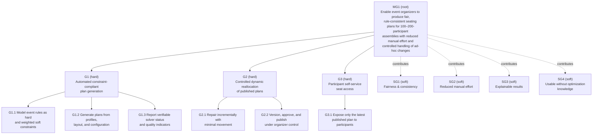
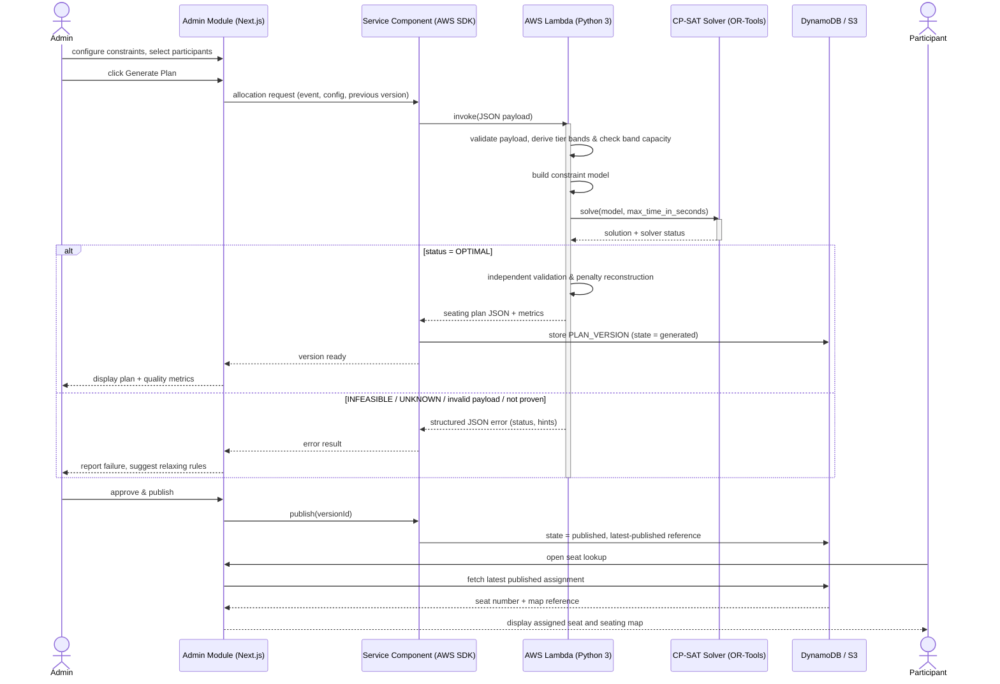
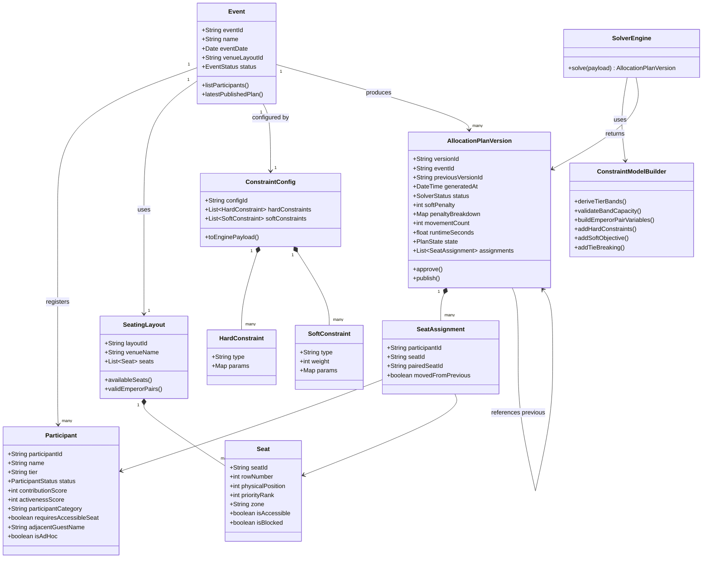
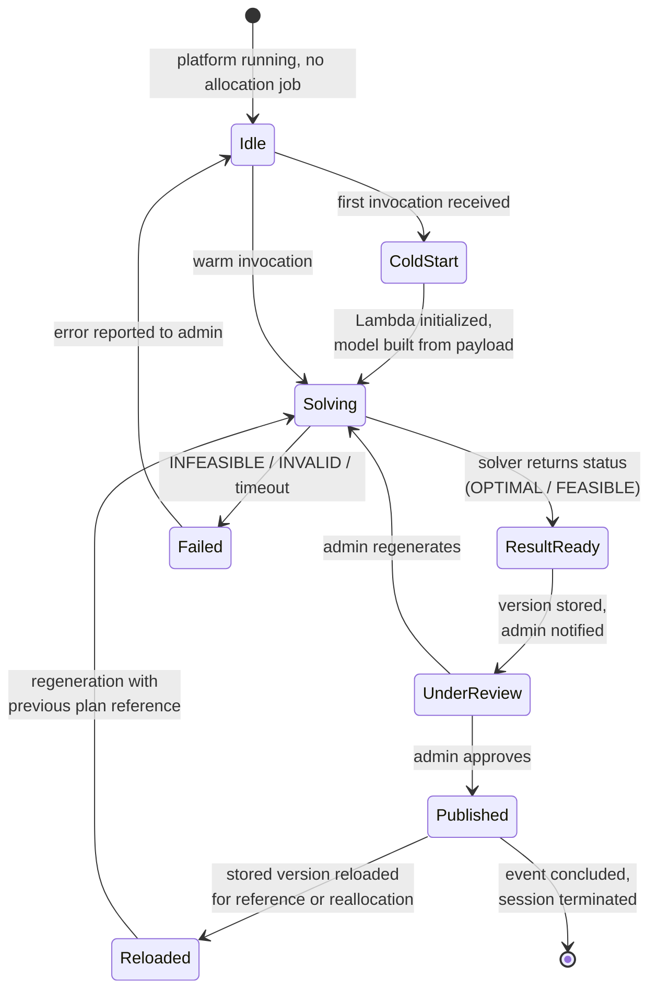
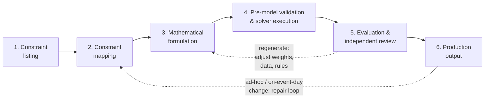
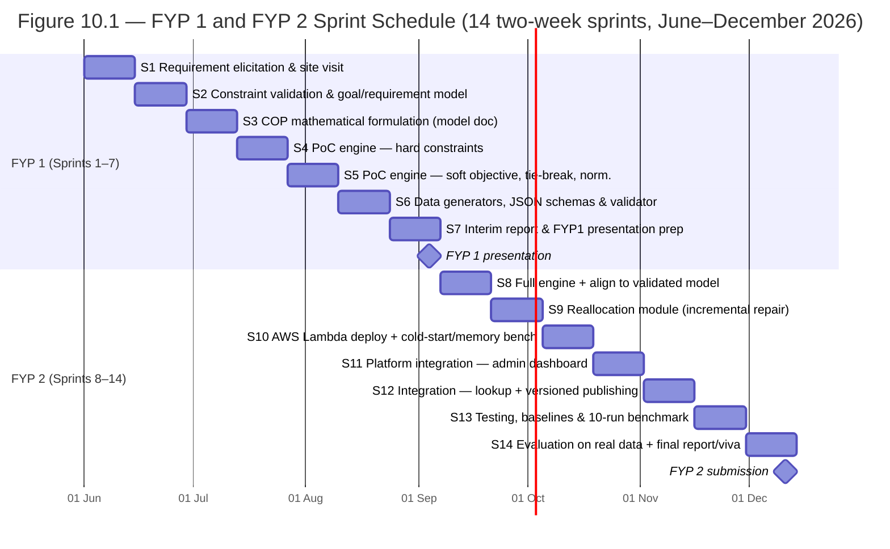

# UNIVERSITI TEKNOLOGI PETRONAS

## Department of Computing

### TFB3413/TEB3413: Software Requirements Engineering

### Final Project Report — Requirements Engineering Activities for the FYP1 Project

## Intelligent Automated Seating Allocation System for Large-Scale Assemblies Using Configurable Constraint Optimization

**Lecturer:** Ts. Dr. Shuib bin Basri

| Name | Student ID | Email |
|---|---|---|
| Darius Lee Shin | 22003269 | darius_22003269@utp.edu.my |

**Industry Collaborator:** Netizen eXperience
**Case Study Organization:** Petaling Jaya Kwan Inn Teng (PJKIT)
**Date:** July 2026

---

## Table of Contents

1. Project Title
2. Project Vision
3. Project Problems and Objectives
4. System Goals
5. Requirements Engineering Context Analysis
6. RE Analysis Modelling (Use Cases, Behavioural, and Functional Modelling)
7. Methodology
8. Proposed Interface Design
9. Requirement Resources and Elicitation
10. Project Milestones, Tools, and Budget
11. Overall Findings and Output
12. References
Appendix A: Requirement Traceability Matrix
Appendix B: Implemented Constraint Model (Source-Code Listing)

---

# 1.0 Project Title

**Intelligent Automated Seating Allocation System for Large-Scale Assemblies Using Configurable Constraint Optimization.**

The project is a Final Year Project with Petaling Jaya Kwan Inn Teng (PJKIT) as the case-study organization and Netizen eXperience as the industry collaborator.

---

# 2.0 Project Vision

## 2.1 Vision Statement

> To provide an intelligent and configurable seating allocation system that supports constraint-compliant seating arrangements for large-scale assemblies, enabling event organizers to generate seating plans automatically by considering participant profiles, priority rules, and event-specific constraints, and to support ad-hoc event handling for seating allocation.

## 2.2 Rationale for the Vision

The vision makes **ad-hoc event handling** an explicit part of its statement. Requirement elicitation with PJKIT (Section 9) established that late changes — absences, substitutions, and ad-hoc participants registering close to or on the event day — are not an edge case but a recurring operational reality, and that uncontrolled revision of a published plan is one of the organizer's most disruptive pain points. Stating controlled ad-hoc handling in the vision anchors the reallocation goals (G2) and requirements (FR9, FR14) that follow.

## 2.3 Role of the Vision in Requirements Engineering

The vision states the change the system brings to the existing seating workflow and bounds what the project is *not*: it is neither a complete event-management platform nor a novel optimization algorithm. Every goal in Section 4, every requirement in Section 5, and every model in Section 6 is traceable back to this statement; the traceability matrix in Appendix A closes that chain, so every goal is operationalized and every requirement is justified by a goal.

---

# 3.0 Project Problems and Objectives

## 3.1 Problem Background (Validated Case Study)

PJKIT organizes community assemblies of approximately 100 to 200 participants in a 16-row × 16-seat venue (256 seats, of which 232 are assignable after a structural blocked centre block of 24 seats in rows 6–9, observed identically in the community's 2023 and 2024 event layouts), with a centre aisle between physical positions 8 and 9. Seating is currently prepared by hand using spreadsheets, printed charts, and PDF name lists. The problem is combinatorial: each participant must be matched to a suitable seat while contribution tier and score, activeness, participant status, accessibility need, and venue restrictions are weighed simultaneously. The PJKIT case adds structural rules that generic tools cannot express: three contribution tiers (Emperor, Merit, Bodhi) are seated in contiguous, demand-derived row bands ordered **Emperor → Merit → Bodhi** from the front of the hall, and a row may be shared at a tier boundary so that the numbered section is packed to capacity with no empty seat; an Emperor registration — the majority registration type at recent events — occupies **two adjacent seats** that must form a valid within-row pair and must never straddle the centre aisle; and seating order within each tier must respect contribution ranking. The venue follows a concert-style layout: a **numbered section** at the front, allocated by the system to exactly the registered demand, and a **free-seating section** behind it that is not solved. In the default configuration of 122 registrations (86 Emperor, 12 Bodhi, 24 Merit), the numbered section occupies 208 of the 232 assignable seats, and the remaining 24 seats form the free-seating section.

## 3.2 Problem Statements

The three problem statements below were validated against the PJKIT workflow during the site visit and stakeholder discussions.

**Problem Statement 1 — Inconsistency and inefficiency in multi-criteria manual seating allocation.** Manual allocation requires the organizer to weigh many participant attributes simultaneously against a constrained layout with demand-derived tier bands, two-seat Emperor pairs, a structural blocked centre block, and an aisle that breaks physical adjacency. The process is slow, does not scale, produces different outcomes depending on who performs it, and yields plans whose quality cannot be measured or defended against the organizer's own stated rules.

**Problem Statement 2 — High operational disruption and lack of controlled dynamic reallocation.** Participant data changes close to, and on, the event day. Once a plan has been published, a change is a *repair* problem: the affected assignments must be corrected while the remainder of the already-communicated plan is preserved. Manual practice offers no controlled repair mechanism — a late change forces wholesale revision, disrupting unaffected participants and risking duplicate seats, broken Emperor pairs, and outdated printed lists.

**Problem Statement 3 — Communication bottlenecks in participant seat retrieval.** Participants retrieve their seats from printed lists, PDF listings, or staff. This organizer-driven dissemination creates queues at the venue, gives no guarantee that a participant is reading the latest approved plan, and offers no self-service channel.

## 3.3 Project Objectives

The objectives derive directly from the problem statements:

**Objective 1.** To design and develop an intelligent seating allocation engine that generates rule-consistent, priority-aware seating plans from participant profiles, seating layouts, and configurable event rules, by modelling the allocation task as a Constraint Optimization Problem with hard constraints and weighted soft constraints solved using the Google OR-Tools CP-SAT solver (resolves Problem Statement 1).

**Objective 2.** To develop a controlled dynamic reallocation mechanism realized as incremental repair of the published plan: only the assignments affected by a change are modified, unaffected participants keep their published seats wherever possible, and every repaired result becomes a new version requiring organizer approval (resolves Problem Statement 2).

**Objective 3.** To provide a participant-facing seat lookup channel through which a participant retrieves their assigned seat and consults the seating map from the latest organizer-approved published plan (resolves Problem Statement 3).

---

# 4.0 System Goals

This section defines the goal model under a **single identifier scheme**, decomposing the root goal into a goal tree whose structure mirrors the three problem statements and separating hard goals (objectively satisfiable) from soft goals (quality-oriented, judged by indicators). Every requirement in Section 5 traces to a goal defined here, and Appendix A verifies that every goal is operationalized.

## 4.1 Goal Tree



*Figure 4.1: Goal tree. Solid edges are AND-decomposition; dashed edges show soft goals the root goal contributes to.*

## 4.2 Goal Definitions

| Goal ID | Goal Description | Type | Satisfaction Evidence |
|---|---|---|---|
| **MG1** | The system shall enable event organizers to produce fair, rule-consistent seating plans for large-scale assemblies (validated baseline: 100–200 participants; 256-seat venue with 232 assignable seats) with reduced manual effort and controlled handling of ad-hoc changes. | Root | Satisfied when G1, G2, and G3 are satisfied. |
| **G1** | The system shall generate constraint-compliant seating plans automatically. | Hard | A generated plan exists, satisfies all configured hard constraints, and is confirmed by independent validation. |
| G1.1 | Event rules shall be modelled as computable hard constraints and weighted soft constraints. | Hard | Each rule in the validated constraint listing (Appendix B) has a corresponding model construct. |
| G1.2 | Plans shall be generated from participant profiles, seating layout, and constraint configuration. | Hard | The engine returns a participant-to-seat mapping for valid input. |
| G1.3 | Every run shall report a verifiable solver status and reconstructible quality indicators. | Hard | Status and per-constraint penalty breakdown are returned and independently recomputed. |
| **G2** | Published plans shall be reallocated under organizer control when participant or event data changes. | Hard | A change scenario produces a repaired plan version that preserves unaffected assignments wherever possible. |
| G2.1 | Reallocation shall repair incrementally, minimizing first the number of unaffected participants moved and then total movement distance. | Hard | Movement summary of the repaired version confirms the minimization hierarchy. |
| G2.2 | Every generated or repaired result shall be a version requiring explicit organizer approval before publication. | Hard | No plan reaches participants without an approval action. |
| **G3** | Participants shall retrieve their assigned seat themselves. | Hard | A participant lookup returns the correct seat from the latest published version. |
| G3.1 | Only the latest published plan shall ever be exposed to participants. | Hard | Unpublished versions are inaccessible through the participant route. |
| **SG1** | The system should improve fairness and consistency of seating decisions. | Soft | Identical input and configuration reproduce the identical plan (determinism); weighted penalty is lower than every automated baseline. |
| **SG2** | The system should reduce the organizer's manual effort. | Soft | Comparison against the documented manual workflow during evaluation. |
| **SG3** | The system should make allocation results explainable. | Soft | Solver status, penalty breakdown, and movement summaries accompany every version. |
| **SG4** | The system should be usable by organizers without optimization knowledge. | Soft | An organizer generates and publishes a plan without assistance after a single briefing (subject to stakeholder validation). |

## 4.3 Goals Against Problems, Objectives, and Vision

| Goal | Problem Statement | Objective | Vision Element |
|---|---|---|---|
| G1 (G1.1–G1.3) | PS1 | Objective 1 | Intelligent, configurable, constraint-compliant automatic generation |
| G2 (G2.1–G2.2) | PS2 | Objective 2 | Ad-hoc event handling for seating allocation |
| G3 (G3.1) | PS3 | Objective 3 | Support for large-scale assemblies (participant-facing scale) |
| SG1–SG4 | PS1–PS3 (quality dimension) | All | Intelligent and configurable system |

This goal model is deliberately the referencing anchor for the rest of the report: each requirement identifier in Section 5 carries a goal trace, and any future change to a requirement must first be justified against a goal here.

---

# 5.0 Requirements Engineering Context Analysis

The context is organized into the Subject, Usage, and IT System facets plus the Development Context, grounded in the facts validated during elicitation (Section 9).

## 5.1 Subject Facet

The information, entities, and domain concepts the system must represent.

| Context Object | Explanation |
|---|---|
| Participant Profile | Tier (Emperor / Bodhi / Merit), contribution score (integer ringgit), activeness score (events joined in the last two years), status eligibility, participant category and special-need flags (elderly, monk, accessibility requirement), adjacent-guest name for Emperor registrations, and ad-hoc flag. |
| Event / Assembly | The domain situation requiring allocation; carries date, status, and the associated layout and constraint configuration. |
| Venue Layout | 16 rows × 16 seats (256 seats) with a centre aisle between physical positions 8 and 9; a structural blocked centre block of 24 seats in rows 6–9 leaves 232 assignable seats; defines the physical environment and constrains assignments. |
| Seat | Carries row number, **physical position** (adjacency and aisle rules), **priority rank** (preference rules) — two distinct attributes that must never be conflated — spatial zone (for category suitability), an accessibility flag (accessible seats are the **side/edge seats** of the hall, used for participants with limited mobility), and a blocked flag. |
| Tier Band | The contiguous block of rows a tier occupies, ordered **Emperor → Merit → Bodhi** from the front; boundaries are **derived from each event's tier demand** (not fixed venue zones), a boundary row may be **shared** between two tiers, and the numbered section is packed with no empty seat. Band capacity is validated before model construction. Illustrative default: Emperor ≈ rows 1–13, Merit ≈ rows 13–14, Bodhi ≈ rows 14–15, with free seating behind. |
| Numbered vs Free Seating | The front **numbered section** is allocated by the system to exactly the registered demand; the **free-seating section** behind it (the remaining assignable rows) is not solved. |
| Emperor Pair | The two-seat allocation unit of an Emperor registration, restricted to valid within-row pairs; positions 8–9 never form a pair. |
| Constraint Rule & Weight | Hard rules and weighted soft preferences; weights are organizer-configurable integers. |
| Allocation Plan Version | A generated result with solver status, penalty breakdown, movement summary, and lifecycle state (generated → approved → published), each version referencing its predecessor. |
| Participant Status / Change Event | Absence, substitution, or ad-hoc registration that triggers reallocation. |

## 5.2 Usage Facet

| Context Object | Explanation | Interaction |
|---|---|---|
| Event Organizer / Admin | Primary user. | Prepares data, configures constraints and weights, generates and regenerates plans, reviews versions, approves and publishes, exports. |
| **Event Participant** | **Direct actor.** | Retrieves their assigned seat and views the seating map from the latest published plan (FR13). |
| Secretariat Staff | Supports data preparation and event-day operations. | Updates participant records and statuses; uses the published plan. |
| Netizen eXperience | Industry collaborator operating the CSR platform. | Integrates the engine, relays PJKIT stakeholder feedback, maintains platform-side components. |
| Existing CSR Web Platform | External system. | Sends participant, layout, and constraint data to the engine; receives and persists plan JSON. |
| System Administrator | Maintains availability and access control. | Platform operations. |
| FYP Supervisor / Examiner | Academic stakeholders. | Influence scope, evaluation, and documentation; do not operate the system. |

## 5.3 IT System Facet

The deployment decision is recorded once, with its rationale and fallback.

| Context Object | Explanation |
|---|---|
| Seat Allocation Engine | Python 3 function embedding OR-Tools CP-SAT, deployed on **AWS Lambda**. Rationale: the engine runs on demand only; the explicit 60-second solver budget sits well inside Lambda's 15-minute ceiling. Fallback: container-image packaging or provisioned concurrency if measured cold starts materially affect the on-event-day workflow. |
| Existing CSR Web Platform | Next.js / React (TypeScript) application hosting the admin module and participant lookup; invokes the engine through the AWS SDK with JSON payloads. |
| Persistence | Amazon DynamoDB for event, participant, and allocation metadata (including the latest-published reference); Amazon S3 for versioned seating-plan JSON documents. |
| Infrastructure as Code | SST framework provisioning Lambda, DynamoDB, and S3. |
| API Communication | Structured JSON request and response payloads; oversized artifacts routed through S3 references. |
| Export Module | Exportable seating results for event-day operation. |

## 5.4 Development Context

| Context Object | Rationale | Source & Type |
|---|---|---|
| FYP1 & FYP2 Timeline (June–December 2026) | Bounds scope and priorities. | Project constraint |
| FYP Supervisor (Ts. Dr Ooi Boon Yaik) | Academic guidance and scope validation. | Academic stakeholder |
| Netizen eXperience Industry Supervisor (Tech Lead) | Requirement elicitation intermediary, integration guidance, SCRUM cadence. | Industry stakeholder |
| PJKIT Site Visit (26 June 2026) | Validated venue structure, workflow, constraints, and scale. | Domain source |
| Validated Event Dataset | **100–200 participants; 256-seat venue, 232 assignable**; default evaluation scenario of 122 registrations (86 Emperor, 12 Bodhi, 24 Merit → 208 numbered seats packed with no empty seat, the remaining 24 assignable seats being free seating). | Data source |
| Historical Seating Layouts (2023 & 2024) | The organizer's actual charts, analysed cell by cell; source of the 16×16 grid, the blocked centre block, the Emperor-majority composition, the Emperor → Merit → Bodhi ordering, and the front-to-back, centre-out packing with shared boundary rows. | Domain artifact |
| Development Tools | Python 3.11+, OR-Tools CP-SAT, Next.js, AWS (Lambda, DynamoDB, S3), SST, VS Code, GitHub, Claude Code. | Technical resource |
| Data Privacy (PDPA 2010) | Personal data of real community members; pseudonymization at the engine boundary, anonymized/simulated test data. | Ethical / data constraint |
| Solver Runtime Limits | Explicit `max_time_in_seconds` budget; benchmarked memory sizing. | Technical constraint |

## 5.5 Functional Requirements

The functional requirements are stated below under a single identifier scheme, with a uniform modal-verb convention (*shall* for mandatory behaviour, *should* for a recommendation or an item pending stakeholder validation, *may* for optional behaviour) and a goal trace for every requirement.

| ID | Functional Requirement | Goal Trace |
|---|---|---|
| FR1 | The system shall accept participant profile data from the existing web platform as a structured JSON payload. | G1.2 |
| FR2 | The system shall accept seating layout data from the existing web platform as a structured JSON payload. | G1.2 |
| FR3 | The system shall allow event organizers to configure the weights of the supported soft constraints. | G1.1 |
| FR4 | The system shall map the following configurable rule areas into computable hard constraints and weighted soft constraints: contribution tier and score, activeness, participant status, side-of-hall accessibility placement, demand-derived tier-band placement (ordered Emperor → Merit → Bodhi, with shared boundary rows and no empty numbered seat), Emperor two-seat pairing, centre-aisle integrity, within-tier contribution ordering, front-to-back and centre-out packing, unavailable-seat exclusion (including the structural blocked centre block), category-to-zone suitability, and movement minimization during reallocation. | G1.1 |
| FR5 | The system shall generate a seating allocation result based on participant profiles, seating layout, and constraint configuration. | G1.2 |
| FR6 | The system shall return the generated seating allocation result in a frontend-consumable JSON format, including when the run fails. | G1.2, G1.3 |
| FR7 | The system shall return the solver status of every allocation run (OPTIMAL, FEASIBLE, INFEASIBLE, UNKNOWN, or error) together with a clear status message when allocation succeeds, fails, or becomes infeasible; a FEASIBLE result shall be reported as OPTIMAL_NOT_PROVEN when a proven optimum is required. | G1.3 |
| FR8 | The system shall calculate and return reconstructible quality indicators for every generated plan: solver status, independent hard-constraint validation result, total weighted soft-constraint penalty with a per-constraint breakdown, movement count and distance where applicable, and runtime. | G1.3, SG3 |
| FR9 | The system shall perform dynamic reallocation as incremental repair of the published plan, modifying only the assignments affected by a change and, where necessary, a bounded surrounding seating area, minimizing first the number of unaffected participants moved and then total movement distance, and shall store the repaired result as a new plan version requiring organizer approval under FR14. | G2.1, G2.2 |
| FR10 | The system shall allow event organizers to review generated seating plan versions, including the seating map and quality indicators, through the admin review page. | G2.2, SG3 |
| FR11 | The system shall allow seating results to be exported for event operation. | G1.2 |
| FR12 | The system shall store and retrieve the persisted entities of the data model: events, participants, layouts, seats, constraint configurations, plan versions, and assignments, with each plan version referencing its predecessor. | G1.2, G2.2 |
| FR13 | The system shall allow a participant to retrieve their assigned seat and view the seating map from the latest published seating plan. | G3.1 |
| FR14 | The system shall store every generated allocation result as a plan version, shall require explicit organizer approval before publication, and shall expose only the latest published version to participants. | G2.2, G3.1 |
| FR15 | The system shall validate every incoming payload against its schema and structural rules — including pre-model tier-capacity validation — and shall return a structured, frontend-consumable error response for invalid input. | G1.2, G1.3 |
| FR16 | The system shall re-check every generated seating plan against all hard constraints independently of the solver that produced it, including reconstruction of the reported objective value, before the plan can be accepted. | G1.3 |
| FR17 | The system shall return a structured failure response containing the solver status and any determinable validation, capacity, or input failure reasons, shall prevent an unsuccessful result from being published, and shall allow the organizer to revise data, constraints, weights, or seat availability. | G1.3, G2.2 |

## 5.6 Non-Functional (Quality) Requirements

Each quality requirement now carries a fit criterion and a goal trace, repairing the "should + subjective qualifier" pattern found across all six original NFRs.

| ID | Quality Requirement | Goal Trace |
|---|---|---|
| NFR1: Performance | The system shall return an OPTIMAL result within the configured 60-second solver budget for the default dataset of 122 registrations and the 256-seat (232-assignable) case-study layout under the defined evaluation environment; when the budget expires before optimality is proven, the system shall return the actual solver status and shall not represent the solution as optimal. | G1.3, SG1 |
| NFR2: Usability | The system shall enable an event organizer to generate and publish a seating plan without assistance after a single briefing session (criterion subject to stakeholder validation). | SG4 |
| NFR3: Reliability | The system shall not publish a plan that fails input validation, solver processing, or independent post-solve validation, and shall keep the previously published plan unchanged and accessible when such a failure occurs. | G2.2, G3.1 |
| NFR4: Maintainability | The system shall isolate the constraint configuration from the solver logic such that a change to the constraint configuration requires no modification of solver code. | G1.1 |
| NFR5: Security & Privacy | The system shall inherit administrative access from the host platform's authentication, shall restrict unpublished plan versions to authorized administrators, shall allow each participant to view only their own assignment from the latest published version, shall use pseudonymous participant identifiers in the solver payload, and shall retain data in line with the event lifecycle. | G3.1 |
| NFR6: Scalability | The system shall support the validated operational baseline of 122 registrations and the 232-assignable-seat layout, and shall treat larger datasets as exploratory scalability experiments paired with layouts of sufficient capacity. | MG1 |
| NFR7: Availability | The participant seat lookup should remain available throughout the event window; the target availability level should be elicited and agreed with Netizen eXperience because the lookup depends on the host platform's availability characteristics. | G3 |
| NFR8: Reproducibility | For identical normalized input data, constraint configuration, solver parameters, and deterministic seed, repeated executions shall produce the same canonical allocation and quality indicators. | SG1 |

## 5.7 Impact of the System Context

The Subject facet dictates the data model: seats must carry both physical position and priority rank as distinct attributes because adjacency rules and preference rules operate on different properties, and Emperor registrations must be represented as two-seat allocation units rather than two independent assignments. The Usage facet drives the publish-then-lookup workflow: because the participant is a direct actor, the version lifecycle (generated → approved → published) and the access restriction of NFR5 become architectural obligations rather than conveniences. The IT System facet commits the engine to an integer-only constraint model (CP-SAT accepts no floating-point coefficients), JSON-based communication, and an explicit solver time budget that in turn settles the serverless deployment question. The Development context bounds everything to the validated 100–200-participant baseline and the December 2026 timeline, keeping the scope at predefined constraint templates with configurable weights rather than open-ended natural-language rules.

---

# 6.0 RE Analysis Modelling (Use Cases, Behavioural, and Functional Modelling)

This section presents the analysis models in three complementary RE perspectives: the **functional / use-case perspective** (what services actors obtain: use case diagram, swimlane activity diagram, sequence diagram), the **data / structural perspective** (what information is represented: class diagram), and the **behavioural perspective** (how system state evolves: use-case-level state diagram). The *Generate Seating Plan* use case — the core research contribution — is modelled in the greatest depth.

## 6.1 Use Case Model (Functional Perspective)

Figure 6.1 shows the system's use cases for its two human actors, with the seat allocation engine as a supporting system actor. The official rendered use case diagram is maintained at `academic/diagrams/FYP_Use_Case_Diagram.png`.


*Figure 6.1: Use case diagram of the proposed system (rendered artifact: `academic/diagrams/FYP_Use_Case_Diagram.png`).*

The diagram's central takeaway is the **asymmetry of authority between the two human actors** across a single system boundary. The event organizer owns the entire decision chain — preparing participant data, configuring constraints and weights, generating and regenerating plans, reviewing versions, and approving, publishing, and exporting — whereas the participant is confined to two read-only cases, viewing their assigned seat and the seating map. The seat allocation engine appears not as a user but as a **supporting system actor**, and the dashed `invoke` edges reveal that it is reached at only two points, *Generate seating plan* and *Regenerate/repair plan*; every other case is human-facing platform work. Reading the diagram this way makes the control model explicit: computation is triggered exclusively by the organizer, and nothing the participant does can alter an allocation — the guarantee that later hardens into the publish-before-lookup rule of FR13/FR14.

**Primary use case description — Generate Seating Plan.**

| Field | Description |
|---|---|
| Use Case | Generate Seating Plan (UC3) |
| Primary Actor | Event Organizer / Admin |
| Supporting Actor | Seat Allocation Engine |
| Goal Trace | G1 (G1.1–G1.3) |
| Precondition | Participant data, seating layout, and constraint configuration prepared; total demand within assignable capacity and each tier's demand-derived band fits the hall. |
| Trigger | Organizer clicks *Generate Plan* in the admin module. |
| Main Success Scenario | (1) Platform packages participants, layout, configuration, and optional previous allocation into a JSON payload. (2) Engine validates schema, derives the demand-driven tier bands, and checks band capacity. (3) Engine builds the integer constraint model over eligible combinations only. (4) CP-SAT solves within the configured time budget. (5) Engine extracts assignments and penalty breakdown. (6) Independent validator re-checks all hard constraints and the reconstructed objective. (7) Result is stored as a new plan version (state = generated). (8) Organizer reviews the version and quality indicators. |
| Extensions | (2a) Invalid payload → structured INVALID_INPUT error. (2b) Capacity exceeded (total or per-band) → structured infeasibility explanation without invoking the solver. (4a) INFEASIBLE / UNKNOWN → status and conflict hints returned; organizer relaxes rules or adjusts seat range. (4b) FEASIBLE with proven optimum required → reported as OPTIMAL_NOT_PROVEN, never as optimal. (6a) Independent validation fails → result rejected, failure reported. |
| Postcondition | A reviewable plan version exists; nothing is published without explicit approval (UC6). |

## 6.2 Swimlane Activity Diagram — Generate Seating Plan (Functional Perspective)

Figure 6.2 allocates the generation workflow across the three responsibility lanes: the organizer, the CSR platform, and the allocation engine.

```mermaid
swimlane-beta TB
  subgraph Event Organizer
    A1([Start: event data ready])
    A2[Configure constraints & weights]
    A3[Trigger plan generation]
    A9{Review version:<br/>satisfactory?}
    A10[Adjust weights, data,<br/>or seat availability]
    A11[Approve & publish version]
    A12([End: plan published])
  end

  subgraph Event Management Platform
    B1[Assemble JSON payload:<br/>participants, layout, config,<br/>optional previous allocation]
    B2[Invoke engine via AWS SDK]
    B3[Store result as new<br/>plan version - state: generated]
    B4[Display plan, metrics,<br/>or structured error]
    B5[Update state to published,<br/>set latest-published reference]
  end

  subgraph Allocation Engine
    C1{Schema & structural<br/>validation pass?}
    C2[Return structured<br/>INVALID_INPUT error]
    C3{Derive tier bands;<br/>capacity feasible?}
    C4[Return structured infeasibility<br/>explanation - solver not invoked]
    C5[Build integer model over<br/>eligible combinations only]
    C6[Solve with CP-SAT<br/>within time budget]
    C7{Solver status}
    C8[Return status &<br/>conflict hints]
    C9[Independent validation:<br/>duplicates, pairs, aisle, tiers,<br/>ordering, reconstructed objective]
    C10[Return plan JSON +<br/>penalty breakdown + status]
  end

  A1 --> A2 --> A3
  A3 --> B1 --> B2 --> C1

  C1 -->|No| C2 --> B4
  C1 -->|Yes| C3

  C3 -->|No| C4 --> B4
  C3 -->|Yes| C5 --> C6 --> C7

  C7 -->|INFEASIBLE / UNKNOWN /<br/>OPTIMAL_NOT_PROVEN| C8 --> B4
  C7 -->|OPTIMAL| C9 --> C10 --> B3 --> B4 --> A9

  A9 -->|No| A10 --> A3
  A9 -->|Yes| A11 --> B5 --> A12
```

*Figure 6.2: Swimlane activity diagram for the Generate Seating Plan use case.*

Read left-to-right across the three lanes, the diagram traces one generation request from the organizer's trigger, through the platform's payload assembly and engine invocation, into the engine's processing, and back — and its important takeaway is the **sequence of guard points that protect the plan before it can ever reach a participant**. The engine applies two cheap early exits before any expensive solving: an invalid payload is rejected outright, and infeasible tier-band capacity is reported without invoking the solver at all. Only a well-formed, feasible request reaches CP-SAT, and even a returned solution is not trusted directly — the *OPTIMAL* branch passes through an independent validation step before the result is stored, while every other solver status (infeasible, unknown, or feasible-but-unproven) is routed back to the organizer as a structured explanation rather than a plan. The lane structure also makes the ownership of each step unambiguous, and the loop from an unsatisfactory review back to *Trigger plan generation* captures the iterative weight-tuning cycle. Crucially, the only path into the *published* state runs through the organizer's explicit approval, so no automated step can publish on its own.

## 6.3 Sequence Diagram — Generation, Publication, and Lookup (Functional Perspective)



*Figure 6.3: Sequence diagram for plan generation, publication, and participant lookup with explicit failure path.*

Where the swimlane shows *who* is responsible, this diagram shows the **time-ordered message exchange** and, most importantly, that the two participant-facing capabilities are decoupled from generation in time. The upper interaction is the organizer's synchronous generation call: the request travels Admin → UI → service component → Lambda → CP-SAT and returns, with the `alt` fragment making the two outcomes explicit — an *OPTIMAL* result is independently re-validated and stored as a version, whereas any error status returns a structured message and stores nothing. Publication is a separate, later interaction that flips the version's state and sets the *latest-published reference*. The final interaction is the participant's lookup, and the key takeaway sits here: it reads the assignment straight from the data store's latest-published pointer and never touches the solver, so participant reads are cheap, always reflect only an approved plan, and are fully independent of whether a generation or reallocation happens to be running.

## 6.4 Class Diagram (Data / Structural Perspective)

Figure 6.4 defines the principal classes, separating the domain model, the constraint configuration, the allocation artifacts, and the engine-side builder and solver wrapper. The persistent storage schema follows this structure (entities: events, participants, layouts, seats, constraint configurations, plan versions, assignments; each plan version references its predecessor — the reference that enables movement minimization during reallocation, FR12).



*Figure 6.4: Class diagram of the seating allocation system.*

The structure reads outward from `Event` as the aggregate root: an event registers many participants, uses one seating layout (itself composed of seats), is configured by one constraint configuration (composed of hard and soft constraint definitions), and produces many allocation plan versions (each composed of seat assignments). The distinction between **composition** (filled diamonds — seats belong to a layout, assignments belong to a version) and **association** (an assignment merely *references* a participant and a seat) is the diagram's way of saying which objects are owned and which are pointed at. Three details carry most of the design intent and are the takeaways to note: the **self-reference on `AllocationPlanVersion`** (`references previous`) is what lets reallocation measure movement against the prior published plan; the `Seat` class deliberately carries **`physicalPosition` and `priorityRank` as separate fields**, keeping adjacency/aisle logic apart from preference logic; and the engine-side `SolverEngine` and `ConstraintModelBuilder` are cleanly separated from the domain and artifact classes, so the builder's operations (derive bands, build pair variables, add hard constraints, assemble the soft objective, tie-break) are the concrete realization of the constraint model rather than properties of the domain data.

## 6.5 Use-Case-Level System State Diagram (Behavioural Perspective)

Figure 6.5 models the system's high-level states across an allocation session — cold start of the serverless engine, solving, review, publication, reload for reallocation, and termination.



*Figure 6.5: Use-case-level state diagram of the allocation process.*

This diagram walks through the **life of one allocation session** and highlights two behaviours that the earlier functional views only imply. First, the serverless nature of the engine is visible in the entry transitions: a first invocation incurs *ColdStart* before *Solving*, while a warm invocation goes straight to *Solving* — the practical basis for the cold-start mitigations discussed in the methodology. Second, *Solving* forks to either *ResultReady* or *Failed*, and from review (*UnderReview*) the session can branch two ways — back to *Solving* when the organizer regenerates, or forward to *Published* when they approve. The most important takeaway is the **reallocation loop**: a *Published* plan can be *Reloaded* and fed back into *Solving* with the previous plan as reference, so incremental repair reuses the same solving machinery as initial generation rather than being a separate subsystem. The session terminates only from *Published*, once the event concludes, confirming that a published plan is the single stable resting state of the system.

Together, the five models cover the three analysis perspectives required of RE modelling: Figures 6.1–6.3 specify the functional perspective (services and interactions), Figure 6.4 the data perspective (structure and persistence), and Figure 6.5 the behavioural perspective (state evolution). Each model is traceable to the goals of Section 4 and realizes the requirements of Section 5.

---

# 7.0 Methodology

## 7.1 Software Development Methodology: Agile SCRUM with Netizen eXperience

The project is executed under an Agile SCRUM arrangement operated jointly with Netizen eXperience, structured around the four SCRUM ceremonies shown in Figure 7.1. Each sprint is bracketed by a **Sprint Planning** session and closed by a **Sprint Review (demo)** and a **Sprint Retrospective**, with a **Daily Stand-up** for ongoing synchronization; all ceremonies are held on Wednesdays with the industry supervisor (the assigned Tech Lead). Sprint Planning and the Stand-up run weekly (10:00–10:15 am) to set and track the sprint backlog, while the Sprint Review and Retrospective run biweekly (10:30–11:00 am) to demonstrate the increment and reflect on the process. Work is tracked as **GitHub Issues under a GitHub Project board** in the Netizen eXperience buddy repository.

The three SCRUM roles are mapped as follows: the industry supervisor acts as **Product Owner**, prioritizing the backlog and relaying the requirements of the **PJKIT stakeholders** (who are the source of the seating rules but do not develop the system); the student is the **Development Team** who models, implements, and demonstrates each increment.


*Figure 7.1: The Agile SCRUM sprint cycle adopted with Netizen eXperience.*

Figure 7.1 reads as a continuous loop around the central roles. A sprint begins at (1) **Sprint Planning**, where the Product Owner and Development Team agree the sprint backlog from the prioritized requirements; (2) the **Daily Stand-up** keeps progress, plans, and blockers visible during the sprint; (3) the **Sprint Review / Demo** presents the working increment for feedback; and (4) the **Sprint Retrospective** captures process improvements before the loop returns to the next sprint. The two arrows along the base — *Define Requirements* feeding in and *Next Sprint* feeding forward — express the incremental nature of the arrangement: requirements are refined continuously and each sprint delivers a demonstrable increment rather than deferring integration to a single late milestone. The takeaway is that the collaboration's communication is institutionalized as fixed ceremonies (weekly planning and stand-up, biweekly review and retrospective) rather than left ad hoc.

Because the project's central risk is *modelling* risk — the danger that a real-world rule is translated into an incorrect integer constraint — the SCRUM cadence embeds a **constraint-validation protocol**: each rule from the drafted constraint listing is a backlog item whose definition-of-done requires (i) the rule modelled and implemented against sample PJKIT data, (ii) the behaviour demonstrated at a biweekly demo, and (iii) sign-off relayed through the industry supervisor from PJKIT stakeholders that the demonstrated behaviour matches the community's intent. No constraint is considered validated by implementation alone.

## 7.2 System Architecture


*Figure 7.2: System architecture and deployment overview.*

The system adopts a **four-layer architecture** that separates the people who use the system from the software they interact with, the computation that produces a seating plan, and the storage that persists it. Reading Figure 7.2 top to bottom: the **Users layer** holds the two actors — the Event Administrator / Organizer and the Event Participant; the **Application Layer** is the Netizen eXperience Event Management Platform, containing the Admin Seating Allocation Dashboard, a Next.js server component that holds the AWS SDK, and the Participant Seat Lookup Interface; the **Compute Layer** is AWS serverless, where an AWS Lambda function hosts the core seating allocation engine and its embedded Google OR-Tools CP-SAT solver function; and the **Data Layer** is AWS storage, comprising Amazon DynamoDB (event, participant, and allocation metadata, plus the latest-approved seat references) and Amazon S3 (versioned seating-plan result JSON, kept for traceability). Layering this way means each tier depends only on the one beneath it, so the platform, the solver, and the storage can evolve independently.

The primary flow begins with the **Event Administrator**. From the Admin Seating Allocation Dashboard the organizer configures the constraints and selects the participant data, which the Next.js server component assembles and sends to the Compute Layer by **invoking the Lambda with a JSON payload through the AWS SDK**. Inside the Lambda, the engine **builds and solves the model** with CP-SAT and returns the **optimal/feasible solution together with its solver status**; the resulting **seating-plan JSON** flows back to the server component, which stores the event and participant metadata in DynamoDB and the versioned seating-plan document in S3. When a change occurs after publication, the same path is used for **reallocation** — the server component re-invokes the Lambda with the updated payload *and the previous plan*, so the engine repairs rather than regenerates. The **Event Participant** never reaches the compute tier: the Participant Seat Lookup Interface requests participant-specific seating details from the server component, which serves the **latest published seating details** read from DynamoDB, and the participant is shown their seat. The takeaway is that computation is triggered only by the administrator and runs on demand, while the participant's path is a short, read-only lookup of already-approved data.

## 7.3 Methods and Technologies Adopted

| Method / Technology | Role in the Project |
|---|---|
| Constraint Programming with hard and weighted soft constraints | Core method: models event seating rules as a Constraint Optimization Problem. |
| Google OR-Tools CP-SAT solver | Executes the constraint model and reports explicit solver statuses (optimal, feasible, infeasible, model invalid, unknown). |
| Python 3 | Implementation language of the solver function. |
| AWS Lambda | On-demand serverless deployment of the engine, invoked with an explicit solver time budget. |
| AWS SDK (from the Next.js service component) | Invocation channel for JSON payloads and results. |
| Next.js / React (TypeScript) | Existing CSR platform hosting the admin module and participant lookup. |
| Amazon DynamoDB & Amazon S3 | Persistence of allocation metadata and versioned plan JSON respectively. |
| SST Framework | Infrastructure-as-code provisioning. |
| GitHub Issues & Projects | SCRUM work tracking in the collaborator's repository. |

CP-SAT is selected over the closest exact alternative (ILP/MIP) because it expresses PJKIT's conditional and structural rules natively through reification and channeling rather than hand-compiled big-M linearizations, while retaining exactness, and over published seating heuristics (region growing, genetic algorithms) because it provides a provable optimality claim and a falsifiable solver status — under the project's standing rule that a solution is never reported optimal unless CP-SAT returns OPTIMAL.

## 7.4 Seating Allocation Optimization Lifecycle

The seating allocation engine follows a structured six-step optimization lifecycle that transforms human-readable seating rules into a generated, reviewable seating plan. The lifecycle is the methodological spine of Objective 1: it is the sequence each rule travels along under the SCRUM constraint-validation protocol (Section 7.1), and its steps map directly onto the implemented source modules and the other artifacts of this report. Figure 7.3 summarizes the flow; the subsections below describe each step as realized in this project, which differs in several respects from a generic constraint pipeline.



*Figure 7.3: The six-step seating allocation optimization lifecycle, with the regeneration feedback path (Objective 1) and the reallocation repair loop (Objective 2).*

**Step 1 — Constraint listing.** Raw business rules are collected from the event context through elicitation (Section 9) — stakeholder discussions, the site visit, and cell-by-cell analysis of the organizer's 2023 and 2024 seating charts — and recorded in the working constraint listing (Appendix B, rules C1–C17). Beyond the generic rules — one allocation unit per participant, at most one occupant per seat, blocked seats excluded, higher-contribution participants receiving more suitable seats — this step captures the PJKIT-specific structural rules that generic tooling cannot express: the demand-derived tier bands ordered Emperor → Merit → Bodhi with shared boundary rows, the Emperor two-seat pairing with centre-aisle exclusion, within-tier contribution ordering, side-of-hall placement for participants who need accessible seats, and the front-to-back, centre-out packing that fills the numbered section with no empty seat, read from the historical layouts. Each rule enters this step in plain language and remains a validation backlog item until stakeholder sign-off.

**Step 2 — Constraint mapping.** This step is the bridge between human rules and programmable logic. Each rule is classified as a **hard constraint** (must never be violated) or a **weighted soft constraint** (a preference contributing a penalty), the required data fields are identified — for participants, `contribution_tier`, `contribution_amount_rm`, `participant_category`, `requires_accessible_seat`, `events_joined_last_2_years`, and `previous_seat_ids`; for seats, `row_number`, `physical_position`, `priority_rank`, `zone`, `is_accessible`, and `is_blocked` — and a modelling strategy is chosen per rule. Strategies used include **domain reduction**, in which decision variables are created only for eligible participant–seat (or Emperor–pair) combinations, so tier-band placement, blocked seats, accessibility, and aisle integrity are enforced *by construction* rather than by explicit constraints; **exact per-row equalities** for the front-fill pattern; **penalty scoring** for the soft constraints; **reification**, linking a logical condition (for example, "this participant moved from their previous seat") to a Boolean indicator that can be counted; and **channeling**, linking a participant's assigned-seat variable to that seat's row, position, zone, and rank. A domain-specific mapping decision is fixed here: **physical position and priority rank are kept as distinct fields** — adjacency and aisle rules operate on physical position, preference alignment on priority rank — and the two are never conflated into a single "column" attribute.

**Step 3 — Mathematical formulation.** The mapped rules are converted into integer decision variables ($x_{p,s}$, $y_{e,q}$), integer hard constraints, Boolean indicators, and an objective function (detailed in Section 7.5). Because CP-SAT accepts no floating-point coefficients, every cost, weight, and objective term is integer. The scaling concern here is not merely float-to-integer conversion — contribution amounts are already integer ringgit — but **normalization**: the raw soft-constraint components have incomparable ranges (movement can reach ~139 while a priority mismatch tops out at 11), so each raw component is rescaled to a common 0–100 integer range by its theoretical maximum before the configured weights are applied, ensuring the weights mean what they say. The objective combines the weighted soft-constraint penalties, and a deterministic tie-break term is added under a large `MAIN_OBJECTIVE_SCALE` so the tie-break can select a canonical plan among equal-cost optima without ever overriding a real penalty difference. A pre-model tier-capacity validation guards this step: infeasible tier demand is rejected with a structured explanation *before* any model is built.

**Step 4 — Pre-model validation and solver execution.** Before any solving, the engine validates the payload against its JSON Schemas, checks total seat demand against the 232 assignable seats, and derives the demand-driven tier bands, rejecting impossible inputs with structured error documents without ever invoking the solver. For valid inputs the CP-SAT model is built over eligible combinations only and passed to the OR-Tools solver with an explicit `max_time_in_seconds` budget (default 60 seconds), which searches for an assignment that satisfies every hard constraint and minimizes the weighted soft-constraint penalty. The solver returns an explicit status — OPTIMAL, FEASIBLE, INFEASIBLE, MODEL_INVALID, or UNKNOWN — and, under the project's standing rule, a FEASIBLE-but-unproven result is reported as `OPTIMAL_NOT_PROVEN` when a proven optimum is required and is never presented as optimal.

**Step 5 — Evaluation and independent review.** The numerical solver output is decoded back into human-readable seating information and evaluated. Crucially, hard-constraint satisfaction is established **not by trusting the solver but by an independent validation module** (`validator.py`) that re-checks duplicate seats, Emperor pairing and aisle compliance, band placement and derivation, contribution ordering, accessibility, blocked seats, and the reconstructed objective value — independently of the solver that produced them. The reported indicators are solver status, independent hard-constraint validation result, total weighted soft penalty with its per-constraint breakdown (priority, zone, movement, activeness), movement count and distance where applicable, and runtime. Only a plan that passes independent validation proceeds; the organizer then reviews the version and its metrics (use case UC5). This step is where the lifecycle can loop back: if the organizer adjusts weights, data, or rules, the process re-enters at Step 3.

**Step 6 — Production output.** The accepted seating plan is serialized to structured, frontend-consumable JSON that remains well-formed even when a run fails (returning a structured error rather than an exception). This output drives the seat-map rendering and admin review of the dashboard, is stored as a version in the plan history, and feeds the participant lookup of the latest approved plan. When an ad-hoc or on-event-day change subsequently arrives, that change re-enters the lifecycle at Step 2 as a bounded repair rather than a full regeneration (Objective 2), closing the loop between initial allocation and controlled reallocation.

Steps 1–2 are realized in `preprocessing.py` and the constraint configuration; Step 3 in `cost_calculator.py` and `cp_sat_model.py`; Step 4 in `solver.py`; Step 5 in `validator.py`; and Step 6 in `result_formatter.py` (module map, Appendix B). The lifecycle therefore doubles as a traceability device linking each methodological step to concrete, testable code.

## 7.5 Preliminary Mathematical Formulation of the Seating COP

The formulation demonstrates that the PJKIT rules are expressible as an integer constraint model of the kind CP-SAT accepts (elaborated in the machine-readable model document `docs/mathematical_model.json`). It elaborates Step 3 of the lifecycle in Section 7.4.

**Sets.** $P = P_E \cup P_B \cup P_M$ (participants by tier; default $|P_E|=86$, $|P_B|=12$, $|P_M|=24$); $S$ the 256 seats of the 16×16 layout, each with row $r(s) \in \{1,\dots,16\}$, physical position $pos(s) \in \{1,\dots,16\}$, priority rank $rank(s)$ (mirrored centre-out, east-of-aisle best), zone $z(s)$, and blocked flag — a structural blocked centre block in rows 6–9 leaves 232 assignable seats; $Q \subset S \times S$ the valid Emperor pairs — within-row position pairs $(1,2),(3,4),\dots,(15,16)$ excluding any pair with a blocked seat, with $(8,9)$ structurally excluded by the centre aisle. Each valid pair carries a centre-out east-first priority: $(9,10)$ highest, then $(7,8),(11,12),(5,6),(13,14),(3,4),(15,16),(1,2)$. Each tier's **band** $\mathit{band}(t)$ — a contiguous block of rows — is derived from demand before model construction, rows being consumed front to back in tier precedence order **Emperor → Merit → Bodhi**; a boundary row may be **shared** between two adjacent tiers, and the numbered section is packed with no empty seat (the remaining assignable rows form the free-seating section, which is not modelled). Illustrative default: Emperor ≈ rows 1–13, Merit ≈ rows 13–14, Bodhi ≈ rows 14–15.

**Decision variables** (created only for eligible combinations, which enforces tier bands, blocked seats, accessibility, and aisle integrity by construction): $x_{p,s} \in \{0,1\}$ for Bodhi/Merit participants over non-blocked seats with $r(s) \in \mathit{band}(t(p))$; $y_{e,q} \in \{0,1\}$ for Emperor units over valid pairs whose row lies in $\mathit{band}(\text{Emperor})$.

**Hard constraints.** (H1) each single participant exactly one seat: $\sum_s x_{p,s} = 1$; (H2) each Emperor unit exactly one valid pair: $\sum_q y_{e,q} = 1$; (H3) at most one occupant per seat: $\sum_p x_{p,s} + \sum_e \sum_{q \ni s} y_{e,q} \le 1$; (H4) within-tier contribution ordering via row expressions $\rho_p = \sum_s r(s)\,x_{p,s}$: $c(p) > c(p') \Rightarrow \rho_p \le \rho_{p'}$; (H5, structural) tier-band placement in the order Emperor → Merit → Bodhi with shared boundary rows, enforced by variable construction over $\mathit{band}(t)$; (H6, configurable) front-to-back fill (exact per-row occupancy equalities that pack the numbered section with no empty seat) and centre-out fill (monotone occupancy outward from the aisle); (H0) pre-model capacity validation — total registered demand against the 232 assignable seats and the fit of the demand-derived bands, including side-seat capacity for accessibility-requiring participants — returning a structured infeasibility explanation without invoking the solver.

**Objective.** Minimize the weighted sum of integer soft-constraint penalties

$$\min \; w_1 \cdot Pen_{\text{priority}} + w_2 \cdot Pen_{\text{zone}} + w_3 \cdot Pen_{\text{move}} + w_4 \cdot Pen_{\text{activeness}} + \varepsilon \cdot T$$

where the movement penalty is identically zero when no previous allocation exists, and $T$ is a deterministic tie-breaking term whose coefficient $\varepsilon$ is scaled so that $\varepsilon \cdot T_{\max}$ is strictly smaller than one unit of the smallest weighted penalty — tie-breaking selects among optima but never trades away objective value. Because the four raw penalty components live on incomparable scales (movement distances reach several hundred while rank mismatches top out near fifteen), each is first normalized to the integer range 0–100 by its theoretical maximum, using integer round-half-up arithmetic, before the weights are applied, so the configured weights compare like for like; both raw and normalized values are reported for auditability. All weights, coefficients, normalized costs, and penalties are integers, as CP-SAT requires. Every extracted solution is re-validated by an independent checker before acceptance.

**Reallocation as a reduced repair model.** For Objective 2 the same formulation is instantiated in restricted form: unaffected participants' variables are fixed at their published seats, variables are created only for affected participants and a bounded candidate-seat neighbourhood, and the objective hierarchy is re-weighted for stability (unaffected-movement penalty dominates every preference term, then total movement distance, then ordinary preferences). The neighbourhood expands progressively when a repair is infeasible; a movement-penalized full re-solve remains the organizer-invoked terminal fallback.

---

# 8.0 Proposed Interface Design

The proposed interface builds on the working proof-of-concept frontend (Next.js, React, TypeScript with shadcn/ui components) already used for client showcase. It is driven by the real engine through two API routes — `/api/solve`, which invokes the CP-SAT solver on demand, and `/api/allocation`, which serves the latest generated result — so the interface exercises the actual pipeline rather than mock data. The PoC realizes the two actor-facing views of the use-case model (Section 6), and a versioned review-and-publish flow is designed for the platform-integration phase.

**Event Organizer — Admin Seat Allocation Dashboard** (`/seat`, the landing route). The organizer's working surface has three regions. (1) A left **configuration rail** carrying the *Seating priorities* control: the four soft-constraint weights are presented not as raw solver parameters but as plain-language priorities — *Care & accessibility*, *Right area for each group*, *Keep current seats*, and *Reward active members* — rendered as sliders that **always sum to 100%**, so raising one automatically rebalances the others; a *Regenerate seating plan* action then re-invokes the solver with the adjusted weights **and the current plan supplied as the previous allocation**, and reports how many participants kept their seats versus moved — a first, visible instance of the movement-minimizing re-solve of Objective 2. The rail also holds solver-independent display options (highlight mode, show/hide names) and a tier legend. (2) A central **hall seat map** of the 16×16 venue rendered from the engine's JSON, colour-coded by tier with Emperor pairs visually joined, the centre aisle and blocked centre block shown, the front-fill and middle-out fill patterns visible ("front rows fill first · seats fill outward from the aisle"), and per-seat click-through to a participant detail dialog. (3) On-demand **Statistics** and **Participants** dialogs: the statistics dialog reports the tier distribution, occupancy (208 numbered seats occupied, 24 free-seating in the default scenario), the solver metrics (status, weighted penalty, scaled objective, optimality gap, wall time, conflicts/branches, variable and constraint counts), whether all hard constraints were independently satisfied, the front-fill / middle-out / normalization settings, and the weighted per-constraint penalty breakdown with a tie-break line; the participants dialog lists every assignment. A persistent link opens the guest view.

**Event Participant — Guest Seat Lookup** (`/my-seat`). A mobile-first public page on which a participant signs in — in the PoC by selecting their name, standing in for the account or ticket-QR identification of the production flow — and is shown their assigned seat: a large seat number with row reference, a hall floor plan highlighting their seat, their tier and hall area (with the guest seat named for Emperor pairs and an accessibility indicator where applicable), a "moved from" note when reallocation has changed their seat, and event details including the plan reference. The page is **live**: it polls `/api/allocation` and, when the organizer regenerates the plan, updates automatically and raises a banner distinguishing "your seat is unchanged" from "your seat has changed" — directly demonstrating the publish-then-lookup propagation of FR13/FR14 and the participant-facing effect of controlled reallocation.

**Plan Review and Publishing Flow** (designed for the platform-integration phase). A version list with quality indicators per version, side-by-side comparison against the previous version with a movement summary, and explicit approve/publish actions realizing the versioned workflow of FR14. This flow is specified but not yet built in the PoC; the current frontend demonstrates generation, weight-driven regeneration with movement reporting, and live participant lookup, while formal version approval remains integration-phase work.

Across both views the PoC prioritizes explainability over decoration: every figure shown — penalty, solver status, optimality gap, occupancy, kept/moved counts — is a value the engine actually computed and the independent validator can recompute, in line with SG3.

---

# 9.0 Requirement Resources and Elicitation

## 9.1 Elicitation Activities and Resources

| Activity / Resource | Description |
|---|---|
| **Site visit and stakeholder interview at PJKIT (26 June 2026)** | A site visit to the PJKIT venue was conducted together with the industry supervisor from Netizen eXperience. The visit combined a semi-structured interview with PJKIT stakeholders and direct observation of the venue: the 16×16 layout, the centre aisle between positions 8 and 9, the structural blocked centre block, and the printed charts and lists used as the current participant-facing channel. |
| Discussions with the industry supervisor (Netizen eXperience Tech Lead) | Recurring sessions defining and bounding the FYP scope, confirming integration points with the CSR platform, and relaying PJKIT stakeholder feedback under the SCRUM cadence. |
| **Analysis of historical seating layouts (2023 & 2024)** | The organizer's actual seating charts were obtained and analysed cell by cell — establishing from primary data the 16×16 grid, the aisle between positions 8 and 9, the recurring 24-seat blocked centre block, the Emperor-majority composition (87 merged-pair units in 2024), the merged-cell display convention for Emperor pairs, and the community's practice of packing rows outward from the aisle and filling front to back with no empty seat (the evidence base for the demand-derived tier bands, the Emperor → Merit → Bodhi ordering, and the front-to-back, centre-out packing rules). |
| Document analysis | Historical seating maps and participant lists supplied through the collaborator, used to derive the seat-priority pattern, tier boundaries, and the manual baseline workflow. |
| Observation of the manual workflow | How committee members currently prepare, revise, and disseminate a seating plan, grounding Problem Statements 1–3. |
| Prototyping | The PoC solver and frontend used as an elicitation instrument: demonstrated increments at biweekly demos elicit corrections to constraint behaviour (the constraint-validation protocol of Section 7.1). |

## 9.2 Sample Elicitation Questionnaire

The following questionnaire was designed for the PJKIT stakeholder interview to elicit the seating allocation constraint rules. It progresses from event scale, through layout, tiering, within-tier factors, subjective weighting of soft constraints, to ad-hoc scenarios.

**Part A — Event scale and context**
1. How many participants typically attend your largest annual assembly, and how does attendance vary between events?
2. How many events per year require a formal seating plan, and are the rules the same across them?
3. How long before the event does seating preparation currently start, and how many people are involved?

**Part B — Venue and layout structure**
4. How is the venue physically laid out — how many rows, how many seats per row, and where are the aisles?
5. Are there seats that must never be assigned (blocked, reserved, equipment, safety)?
6. Which seats do you consider the "best" seats, and what makes one seat better than another (row, closeness to the centre, closeness to the stage)?
7. Are there seats designated or preferred for participants with mobility difficulties or wheelchairs?

**Part C — Tiering (the first-order allocation factor)**
8. What is the first factor that decides where a participant broadly sits — contribution level, role, seniority, or something else?
9. How are the contribution tiers defined, and what are the boundaries between them (e.g., contribution amount thresholds)?
10. Are the rows assigned to each tier fixed every event, or does the block of rows depend on how many people register in each tier? In what order are the tiers seated from the front of the hall, and can a tier's rows ever be shared with the next tier?
11. Do any registrations occupy more than one seat (e.g., a contributor with an accompanying guest)? If so, must the two seats be adjacent, and may they be split across an aisle?

**Part D — Ordering, filling, and special placement within the same tier**
12. Within the same tier, what decides who sits in front of whom — exact contribution amount, activeness or participation history, seniority, or registration order?
13. If two participants have identical standing, how do you break the tie today?
14. When a tier's rows are not completely full, where do the empty seats end up — the back rows of the tier, the outer edges of rows, or spread evenly? Do you fill each row outward from the centre aisle?
15. Are there participant categories with special placement expectations (monks, elderly participants, guests of honour), or participants who require an accessible seat?

**Part E — Relative importance of the soft factors (weighting)**
16. Among the factors just mentioned — contribution-to-seat matching, activeness, category-to-zone suitability — which is the most important to satisfy when they conflict?
17. Could you rank these factors, or say which factor you would sacrifice first if not all can be satisfied?
18. Would you want the ability to change these priorities per event, and who should be allowed to change them?

**Part F — Ad-hoc events and dynamic changes**
19. What last-minute changes have you experienced in past events (withdrawals, substitutions, walk-in registrations), and how frequently do they happen on the event day itself?
20. When a change happens after the plan is finalized, how much of the existing plan are you willing to change — and which participants must absolutely not be moved?
21. How is a revised plan communicated today, and what problems has that caused at the venue?
22. Who has the authority to approve a seating plan (or a revision) before it is announced to participants?

Answers to Parts B–D became the hard-constraint set (demand-derived tier bands ordered Emperor → Merit → Bodhi with shared boundary rows, Emperor two-seat pairing, centre-aisle integrity, within-tier contribution ordering, side-of-hall accessibility placement, and the front-to-back, centre-out packing that leaves no empty numbered seat); Part E confirmed that the soft factors carry no fixed ranking and are configurable per event, with contribution-to-seat matching and activeness as the planning focus; Part F validated that the primary dynamic case is participant absence and substitution after the registration cutoff, producing Objective 2 and FR9/FR14.

## 9.3 Industry-Supervisor Interview Record

The interview was conducted with the Netizen eXperience industry supervisor acting as the intermediary to PJKIT stakeholders. The responses below are the primary elicitation evidence underpinning the goals, requirements, and constraint model of this report; each is recorded in formal summary form against the corresponding question of Section 9.2.

| Ref | Elicited response (formal record) |
|---|---|
| A1 | Exact attendance figures are not retained, but attendance across events in the past two years has consistently fallen within the 100–200 participant range. |
| A2 | PJKIT holds one to two events per year that require a formal seating plan. The seating rules are largely stable across events; only the preferred (soft) constraints vary between events. |
| A3 | Seating preparation begins only about two weeks before the event and is carried out by a team of fewer than five senior volunteers who must personally know the participants and understand the significance of each placement; the task cannot be delegated to general staff. |
| B4 | The hall comprises approximately sixteen rows of about sixteen seats, arranged concert-style: a numbered (allocated) section toward the front and a free-seating section toward the back. |
| B5 | Certain seats are permanently unavailable owing to the building's structural elements; the affected rows simply lose a few seats. |
| B6 | The most desirable seats are those of the east block (東單) nearest the centre aisle; the next most desirable are the west block (西單) seats nearest the aisle. |
| B7 | Participants with limited mobility are seated at the side of the hall for ease of access, as standard practice. |
| C8 | Placement is decided first by contribution tier, then by contribution amount, and thereafter by a combination of seniority and attendance at PJKIT events. |
| C9 | Three tiers are recognised, taken directly from the registration form: Emperor (梁皇功德主), Merit (福慧功德主), and Bodhi (菩提功德主). |
| C10 | The number of rows a tier occupies is not fixed; it depends on the tier's registration count, so a larger Emperor turnout extends further toward the front. Tiers are seated in the order Emperor → Merit → Bodhi from the front, and a row may be shared between two tiers — when one tier's registrations end partway along a row, the next tier continues in the same row. Every row of the numbered section is filled to capacity, leaving no empty numbered seats. |
| C11 | A registration normally occupies two adjacent seats (a married couple, 两夫妇), which almost always carry the same name. Registrations larger than two seats are extremely rare (for example, a single blessing tablet bearing five monks' names) and are treated as exceptions. |
| D12 | Within a tier, order is governed first by contribution amount; the remaining factors (seniority and attendance) are combined under weightings that have not yet been finalised. |
| D13 | Ties are understood to be resolved by registration order (first come, first served), to be confirmed with the client. |
| D14 | Row filling follows the principle already described: rows are packed to capacity outward from the centre aisle with no deliberately empty seats, in registration order. |
| D15 | Special categories (monks/sifu, elderly participants, guests of honour) and accessibility needs are accommodated, but manually rather than by an explicit rule. |
| E16 | No single factor is most important; conflicts are resolved pragmatically, tending to satisfy participants more likely to complain. For planning, the model is directed to focus on contribution-to-seat matching and on participant activeness in previous PJKIT events. |
| E17 | A fixed ranking of the soft factors is not possible because the trade-off is situational. |
| E18 | The weightings are not expected to change often, but the event administrator may adjust the emphasis of particular rules per event to loosen or tighten a given aspect. |
| F19 | Walk-in or late registrations are uncommon because registration closes on a set date. The change that does occur is the absence of a registered participant, sometimes with a replacement taking the vacated seat. |
| F20 | The registration cutoff limits change, but participant absence can still occur after finalisation; when it does, disruption to already-assigned participants must be kept minimal. |
| F21 | When such a change occurs, the seating map is redone so as to minimise the effect on already-assigned participants and avoid confusion at the venue. |
| F22 | A plan or a revision is approved by the senior-volunteer working team together with the event administrator (sifu) before it is announced to participants. |

---

# 10.0 Project Milestones, Tools, and Budget

## 10.1 Milestones (Gantt Chart)

The 28-week schedule spans FYP1 (Weeks 1–14) and FYP2 (Weeks 15–28), June to December 2026. Because the project is run under Agile SCRUM (Section 7.1), the schedule is expressed as **time-boxed two-week sprints** rather than as long, phase-gated task bars: each sprint carries a goal and ends in a demonstrable increment reviewed at the biweekly demo, and requirements are refined continuously across sprints. This makes the milestone plan consistent with the methodology — a plain waterfall Gantt of sequential phases would misrepresent how the work is actually delivered — while the two academic checkpoints (FYP1 presentation, FYP2 submission) remain as fixed milestones.



*Figure 10.1: Sprint-based project schedule aligned to the Agile SCRUM methodology (14 two-week sprints; calendar dates indicative, sprint numbering authoritative). Sprint 8 includes aligning the prototype to the validated model of Section 11.*

## 10.2 Tools

| Tool | Purpose | License / Access |
|---|---|---|
| Visual Studio Code | Primary development environment (Python, TypeScript). | Free |
| GitHub (Issues, Projects, repository) | Version control and SCRUM work tracking in the collaborator's buddy repository. | Free (collaborator organization) |
| Claude Code (subscription) | AI-assisted development: constraint-model implementation support, test scaffolding, documentation drafting. | Paid subscription |
| Python 3.11+, OR-Tools CP-SAT, pytest, Pydantic | Engine implementation, solving, testing, validation. | Free / open source |
| Next.js, React, TypeScript, shadcn/ui | PoC frontend and platform integration. | Free / open source |
| AWS (Lambda, DynamoDB, S3) + SST | Deployment and persistence, provisioned as code. | Pay-per-use (free tier at FYP scale) |
| Mermaid | Diagrams-as-code for all design artifacts. | Free |

## 10.3 Budget (Estimated)

*All figures are estimates for the seven-month project window (June–December 2026) and are marked for confirmation.*

| Item | Basis | Estimated Cost |
|---|---|---|
| Claude Code subscription | ≈ USD 20/month × 7 months ≈ RM 95/month | ≈ RM 665 |
| AWS usage (Lambda, DynamoDB, S3) | FYP-scale workloads sit within the AWS free tier; small buffer for over-tier testing | ≈ RM 0–50 |
| VS Code, GitHub, Python, OR-Tools, Next.js, Mermaid | Free / open source | RM 0 |
| Development hardware | Existing personal laptop | RM 0 (existing asset) |
| Site visit travel (PJKIT) | Local travel, one visit conducted, allowance for one follow-up | ≈ RM 50 |
| **Estimated total** | | **≈ RM 715–765** |

---

# 11.0 Overall Findings and Output

## 11.1 Preliminary Findings from Elicitation

The elicitation activities (Section 9) yielded the validated constraint and scenario base that drives the whole requirement set:

- **Validated scale and layout.** Events of 100–200 participants in a 16-row × 16-seat venue (256 seats, 232 assignable after a 24-seat structural blocked centre block in rows 6–9, centre aisle between positions 8 and 9), arranged concert-style with a numbered front section and a free-seating back section. In the default scenario of 122 registrations (86 Emperor, 12 Bodhi, 24 Merit) the numbered section is 208 seats packed with no empty seat, and the remaining 24 assignable seats are free seating.
- **Tier structure as the first-order rule.** Three contribution tiers seated in **contiguous, demand-derived row bands** ordered **Emperor → Merit → Bodhi** from the front (illustrative default: Emperor ≈ rows 1–13, Merit ≈ rows 13–14, Bodhi ≈ rows 14–15), with a boundary row shared between two tiers so the numbered section packs with no empty seat, and band-capacity feasibility validated before model construction — not fixed venue zones.
- **Structural rules generic tools cannot express.** Emperor registrations (the majority type) as two-seat allocation units restricted to valid within-row pairs that never straddle the aisle between positions 8 and 9; within-tier contribution ordering; side-of-hall placement of participants who need accessible seats; the front-to-back, centre-out packing read from the historical layouts; and physical position versus seat priority rank as distinct seat attributes.
- **Soft preference factors.** The soft factors carry **no fixed ranking** — conflicts are resolved situationally — so the model treats their weights as configurable per event, with contribution-to-seat matching and participant activeness as the planning focus, alongside category-to-zone suitability and movement avoidance during reallocation.
- **Dynamic-change scenarios from real events.** Because registration closes on a set date, walk-in and late registrations are uncommon; the validated primary case is the **absence of a registered participant, sometimes with a replacement** taking the vacated seat. In every case the stakeholder expectation is that a published plan is **repaired with minimal disruption**, not regenerated — the finding that produced Objective 2, FR9, and FR14.

## 11.2 Overall Finding: Suitability of CP-SAT

The overall technical finding is that **constraint programming with CP-SAT is suitable for the PJKIT seating allocation business case.** Every elicited rule — including the structurally hardest ones (two-seat pairs, aisle integrity, demand-derived tier bands, contribution ordering, fill patterns) — proved expressible as a pure-integer CP-SAT model, largely *by construction* (creating decision variables only for eligible combinations), without big-M linearizations. On the default deterministic 122-registration dataset (86 Emperor / 12 Bodhi / 24 Merit) the solver returns a **proven OPTIMAL** result within the configured time budget, the independently implemented validator confirms zero hard-constraint violations and reconstructs the reported objective value exactly, and repeated runs reproduce the identical canonical plan, confirming the determinism required by NFR8. Explicit solver statuses further allow the system to honour its standing rule of never reporting a plan as optimal unless CP-SAT proves it.

## 11.3 Output 1: The Constraint Model — Rules Modelled into Relationships and Integers

The central output to date is the complete translation of PJKIT's plain-language rules into an implemented integer constraint model (source: `src/seat_solver/`, formalized in `docs/mathematical_model.json`).

**Hard constraints (validated model; see the implementation-status note after the table):**

| ID | Rule (plain language) | Integer / relationship encoding | Source module |
|---|---|---|---|
| HC1 | Every single-seat participant gets exactly one eligible seat. | `AddExactlyOne` over Boolean variables `x[p,s]`. | `cp_sat_model.py` |
| HC2 | Every Emperor unit gets exactly one valid adjacent pair. | `AddExactlyOne` over Boolean pair variables `y[e,k]`. | `cp_sat_model.py` |
| HC3 | At most one occupant per physical seat. | `AddAtMostOne` over all variables touching each seat (a pair counts on both seats). | `cp_sat_model.py` |
| HC4 | Demand-derived tier-band placement, ordered **Emperor → Merit → Bodhi**, with a boundary row **shared** between adjacent tiers so the numbered section packs with no empty seat. | Bands derived from tier demand before modelling; variables created only for seats inside a participant's band; the numbered block spans exactly the registered demand, the remaining assignable rows being free seating. | `preprocessing.py` |
| HC5 | Within-tier contribution ordering. | Linear row expressions plus auxiliary boundary variables between consecutive contribution levels; transitivity yields the full ordering. | `cp_sat_model.py` |
| HC6 | Emperor adjacency (valid within-row pairs only). | Construction of the valid-pair set K: positions (1,2),(3,4),…,(15,16), each pair carrying a centre-out east-first priority. | `preprocessing.py` |
| HC7 | No centre-aisle crossing. | The pair (8,9) is never a member of K — no variable can represent an aisle-crossing pair. | `preprocessing.py` |
| HC8 | Accessibility: participants who need an accessible seat are placed at the **side/edge seats** of the hall. | Eligibility filtering restricts such participants (and, for an Emperor unit, its pair) to side/edge seats. | `preprocessing.py` |
| HC9 | Blocked seats never assigned. | No variable is created on a blocked seat. | `preprocessing.py` |
| HC10 | One allocation unit per primary participant. | Unit construction (single-seat unit or Emperor pair unit) plus HC1/HC2. | `preprocessing.py` |
| HC11 | Capacity validation before modelling. | Pre-model check: registered seat demand (`2·|Emperor| + |Bodhi| + |Merit|`) `≤` 232 assignable seats, plus the fit of the demand-derived bands and side-seat capacity for accessibility needs; violations return structured errors (`TIER_CAPACITY_EXCEEDED` / `CAPACITY_EXCEEDED`) without invoking the solver. | `preprocessing.py` |
| HC12 | Integer-only model. | Every variable, cost, weight, and objective term is an integer; fractional costs are scaled before model construction. | `cost_calculator.py` |
| HC13 | Front-to-back packing (configurable). | Exact per-row occupancy equalities from known demand, filling the numbered section front to back with no empty seat. | `cp_sat_model.py` |
| HC14 | Centre-out fill (configurable). | Occupancy chain `occ(outer) ≤ occ(inner)` outward from the aisle on each side of each row, over physical positions. | `cp_sat_model.py` |

**Implementation status.** The listing above states the **validated** constraint model. The current prototype build implements an earlier simplification in three respects: the tier order **Emperor → Bodhi → Merit** (not Emperor → Merit → Bodhi); **tier-exclusive rows** that leave trailing empty seats (not shared boundary rows packed with no empty seat); and accessibility as a **front-of-hall accessible-seat** preference (not side-of-hall placement). Aligning the prototype to the validated model — in the named modules — is scheduled for FYP2 Sprint 8 (Section 10.1). The relationship/integer encodings themselves (exactly-one, at-most-one, linear ordering, pair construction, aisle exclusion, integer-only objective, capacity pre-check) are unaffected by these parameter changes.

**Soft constraints (weighted integer penalties, normalized to a common 0–100 scale before weighting so the configured weights compare like for like):**

| ID | Preference | Integer cost encoding | Default weight |
|---|---|---|---|
| SC1 | Priority-seat alignment | `abs(desired_priority_rank − seat_priority_rank)`; desired rank derives from the participant's category rules — e.g. monk/elderly/general (lowest applicable rank wins). Accessibility is handled separately as a hard side-placement rule (HC8), not as a priority pull. | 40 |
| SC2 | Category-zone suitability | Configurable integer category-to-zone cost matrix; an Emperor pair sums its two seats. | 25 |
| SC3 | Movement after regeneration | 0 for keeping the previous seat; otherwise fixed move penalty + row-distance and column-distance terms; identically zero when no previous allocation exists. | 20 |
| SC4 | Activeness alignment | `abs(activity_target_rank − seat_priority_rank)` with the target rank computed by integer round-half-up interpolation. | 15 |

**Objective and determinism.** The final objective is `MAIN_OBJECTIVE_SCALE (100 000) × weighted main penalty + tie-break term`, where the deterministic tie-break term is provably dominated (its maximum attainable total is computed at build time and must remain below the scale), so it can only select a canonical plan among equal-penalty optima and can never trade away objective value.

**Independent validation.** A separate validator (`validator.py`) re-checks every accepted solution — duplicate seats, pairing validity, aisle rule, band placement and derivation, contribution ordering, accessibility, blocked seats, fill rules, and reconstruction of the reported objective value — independently of the solver that produced it (FR16).

## 11.4 Output 2: Proof of Concept for Client Showcase

A working PoC has been developed and used for client showcase: the Python CP-SAT engine (deterministic data generator, floor-plan generator, preprocessing, model builder, solver wrapper, result formatter, independent validator, and benchmark harness, with a pytest suite), and the Next.js frontend comprising the admin seat allocation dashboard — interactive 16×16 seat map, the 100%-balanced seating-priority sliders that regenerate the plan through a live `/api/solve` call while reporting kept-versus-moved counts, and on-demand statistics and participants dialogs — together with the live-updating participant `/my-seat` lookup view that polls for regenerations and flags seat changes (detailed in Section 8). The PoC demonstrates the full pipeline from JSON input through solving and independent validation to frontend-ready JSON output, and doubles as the elicitation instrument of the constraint-validation protocol.

## 11.5 Output 3: Requirements Engineering Artifacts

The RE outputs of this report itself: the goal model with a single identifier scheme (Section 4); the verifiable requirement set of 17 functional and 8 quality requirements with full goal traceability (Section 5, Appendix A); the analysis models across the functional, data, and behavioural perspectives (Section 6); the machine-readable mathematical model document; and the validated constraint listing with the elicitation questionnaire that produced it (Section 9).

## 11.6 Remaining Work

The findings above cover the planning phase and the PoC. Remaining work follows the roadmap of Section 10: the full reallocation module (incremental repair with progressive neighbourhood expansion), AWS Lambda deployment with cold-start and memory benchmarking, platform integration of the versioned publishing workflow, and execution of the defined evaluation methodology (baseline comparison, 10-run benchmark protocol, reallocation-scenario measurement, and validation on anonymized real event data).

---

# 12.0 References

Google. (n.d.). *CP-SAT solver*. Google for Developers — OR-Tools. https://developers.google.com/optimization/cp/cp_solver

Hoang, K. D. (2022). *Dynamic continuous distributed constraint optimization problems* [Doctoral dissertation, Washington University in St. Louis].

Ipsen, A., Cashmore, M., Fielding, K., Marchesotti, N., Zehtabi, P., Magazzeni, D., & Veloso, M. (2026). *Beyond manual planning: Seating allocation for large organizations*. arXiv:2602.05875.

ISO/IEC/IEEE. (2018). *Systems and software engineering — Life cycle processes — Requirements engineering* (ISO/IEC/IEEE 29148:2018). International Organization for Standardization.

Jain, R., Chiu, D. M., & Hawe, W. R. (1998). *A quantitative measure of fairness and discrimination for resource allocation in shared computer systems* (cs.NI/9809099). arXiv.

Muñoz, V., Montaner, M., & López, B. (2005). *Seat allocation for massive events based on region growing techniques*. Universitat de Girona.

Perron, L., & Didier, F. (2023). The CP-SAT-LP solver (invited talk). In *Proceedings of the 29th International Conference on Principles and Practice of Constraint Programming (CP 2023)*. Schloss Dagstuhl – Leibniz-Zentrum für Informatik.

Pohl, K., & Rupp, C. (2015). *Requirements engineering fundamentals* (2nd ed.). Rocky Nook.

Rossi, F., van Beek, P., & Walsh, T. (Eds.). (2006). *Handbook of constraint programming*. Elsevier.

Schiex, T., Fargier, H., & Verfaillie, G. (1995). Valued constraint satisfaction problems: Hard and easy problems. In *Proceedings of IJCAI-95* (pp. 631–639). Morgan Kaufmann.

Schwaber, K., & Sutherland, J. (2020). *The Scrum guide*. Scrum.org.

Sommerville, I. (2016). *Software engineering* (10th ed.). Pearson.

Stuckey, P. J. (2010). Lazy clause generation: Combining the power of SAT and CP (and MIP?) solving. In *CPAIOR 2010* (LNCS 6140, pp. 5–9). Springer.

Sun, S. (2020). Mathematical model of seat arrangement in large gymnasium. *IOP Conference Series: Materials Science and Engineering*, *806*, 012013.

Wiegers, K., & Beatty, J. (2013). *Software requirements* (3rd ed.). Microsoft Press.

---

# Appendix A: Requirement Traceability Matrix

| Goal | Realized by (FR) | Constrained by (NFR) |
|---|---|---|
| G1.1 Model rules as constraints | FR3, FR4 | NFR4 |
| G1.2 Generate plans | FR1, FR2, FR5, FR6, FR11, FR12, FR15 | NFR1, NFR6, NFR8 |
| G1.3 Verifiable status & indicators | FR6, FR7, FR8, FR15, FR16, FR17 | NFR1, NFR3 |
| G2.1 Incremental, movement-minimizing repair | FR9 | NFR1, NFR8 |
| G2.2 Versioning, approval, publishing | FR9, FR10, FR12, FR14, FR17 | NFR3 |
| G3.1 Latest-published-only participant access | FR13, FR14 | NFR5, NFR7 |
| SG1 Fairness & consistency | FR5, FR8 | NFR1, NFR8 |
| SG2 Reduced manual effort | FR5, FR9, FR13 | NFR2 |
| SG3 Explainability | FR7, FR8, FR10 | — |
| SG4 Usability | FR10, FR13 | NFR2 |

Every functional and non-functional requirement of Section 5 appears in at least one row, and every goal of Section 4 is operationalized by at least one requirement — confirming that the goal model and the requirement set are mutually complete.

# Appendix B: Implemented Constraint Model (Source-Code Listing)

See Section 11.3 for the full table. Module map: input models and schema validation — `models.py`; eligibility construction, valid-pair set, and pre-model capacity checks (HC4, HC6–HC11) — `preprocessing.py`; integer cost matrices and normalization (HC12, SC1–SC4) — `cost_calculator.py`; model construction, ordering, fill rules, objective, and tie-break (HC1–HC3, HC5, HC13–HC14) — `cp_sat_model.py`; solving and extraction — `solver.py`; independent re-validation — `validator.py`; frontend-ready output — `result_formatter.py`; reproducible measurement — `benchmark.py`.
