# Intelligent Automated Seating Allocation System for Large-Scale Assemblies using Configurable Constraint Optimization

**Final Year Project — Planning Phase Interim Report (Refined)**

**Author:** Darius Lee Shin (22003269)
**Programme:** Bachelor of Computer Science (Hons)
**FYP Supervisor:** Ts. Dr Ooi Boon Yaik
**Examiner:** Ts. Dr Nurul Aida bt Osman
**Industry Collaborator:** Netizen eXperience
**Case Study Organization:** Petaling Jaya Kwan Inn Teng (PJKIT)

---

## Abstract

Seating allocation for large-scale assembly events is a multi-criteria combinatorial problem in which participants must be matched to a limited set of seats while simultaneously satisfying event-specific rules concerning participant category, priority and contribution score, activeness, status eligibility, and venue restrictions. Despite the computational difficulty of this problem, many event organizers — including Petaling Jaya Kwan Inn Teng (PJKIT), the case-study organization of this project — continue to rely on manual allocation methods such as spreadsheets, printed charts, and PDF listings. These methods do not scale: as participant numbers grow toward the 100–200 attendees typical of PJKIT community assemblies, manual allocation becomes slow, inconsistent between allocators, difficult to justify, and prone to errors, duplications, and rework, while participants face queues and confusion when retrieving their assigned seats on the event day. The PJKIT case study is further distinguished by community-specific rules that generic tooling cannot express: participants belong to three contribution tiers (Emperor, Merit, and Bodhi) seated in contiguous row bands ordered Emperor → Merit → Bodhi from the front, whose boundaries are determined by each event's tier demand rather than by fixed venue zones, with a boundary row shared between adjacent tiers so that the numbered front section is packed with no empty seat; Emperor registrations — the majority of registrations at recent events — occupy *two adjacent seats* that must form a valid pair within a row and must never straddle the venue's centre aisle; and seating order within each tier must respect contribution ranking.

This Final Year Project proposes an intelligent, configurable, constraint-based seating allocation system. The core contribution is a seating allocation engine that models these real-world event rules as a Constraint Optimization Problem (COP), distinguishing mandatory hard constraints from weighted soft constraints, and solves the resulting model using the Google OR-Tools CP-SAT solver — a lazy-clause-generation solver combining constraint propagation, conflict-driven clause learning, and linear-relaxation bounds (Stuckey, 2010; Perron & Didier, 2023). The engine is designed as a Python 3 function deployed on AWS Lambda and invoked with JSON payloads from the existing Corporate Social Responsibility (CSR) event-management platform developed by the industry collaborator, Netizen eXperience. Surrounding the engine, the project scope includes an admin-side seat allocation management module with versioned publishing, a participant-facing seat lookup, configurable constraint-based allocation, and controlled dynamic reallocation focused on ad-hoc participants and on-event-day changes — realized as the incremental repair of the published plan, in which only the assignments affected by a change and, where necessary, a limited surrounding seating area are modified, unaffected participants retain their published seats wherever possible, and complete regeneration is reserved as an explicit fallback.

A literature review covering the academic seating- and spectator-allocation literature (Ipsen et al., 2026; Muñoz et al., 2005; Sun, 2020), constraint-optimization theory with switching costs (Hoang, 2022), and the primary technical literature on the chosen solver establishes that no published seating-allocation method combines a general-purpose solver, provable optimality statuses, and a stability-preserving incremental reallocation mechanism — the combination this project delivers. A white-space analysis of existing systems — manual charts, Cvent, PerfectTablePlan, and WeddingWire/Zola — demonstrates that no reviewed commercial solution combines configurable profile-based allocation, constraint-based optimization, controlled dynamic reallocation, and participant-facing lookup within a single workflow. The methodology chapter details the Agile SCRUM working arrangement adopted with Netizen eXperience, the business-level and technical design of the system, a preliminary mathematical formulation of the seating COP, the methods and technologies employed with an analysis of serverless deployment risks and data-protection obligations, a defined evaluation methodology with baselines, metrics, and per-objective success criteria, and the preliminary work completed to date. The report concludes with the expected outcomes and the plan of work through December 2026.

**Keywords:** seating allocation, constraint optimization, CP-SAT, Google OR-Tools, AWS Lambda, constraint satisfaction, event management

---

## Chapter 1: Introduction

### 1.1 Background of Study

Large-scale assembly events — community gatherings, ceremonies, prize presentations, and religious or cultural assemblies — routinely require organizers to decide where each participant will sit. Although the task appears administrative, it is in fact a multi-criteria combinatorial assignment problem. Every participant must be matched to exactly one seat drawn from a limited seating layout, and each assignment must simultaneously respect a collection of interacting rules: participants of particular categories may need to be placed in particular zones; participants with higher priority or contribution scores may deserve more favorable seats; certain seats may be blocked or reserved; and only participants of eligible status may be seated at all. The number of possible assignments grows explosively with scale: even in the simplified case where each of the case study's 122 primary participants occupied a single seat among its venue's 232 assignable seats, the number of possible ordered assignments is 232!/(232−122)! — far beyond exhaustive checking by hand and computationally impractical to enumerate naively even by machine (Rossi et al., 2006). The real problem is harder still, because — as described below — some participants occupy *two* seats as an inseparable pair, and tier and ordering rules couple decisions across the entire venue.

The case-study organization of this project, Petaling Jaya Kwan Inn Teng (PJKIT), organizes large annual community events attended by approximately 100 to 200 participants per event, seated in a venue of 16 rows with 16 seats per row (256 seats, of which 232 are assignable after a structural blocked block in the centre of rows 6–9 observed identically in the 2023 and 2024 event layouts). PJKIT's current seating workflow is representative of manual practice across many event organizers: participant records are maintained in spreadsheets; seating plans are prepared by hand with reference to printed venue charts; and the finalized allocation is disseminated through printed lists or PDF documents displayed or distributed at the venue. Seating decisions at PJKIT are not arbitrary — they follow community-specific rules that make the problem substantially harder than generic seat assignment. Participants belong to one of three contribution tiers: **Emperor**, **Merit**, and **Bodhi**. The venue follows a concert-style layout — a *numbered* (allocated) section toward the front and a *free-seating* section toward the back. The tiers are seated in the precedence order Emperor → Merit → Bodhi from the front of the hall in contiguous *bands* of rows — every Emperor row precedes the first Merit row, and every Merit row precedes the first Bodhi row — whose boundaries are not fixed venue zones but are determined by each event's tier demand. A boundary row may be *shared* between two adjacent tiers: when one tier's registrations end partway along a row, the next tier continues in the same row, so the numbered section is packed to capacity with no empty seat. An Emperor registration — the majority registration type at recent PJKIT events — is a *two-seat allocation unit*: the primary participant and an accompanying guest occupy two adjacent seats that must form one of the venue's recognized seat pairs within a row, and — because the venue's centre aisle runs between seat positions 8 and 9 — a pair must never straddle the aisle. Within each tier, a participant with a higher contribution score must never be seated in a later (less favorable) row than a participant with a lower score. In the default event configuration of 86 Emperor, 12 Bodhi, and 24 Merit registrations — mirroring the Emperor-dominated composition of the real 2024 event — the 122 registrations occupy a numbered section of 208 seats packed with no empty seat, and the remaining 24 assignable seats form the free-seating section. Balancing these coupled rules by hand, for well over one hundred attendees, requires the allocator to hold many competing considerations in mind at once.

The consequences of continuing with this manual workflow, in the absence of the system proposed by this project, are concrete and compounding. First, allocation quality degrades as scale increases: two different committee members allocating the same event would produce two different plans, and neither plan can be objectively justified against the community's stated tier, pairing, and priority rules, exposing the organizer to perceptions of unfairness. Second, the preparation process consumes disproportionate volunteer time in the weeks before each event, and any late change — an absence, a substitution, a newly registered ad-hoc participant — forces error-prone rework of a nearly finished plan; each manual revision risks introducing duplicate seat assignments, broken Emperor pairs, or orphaned participants, and revised printed lists quickly become inconsistent with one another. Third, on the event day itself, participants must locate their seats by searching printed lists or asking staff, producing queues at entrances, delayed event starts, and a poor participant experience, particularly for elderly attendees. For PJKIT — and for any comparable organizer — these consequences translate into operational strain on volunteers, reputational risk within the community the events are meant to serve, and a standing barrier to growing event attendance beyond what manual methods can absorb.

Commercial event tooling has not closed this gap. As the literature review in Chapter 2 establishes, existing systems such as Cvent, PerfectTablePlan, and WeddingWire/Zola each address fragments of the problem — chart drawing, proximity preferences, or chart sharing — but none provides a configurable rule layer over domain-specific participant attributes, none performs genuine constraint-based optimization with measurable allocation quality, and none can express multi-seat allocation units or tier-ordering rules at all. Nor does the *academic* literature supply a directly reusable solution: published seating- and spectator-allocation methods rely on bespoke integer programs, clustering heuristics, or constructive region-growing heuristics without general-purpose declarative rule expression or provable optimality reporting (Ipsen et al., 2026; Muñoz et al., 2005). The shared understanding that emerges is therefore that a real organizer, facing a computationally hard allocation problem at growing scale, remains dependent on manual methods whose failure modes are well understood and repeatedly experienced. This shared understanding is consolidated into the three problem statements that follow.

This project is undertaken in collaboration with Netizen eXperience, a software company that develops and operates a Corporate Social Responsibility (CSR) event-management platform used to manage events and participants, including those of PJKIT. Netizen eXperience has assigned a Tech Lead as the industry supervisor for this project, providing technical guidance and acting as the intermediary through which real use-case data, workflow details, and seating rules are collected from PJKIT stakeholders. The seating allocation system proposed in this project is therefore designed from the outset for integration into a production platform serving a real organizer, rather than as a standalone academic prototype.

### 1.2 Problem Statement

Three problems, drawn directly from the background above and validated against the PJKIT workflow, define the pain points this project resolves. Left unaddressed, each problem leads directly to the consequences described in Section 1.1 — unjustifiable and inconsistent seating decisions, operationally disruptive rework near the event day, and participant-facing friction at the venue.

**Problem Statement 1: Inconsistency and inefficiency in multi-criteria manual seating allocation.** Manual allocation requires the organizer to weigh many participant attributes simultaneously — contribution or priority score, activeness, tier/category, and status — against a constrained seating layout with demand-driven tier bands, two-seat Emperor pairs, and an aisle that breaks physical adjacency. The process is slow, does not scale with participant numbers, produces different outcomes depending on who performs it, and yields plans whose quality cannot be measured or defended against the organizer's own stated rules.

**Problem Statement 2: High operational disruption and lack of controlled dynamic reallocation mechanisms.** Participant data changes close to, and on, the event day: participants withdraw, substitutes attend in their place, statuses are updated, and ad-hoc participants register late and still require seats. Once a plan has been published, such a change poses a fundamentally different problem from initial allocation: it is a *repair* problem, in which the assignments directly affected by the change must be corrected while the remainder of the already-communicated plan — covering participants who may already have been notified of, or be seated at, their places — is preserved. Existing manual practice offers no controlled mechanism for such repair: a late change forces wholesale revision of the plan, which disrupts many unaffected participants, multiplies the risk of duplicated or outdated seat records, and re-incurs the full cost and inconsistency of manual allocation for every small change.

**Problem Statement 3: Communication bottlenecks and inefficiencies in participant seat retrieval.** Participants currently retrieve their assigned seats from printed lists, PDF listings, or by asking event staff. This organizer-driven dissemination creates queues at the venue, provides no guarantee that a participant is reading the latest approved plan, and offers no self-service channel through which a participant can confirm their seat before or during the event.

### 1.3 Objectives

The objectives of this study derive directly from the three problem statements and specify what the project builds, solves, and achieves. Measurable success criteria for each objective are defined in the evaluation methodology (Section 3.6).

**Objective 1.** To design and develop an intelligent seating allocation engine that generates rule-consistent, priority-aware seating plans from participant profiles, seating layouts, and configurable event rules, by modelling the allocation task as a Constraint Optimization Problem with hard constraints and weighted soft constraints solved using the Google OR-Tools CP-SAT solver — thereby resolving the inconsistency and inefficiency of manual multi-criteria allocation (Problem Statement 1).

**Objective 2.** To develop a controlled incremental seat-reallocation mechanism that accommodates ad-hoc participant changes — absences, substitutions, and late registrations, including on the event day — by treating the previously published plan as the baseline state and modifying only the affected seat assignments and, where necessary, a limited surrounding seating area, while preserving the published assignments of unaffected participants as far as possible; every repaired result is stored as a new reviewable version that replaces the published plan only upon organizer approval — thereby resolving the operational disruption of uncontrolled revision (Problem Statement 2).

**Objective 3.** To provide a participant-facing seat lookup channel through which participants can retrieve their assigned seat number and consult the seating map from the latest organizer-approved published plan — thereby resolving the seat-retrieval bottleneck at the venue (Problem Statement 3).

### 1.4 Scope of Study

The scope of this project comprises five modules, of which the first — the design and development of the constraint-programming solver function — constitutes the principal technical and research contribution. The scope as defined below represents the workload to be completed by December 2026.

**1.4.1 Seat Allocation Engine/Service Development.** The primary scope is the design and development of the seat allocation engine. The engine receives structured input — participant profiles, seating layout, constraint configuration, and previous allocation data where applicable — and generates a seating allocation result. Real-world event rules are modelled as programmable constraint expressions: hard constraints represent mandatory rules that every valid plan must satisfy, while weighted soft constraints represent preferences to be optimized. The engine's output includes participant-to-seat assignments together with evaluation indicators comprising solver status, hard-constraint satisfaction, soft-constraint penalty with a per-constraint breakdown, movement count, and runtime. This module is the core research contribution because it determines how a seating plan can be generated systematically from participant profiles and modelled event constraints — including the non-trivial modelling of two-seat Emperor allocation units, aisle-aware adjacency, demand-derived tier bands (ordered Emperor → Merit → Bodhi, with shared boundary rows and no empty numbered seat), and within-tier contribution ordering formalized in Section 3.5.

**1.4.2 Admin-Side Seat Allocation Management Module.** The system includes an admin-side management module through which the event organizer operates the engine: preparing or selecting participant data, configuring seating-related settings, generating seating plans, reviewing generated results, regenerating where necessary, and approving or publishing a selected plan. Versioning and publishing are part of this module — each generated result is treated as a version that the organizer may compare and review, and only the approved or latest published version is made available to participants. This module is included because seating allocation must remain under organizer control; the system supports decision-making and does not replace human review.

**1.4.3 Participant-Facing Seat Lookup.** The system supports participant-facing seat lookup based on the latest approved allocation. Participants can view their assigned seat number and refer to the seating map after the organizer publishes the plan. This module addresses the current dependence on printed lists, PDF listings, and staff assistance. Detailed authentication implementation is treated as a supporting function of the host platform rather than a research focus of this project.

**1.4.4 Configurable Constraint-Based Allocation.** The system supports configurable constraint-based allocation, in which event-specific seating rules are represented as hard constraints and weighted soft constraints prior to processing by the engine. Hard constraints include: one participant (or one Emperor pair) per allocation unit; at most one occupant per seat; unavailable-seat exclusion (including the venue's structural blocked centre block); valid event seat range; participant status eligibility; **side-of-hall accessibility placement**, under which a participant who needs an accessible seat is placed at a side/edge seat of the hall (or, for an Emperor unit, a pair at the side); **tier-band placement** (contiguous demand-derived row bands ordered Emperor → Merit → Bodhi from the front, with a boundary row shared between adjacent tiers and band capacity validated before model construction); **Emperor two-seat pairing** restricted to the venue's valid within-row pairs and never straddling the centre aisle between positions 8 and 9; **within-tier contribution ordering**, under which a higher-contribution participant is never placed in a later row than a lower-contribution participant of the same tier; and two configurable structural packing rules derived from the venue's historical layouts and pending stakeholder sign-off — **front-to-back packing** (the numbered section fills front to back with no empty seat) and **centre-out fill** (each row fills outward from the centre aisle, so no gap appears between the aisle and an outer occupied seat). Soft constraints include contribution or priority score alignment with seat priority rank, activeness score, participant category-to-zone suitability, and movement minimization after reallocation, with a deterministic tie-breaking term scaled so that it can never override the weighted penalties; the relative weights carry no fixed ranking and are configurable per event. This module ensures that the system generates rule-consistent, priority-aware plans rather than random or merely sequential assignments. The full working constraint listing is given in Appendix A.

**1.4.5 Dynamic Reallocation upon Participant Data Changes.** The system supports dynamic reallocation as the controlled *incremental repair* of an already-published seating plan following participant data changes — absences, substitutions, and ad-hoc registrations, including on the event day itself ("on-flight" changes). Dynamic reallocation is deliberately distinguished from initial plan generation (Section 1.4.1): where generation solves a global optimization over every participant and every seat before any plan exists, reallocation starts from the published plan as its baseline state and processes only the change. The system classifies participants as *affected* — the absent, replacement, or ad-hoc participants, together with any occupants of candidate seats drawn into the repair — or *unaffected*, whose assignments are preserved, and repairs the plan through an escalation hierarchy: a direct substitution or placement into released and empty eligible seats is attempted first; when that is infeasible, a reduced repair model is solved over only the affected participants and a bounded neighbourhood of candidate seats, with all unaffected assignments held fixed; and the neighbourhood is expanded progressively only when the smaller repair proves infeasible. This progressive expansion is what rescues assignment-locking from its known failure mode — naively pinning all unchanged participants can render the residual problem infeasible or force sharply suboptimal placements — because each infeasible repair widens the scope in a controlled step rather than failing outright. A movement-penalized re-solve of the complete plan, an approach with formal precedent in the switching-cost objectives of proactive dynamic constraint optimization (Hoang, 2022), is retained as the terminal fallback that the organizer must explicitly invoke; the system never silently triggers a whole-plan change during an event. Throughout the hierarchy, the repair objective prioritizes stability ahead of ordinary seating preferences: it minimizes first the number of unaffected participants moved and then the total movement distance, so that no unaffected participant is displaced merely to improve another participant's seat preference marginally. Every repaired result is stored as a new version, presented with a movement summary stating which participants moved and why, and requires organizer review before approval and publication, ensuring that dynamic reallocation remains controlled, explainable, and traceable.

---

## Chapter 2: Literature Review and Theory

Chapter 2 is organized in five parts: a review of the academic literature on seating and spectator allocation and on the constraint-optimization foundations of the chosen approach (Section 2.1); a white-space analysis of existing commercial systems (Section 2.2); the constraint-modelling theory that converts human-readable rules into a solvable model (Section 2.3); a comparison of candidate solution methods with the selection rationale (Section 2.4); and a synthesis of the reviewed literature against the three problem statements (Section 2.5).

### 2.1 Academic Literature on Seating Allocation and Constraint Optimization

The academic literature on seating and spectator allocation, though thin relative to general combinatorial optimization, converges on the same structural decomposition this project adopts: a hard-constraint layer guaranteeing validity and a soft, weighted layer expressing preference. Four works are reviewed in depth, followed by the primary technical literature on the selected solver.

**Hierarchical seating allocation in large organizations.** Ipsen et al. (2026), at J.P. Morgan AI Research, introduce the Hierarchical Seating Allocation Problem (HSAP): assigning organizationally nested teams to office floor plans so that related teams sit near each other. They decompose the problem into per-level Seat Allocation (SA) sub-problems solved top-down (their DF-HSA algorithm), and compare four SA solvers of decreasing exactness: an exact Integer Program (IPSA) minimizing distance to a per-team "central seat"; an iterative clustering heuristic (ICA/ICA++) resembling k-means; a regret-based greedy baseline (GSA); and a warm-started Local Search (LS) that re-optimizes only seats near existing central seats, improving an incumbent solution at low added runtime. Three findings transfer directly to this project. First, exact optimization is tractable at the sub-problem scale but must be structured — this project's tier bands (the contiguous Emperor/Merit/Bodhi row blocks derived from demand) play the same decomposition role as HSAP's hierarchy levels, and are exploited in the model by creating decision variables only for band-eligible participant–seat combinations. Second, their warm-started LS method — which re-optimizes only the seats near an incumbent solution rather than re-solving globally — demonstrates that repairing *near an incumbent* is the practical mechanism for keeping successive plans stable, and is the closest published precedent for this project's incremental repair mechanism, which likewise re-solves only a bounded neighbourhood around the published plan. Third, their qualitative evaluation shows that a numerically optimal solution can still diverge from human judgment, motivating this project's insistence on organizer review before publication and on independent validation of every generated plan.

**Spectator allocation for massive events.** Muñoz et al. (2005) address ticket-group-to-seat allocation for the 2003 Formula 1 Grand Prix at scales up to 50,000 seats. Ticket groups carry category, priority rank, and dispersion attributes; seats carry zone, row, category, rank, and status. Rules are explicitly split into *mandatory* rules (category and status must match) and nine *optional* rules — including subgroup splitting, rank alignment, never leaving a single ticket isolated in a row, avoiding empty seats at row edges, and enforcing visual sparsity in undersold venues. Their solver is an anytime constructive heuristic borrowing *region growing* from computer vision: a seed seat is selected per ticket subgroup and grown outward by annexing best-scoring neighbouring seats, followed by a local-search improvement pass. The relevance to this project is twofold. Substantively, their mandatory/optional rule split independently mirrors this project's hard/soft constraint architecture, and two of their optional rules — no isolated single seat in a row, and no vacant seats at row edges — were initially recorded as soft-constraint candidates for the PJKIT listing; comparison against the community's historical 2023 and 2024 seating charts subsequently showed that PJKIT instead packs every row outward from the centre aisle and fills front to back with no empty seat, so the candidates were superseded by the front-to-back packing and centre-out fill structural rules now in the listing (Appendix A, C15–C16), retained as configurable constraints pending stakeholder sign-off. Methodologically, however, region growing offers no completeness or optimality guarantee and no explicit solver status; it is therefore reviewed as a comparison point in Table 2.2, not adopted, since this project requires that a plan is never reported optimal unless the solver proves it.

**Aisle-interrupted seating geometry.** Sun (2020) contributes a combinatorial model rather than an allocation method: stadium rows interrupted periodically by access aisles are modelled as an "arithmetic sequence of periodical arithmetic jump," with closed-form formulas for per-row seat counts and cumulative capacity. Although this project's venue is simpler (a fixed 12-seat row with one central aisle), Sun's model corroborates, from a distinct mathematical angle, the treatment of an aisle as a *structural break* in seating geometry rather than an ordinary seat-to-seat gap — the exact property that underlies this project's hard rule that physical adjacency (and hence Emperor pairing) is computed over physical seat positions and can never span the aisle between positions 8 and 9.

**Constraint optimization with switching costs.** Hoang (2022), in a doctoral dissertation on Dynamic Continuous Distributed Constraint Optimization Problems, provides the closest formal precedent for this project's reallocation objective. His Proactive Dynamic DCOP (PD-DCOP) model optimizes, over a sequence of time steps, a per-step utility term *minus a weighted switching-cost term* that penalizes changing a decision variable's value between consecutive steps, and proves bounds on the solution-quality loss of finite-horizon approximations. PJKIT's requirement — repair the published plan while minimizing seat movement relative to it — is a single-step special case of this switching-cost objective, which gives the movement-minimization term used throughout this project's repair hierarchy and its full-regeneration fallback (Appendix A, C9) a named, formally analyzed counterpart in the literature rather than the status of an ad-hoc heuristic. Two caveats bound the citation's applicability: Hoang's setting is *distributed* (autonomous agents solving by message passing), whereas this project's engine is a single centralized CP-SAT solve inside one function invocation; and his continuous-domain extensions do not apply to a finite discrete seat set. Only the objective structure, not the solution architecture, is inherited.

**Primary literature on the selected solver.** The technology-selection argument in this report does not rest on vendor documentation alone. CP-SAT's architecture is described in the peer-reviewed literature by its own development team: Perron and Didier (2023) document that CP-SAT is a purely integral constraint-programming solver built on *lazy clause generation* — the hybrid of SAT-style conflict-driven clause learning (CDCL) and constraint-propagation solving introduced by Stuckey (2010) — augmented with an integrated linear-programming relaxation for bounding and a portfolio of diverse parallel search workers. Under lazy clause generation, integer variables and constraints are represented natively by propagators, and SAT clauses explaining each propagation or conflict are generated on demand; failed search branches therefore yield reusable learned clauses rather than blind backtracking. This architecture is what allows constraints such as tier-band capacity, Emperor pairing, and contribution ordering to be expressed natively as integer and Boolean constraints — without hand-compiled big-M linearizations — while still permitting the solver to prove optimality and report an explicit status on problems of this project's scale (Perron & Didier, 2023; Stuckey, 2010; Google, n.d.-a).

**Gap identified.** Across the reviewed literature, no published seating-allocation method combines (i) declarative rule expression through a general-purpose constraint solver, (ii) provable optimality with explicit, falsifiable status reporting, and (iii) a stability-preserving incremental reallocation mechanism for already-published plans. Ipsen et al. (2026) achieve exactness only through bespoke integer programs without a reallocation objective; Muñoz et al. (2005) achieve scale and anytime behavior but offer no guarantee at all; Sun (2020) does not address allocation; Hoang (2022) supplies the switching-cost theory but in a distributed multi-agent architecture inapplicable here. This combination is the research gap the present project occupies.

### 2.2 White-Space Analysis of Existing Systems

The review of existing systems examines whether current tooling satisfies the combination of capabilities required by the PJKIT use case: participant-facing seat lookup after administrator allocation, configurable participant-profile-based allocation, controlled dynamic reallocation, and constraint-based optimization. Four representative solutions were selected to span the market spectrum — manual practice (spreadsheets and paper charts), an enterprise event-management platform (Cvent), a dedicated desktop seating planner with automatic assignment (PerfectTablePlan, which employs a genetic algorithm), and consumer seating-chart tools oriented toward chart drawing and sharing (WeddingWire and Zola). Judgments in Table 2.1 are based on each vendor's publicly available product documentation and feature pages, inspected in June 2026 (Cvent, n.d.; Oryx Digital Ltd., n.d.; WeddingWire, n.d.; Zola, n.d.); "Partial" denotes a capability that exists in some form but is not configurable over domain-specific participant attributes or is not exposed as a controlled workflow.

**Table 2.1: White-Space Analysis of Existing Methods and Systems**

| Existing Method / System | Participant-Facing Seat Lookup After Admin Allocation | Configurable Participant-Profile-Based Allocation | Controlled Dynamic Reallocation | Constraint-Based Optimization |
|---|---|---|---|---|
| Manual Excel / Seating Chart | No | No | No | No |
| Cvent | Partial | Partial / limited | Partial editing with synchronization | No |
| PerfectTablePlan | No | Partial, through guest proximity preferences | Partial last-minute editing | Yes, GA-based automatic assignment |
| WeddingWire / Zola | Sharable | Weak | Manual adjustment | No |
| **Proposed FYP System** | **Yes** | **Yes** | **Yes** | **Yes** |

The analysis yields three findings. First, there is a **participant-facing seat accessibility gap**. Existing tools allow seating charts to be printed, exported, shared, or linked to tickets; however, this differs from an authenticated participant route that displays the latest published plan generated by the administrator. In the proposed system the participant-facing route is a core feature rather than an optional export. Second, there is a **configurable participant-profile-based allocation gap**. Reviewed systems support guest preferences, VIP labels, meal choices, groups, or manual tagging, but none clearly provides a generalized rule layer in which administrators configure hard constraints and weighted soft constraints over domain-specific attributes such as contribution score, activeness score, participant tier, and participant status — and none can express structural rules such as two-seat allocation units or demand-derived tier bands at all. Third, there is a **controlled dynamic reallocation gap**. Last-minute editing and manual adjustment differ fundamentally from a solver-centered workflow in which updated participant data is submitted, a new plan version is generated with movement cost considered, the administrator reviews the output, and only the selected version is published. The strongest research gap is therefore not a single missing feature but the missing combination of features required by the PJKIT use case; this project proposes a controlled seating allocation management workflow rather than an improvement to drag-and-drop chart drawing.

### 2.3 Constraint Modelling and Rule Conversion in Seating Allocation

The proposed system requires human-readable event seating rules to be converted into a structured mathematical model before an optimization solver can process them, an activity known as constraint modelling or constraint formulation. Constraint modelling translates a real-world problem into formal components: decision variables, domains, constraints, and an objective function (Rossi et al., 2006). In this project, the real-world problem is the assignment of event participants to available seats under participant-profile and event-specific rules. The decision variables represent the unknown assignment — for example, the seat assigned to a specific participant, or the seat *pair* assigned to an Emperor registration; the domain of each variable is the set of permissible seat identifiers (or valid pairs); and the constraints encode validity and preference — each participant receives exactly one seat, each seat serves at most one occupant, unavailable seats are excluded, Emperor pairs never straddle the centre aisle, tier bands and contribution ordering are respected, and high-priority participants occupy more suitable seats.

Modelling matters because the problem is combinatorial: even ignoring Emperor pairing, assigning 122 participants into the PJKIT layout's 232 assignable seats admits 232!/(232−122)! ordered assignments, a scale at which exhaustive checking is impractical and at which nested-loop, if-else programming becomes difficult to maintain, slow to search, and weak at arbitrating conflicting preferences. The proposed system distinguishes **hard constraints** — mandatory rules a valid plan must satisfy, such as one allocation unit per participant, at most one occupant per seat, unavailable-seat exclusion, valid seat range, status eligibility, side-of-hall accessibility placement, tier-band placement (ordered Emperor → Merit → Bodhi, with shared boundary rows), valid Emperor pairing, and within-tier contribution ordering — from **soft constraints** — preferences satisfied as far as possible, such as priority-score alignment, activeness score, category-to-zone suitability, and movement minimization. This distinction follows valued constraint satisfaction and constraint optimization approaches, in which preferences, costs, and priorities are represented and optimized rather than treated as strict pass-or-fail conditions (Schiex et al., 1995). A weighted-sum aggregation of the soft-constraint penalties is adopted (rather than lexicographic or max-min aggregation) because PJKIT's rules express graded trade-offs between preferences of different kinds, the relative weights are an organizer-configurable input validated with stakeholders, and a single scalar objective is required by the solver; the weight-calibration procedure is part of the requirement-validation cycle described in Section 3.7.

Three modelling principles from the constraint-programming literature are directly relevant. **Linearization**, including Boolean linearization, expresses complex logical conditions using integer or Boolean variables — essential for CP-SAT, which requires all constraints and objective coefficients to be integers (Google, n.d.-a); accordingly, all penalty values and weights in this project are defined on integer scales, and any fractional cost is scaled to an integer before model construction. **Reification** links the truth value of a logical condition to a Boolean variable; for example, a Boolean indicator represents whether a participant has moved from their previous seat after reallocation, enabling movement to be counted and penalized in the objective. **Channeling** links different layers of decision variables — for instance, connecting a participant's assigned seat identifier to that seat's row, physical position, zone, and priority rank; Google's OR-Tools documentation describes channeling constraints as the standard mechanism for representing such relationships, commonly implemented through implications or half-reified linear constraints (Google, n.d.-b). A fourth, domain-specific modelling decision follows from the venue geometry: **physical seat position and seat priority rank are distinct attributes and must never be conflated** — adjacency and aisle rules operate on physical position, while preference alignment operates on priority rank — a separation whose mathematical basis is the treatment of aisles as structural breaks in row geometry (Sun, 2020).

### 2.4 Comparison of Candidate Seating Allocation Methods

Multiple algorithmic approaches could, in principle, implement the solver function. Table 2.2 compares the candidate methods reviewed — now including the constructive region-growing heuristic from the academic literature — with their working principles, strengths, limitations, and suitability for this project.

**Table 2.2: Comparison of Seating Allocation Methods**

| Method | How It Works | Strength | Limitation | Suitability for This FYP |
|---|---|---|---|---|
| Manual assignment | Organizer manually checks the participant list and assigns seats using judgement. | Easy to understand; flexible for small events. | Time-consuming, inconsistent, difficult to update, hard to evaluate objectively. | Baseline for comparison only. |
| First-come-first-served | Participants are assigned seats in registration or list order. | Simple and fast to implement. | Ignores profiles, priority rules, and seat suitability. | Baseline method only. |
| Random allocation | Participants are assigned to available seats randomly. | Trivially easy to implement; useful for comparison. | Considers no event rules or priority. | Weak baseline only. |
| Greedy priority-based | Participants are sorted by priority and assigned the best available seat one by one. | More rule-aware than random or first-come-first-served. | Early locally good decisions can force poor later assignments; weak with competing constraints. | Simplified manual-rule baseline. |
| Region growing + local search (Muñoz et al., 2005) | Seeds each participant group at a seat and grows the block outward; improves with local search. | Anytime behavior; proven at very large scale (50,000 seats). | Constructive heuristic; no optimality or completeness guarantee; no explicit solver status; rules hand-coded into growth scoring. | Literature comparison point; not adopted. |
| Genetic Algorithm (GA) | Evolves a population of seating plans via selection, crossover, and mutation. | Flexible for large search spaces and complex scoring; used in seating tools such as PerfectTablePlan (Oryx Digital Ltd., n.d.). | Typically cannot prove mathematical optimality; requires tuning; no falsifiable status reporting. | Literature benchmark or future alternative. |
| Integer Linear Programming / Mixed-Integer Programming (ILP/MIP) | Represents the problem with linear equations, integer variables, and an objective function. | Mature exact optimization with strong solvers when the model is linear (Williams, 2013); used for the seating sub-problems of Ipsen et al. (2026). | Logical and conditional rules (pairing, adjacency, if-then eligibility) must be manually compiled into linear form, typically via big-M constructions that are error-prone and weaken relaxations; no native reification or channeling; both ILP and CP-SAT require integer modelling, so this cost is not avoided by CP-SAT's alternative. | Viable alternative; higher modelling effort and risk for this rule set. |
| Constraint Programming — CP-SAT | Represents the problem with integer variables, native logical constraints, Boolean indicators, and an objective; solves via lazy clause generation with CDCL learning, LP-relaxation bounds, and portfolio search (Stuckey, 2010; Perron & Didier, 2023). | Native reification and channeling for if-then rules; no big-M compilation; proven optimality with explicit status reporting (OPTIMAL / FEASIBLE / INFEASIBLE / MODEL_INVALID / UNKNOWN); production-grade and free. | Requires careful integer-based modelling; optimality is claimed only when status is OPTIMAL. | **Selected method for this FYP.** |

**Selection rationale.** CP-SAT, implemented through Google OR-Tools, is selected because the proposed system must do more than assign seats: it must enforce hard structural rules (two-seat pairs, aisle breaks, tier bands, ordering), optimize weighted preferences, preserve reallocation stability, and report measurable allocation quality. Relative to ILP/MIP — the closest exact alternative — CP-SAT expresses PJKIT's conditional and structural rules natively through reification and channeling rather than through hand-compiled big-M linearizations, while retaining exactness; its lazy-clause-generation architecture with conflict learning, LP bounding, and parallel portfolio search is specifically designed to prune search spaces of this problem's scale (Perron & Didier, 2023; Stuckey, 2010). Relative to the published seating heuristics — region growing and GA — CP-SAT provides what neither can: a provable optimality claim and an explicit, falsifiable solver status that the system surfaces as part of allocation quality, under the project's standing rule that a solution is never reported optimal unless CP-SAT returns OPTIMAL (Google, n.d.-a). The greedy method is retained as an evaluation baseline, and the genetic algorithm is noted as a literature benchmark and possible future alternative.

### 2.5 Literature Synthesis Against the Three Problem Statements

Synthesizing the reviewed systems and literature against the problem statements confirms the project's positioning. Regarding **Problem Statement 1**, existing commercial systems provide varying levels of guest management and visual seating, but none supplies a configurable rule layer over PJKIT's domain attributes, and the academic literature supplies exact methods only in bespoke, non-configurable forms (Ipsen et al., 2026) or heuristic methods without guarantees (Muñoz et al., 2005); the proposed system addresses this with configurable hard and weighted soft constraints solved by a general-purpose exact solver, making allocation consistent, repeatable, and explainable. Regarding **Problem Statement 2**, manual edits, last-minute changes, and synchronization features do not constitute controlled dynamic reallocation; in this project, reallocation means incrementally repairing the published plan after a data change — modifying only the affected assignments and a bounded surrounding area, with particular emphasis on ad-hoc participants and on-event-day changes — storing the repaired result as a new version, penalizing movement with formal precedent in switching-cost constraint optimization (Hoang, 2022), and publishing only after review, thereby delivering change *optimization* rather than mere change handling. Regarding **Problem Statement 3**, printed lists and organizer-driven sharing leave a communication gap; the proposed participant-facing lookup provides an authenticated route through which participants view the latest published seat number and seating map, directly addressing fragmented seating communication.

---

## Chapter 3: Methodology / Project Work

This chapter presents the methodology through which the objectives in Section 1.3 are achieved. It is organized into seven parts: the software development methodology adopted with the industry collaborator (3.1); the design and architecture of the software at both business and technical levels (3.2); the methods and technologies used, with justification and an analysis of deployment risks and data-protection obligations (3.3); the seating allocation optimization lifecycle through which human-readable rules become a validated seating plan (3.4); a preliminary mathematical formulation of the seating Constraint Optimization Problem (3.5); the evaluation methodology, including baselines, metrics, protocol, and per-objective success criteria (3.6); and the preliminary work completed during the planning phase (3.7).

### 3.1 Software Development Methodology: Agile SCRUM Implementation with Netizen eXperience

This project is executed under an Agile SCRUM arrangement (Schwaber & Sutherland, 2020) operated jointly with Netizen eXperience, and this section describes specifically how SCRUM is implemented in this collaboration rather than restating the framework in general terms.

Development proceeds in sprints structured around the four SCRUM ceremonies shown in the figure below, all held on Wednesdays with the industry supervisor (the assigned Tech Lead). A **Sprint Planning** session and a **Daily Stand-up** run weekly (10:00–10:15 am): planning sets the sprint backlog, and the stand-up reports progress since the previous session, the plan until the next, and any blockers — particularly those requiring collaborator input, such as access to platform internals or clarification of PJKIT rules. A **Sprint Review (demo)** and a **Sprint Retrospective** run biweekly (10:30–11:00 am): the review presents the current prototype increment to verify it matches the agreed scope and to gather feedback that shapes the next sprint's backlog, while the retrospective reflects on the process itself. The three SCRUM roles map onto the collaboration as follows: the industry supervisor acts as **Product Owner**, prioritizing the backlog and relaying the requirements of the **PJKIT stakeholders** (the source of the seating rules, who do not develop the system), while the student is the **Development Team**. Work items are tracked as **GitHub Issues** organized under a **GitHub Project board** hosted in the Netizen eXperience buddy repository: each requirement, constraint-modelling task, engine feature, and integration task is a ticket that moves across the board from backlog through in-progress to review and done, giving both the student and the collaborator continuous, shared visibility of project state.

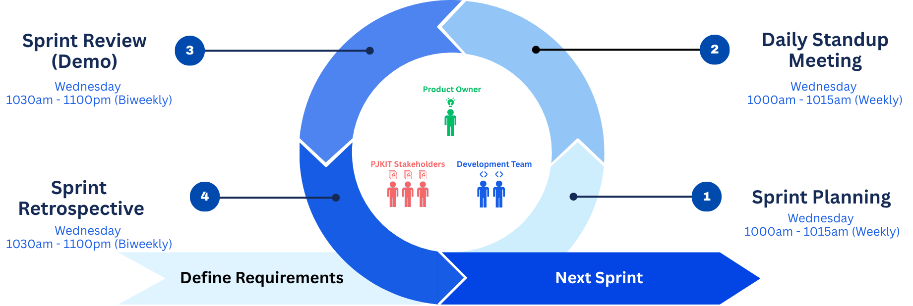

*The Agile SCRUM sprint cycle adopted with Netizen eXperience: four ceremonies — Sprint Planning and Daily Stand-up (weekly), Sprint Review/Demo and Sprint Retrospective (biweekly) — cycling around the Product Owner, PJKIT stakeholders, and Development Team, with requirements feeding in and each sprint delivering a demonstrable increment.*

Because this project's central risk is *modelling* risk — the danger that a real-world rule is translated into an incorrect integer constraint — the SCRUM cadence embeds an explicit **constraint-validation protocol**: each rule from the drafted constraint listing (Appendix A) is treated as a backlog item whose definition-of-done requires (i) the rule modelled and implemented against sample PJKIT data, (ii) the resulting behavior demonstrated at a biweekly demo, and (iii) sign-off relayed through the industry supervisor from PJKIT stakeholders that the demonstrated behavior matches the community's intent. This protocol is how research validity is maintained inside an agile process: no constraint is considered validated by implementation alone.

Agile SCRUM is chosen for three reasons specific to this project. First, the seating engine's requirements are refined progressively — the constraint listing gathered from PJKIT stakeholders is validated and corrected iteratively, and an incremental process allows each newly confirmed rule to be modelled, implemented, and demonstrated within one or two sprints rather than deferred to a distant milestone. Second, the collaboration itself demands regular synchronization: Netizen eXperience must confirm platform integration points and relay stakeholder feedback, and SCRUM's fixed ceremonies institutionalize that communication instead of leaving it ad hoc. Third, short iterations expose modelling errors early — when a demonstration against sample PJKIT data reveals that a constraint behaves incorrectly — at a point where correction is cheap.

### 3.2 Design and Architecture of the Software

The design is presented in two sections. The first is an overview sufficient for a business audience to understand and communicate what the software does; the second provides the in-depth technical design a software engineer requires to implement the system.

#### 3.2.1 Section A — System Overview (Business-Level Design)

**Use Case Diagram.** Figure 3.1 presents the use cases of the system for its two actors. The event organizer (admin) prepares participant data, configures constraints, generates and regenerates seating plans, reviews plan versions, and approves and publishes a selected version. The participant views their assigned seat and consults the seating map from the published plan. The seat allocation engine participates as a supporting system actor invoked during generation and regeneration.

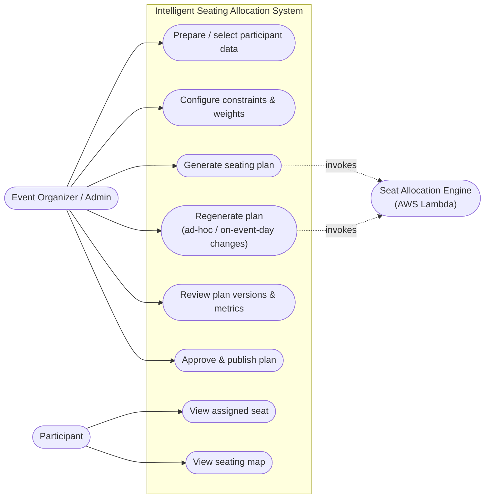

*Figure 3.1: Use case diagram of the proposed system.*

**High-Level User Flow.** Figure 3.2 shows how the two user roles move through the system across the lifecycle of one event, from data preparation to on-event-day lookup, including the regeneration loop triggered by data changes and ad-hoc registrations.

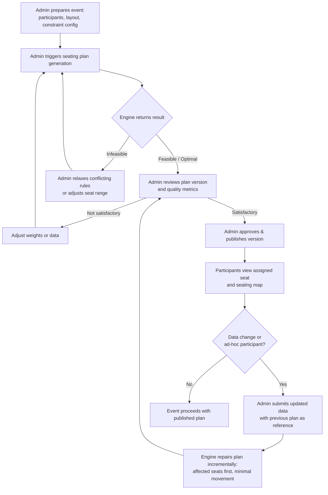

*Figure 3.2: High-level user flow across one event lifecycle.*

**Use-Case-Level System State Diagram.** Figure 3.3 describes the system's high-level process states across an allocation session, including cold start of the serverless engine, active solving, termination, and reload of a stored plan version.

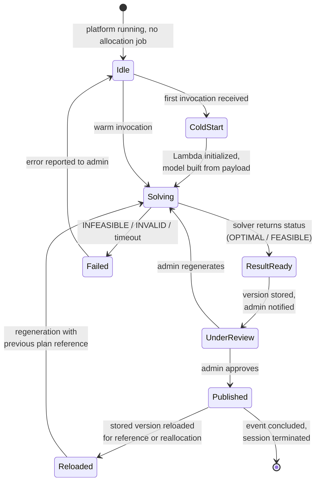

*Figure 3.3: Use-case-level state diagram of the allocation process (cold start, solving, review, publication, reload, termination).*

**Architecture / System Overview Diagram.** Figure 3.4 presents the deployment-level architecture as **four layers**. The **Users layer** holds the two actors — the Event Administrator / Organizer and the Event Participant. The **Application Layer** is the Netizen eXperience Event Management Platform (Admin Seating Allocation Dashboard, a Next.js server component holding the AWS SDK, and the Participant Seat Lookup Interface). The **Compute Layer** is AWS serverless, where an AWS Lambda function hosts the core seating allocation engine and its embedded Google OR-Tools CP-SAT solver. The **Data Layer** is AWS storage: Amazon DynamoDB (event, participant, and allocation metadata plus latest-approved seat references) and Amazon S3 (versioned seating-plan result JSON, retained for traceability). The primary flow begins with the **Event Administrator**: from the dashboard the organizer configures constraints and selects participant data; the Next.js server component invokes the Lambda with a JSON payload through the AWS SDK; the engine builds and solves the model and returns the optimal/feasible solution with its solver status; the seating-plan JSON flows back and is persisted to DynamoDB and S3. When a change occurs after publication, the server component re-invokes the Lambda with the updated payload *and the previous plan*, so the engine repairs rather than regenerates. The **Event Participant** never reaches the compute tier — the lookup interface requests participant-specific seating details from the server component, which serves the latest published details read from DynamoDB.

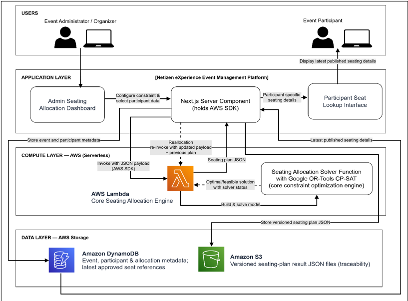

*Figure 3.4: System architecture and deployment overview.*

#### 3.2.2 Section B — Technical Design (Engineering-Level)

**Class Diagram.** Figure 3.5 defines the principal object classes of the system and their relationships. The design separates the domain model (event, participant, seat, seating layout), the constraint configuration (hard and weighted soft constraint definitions), the allocation artifacts (plan versions and individual assignments with quality metrics), and the engine-side model builder and solver wrapper.

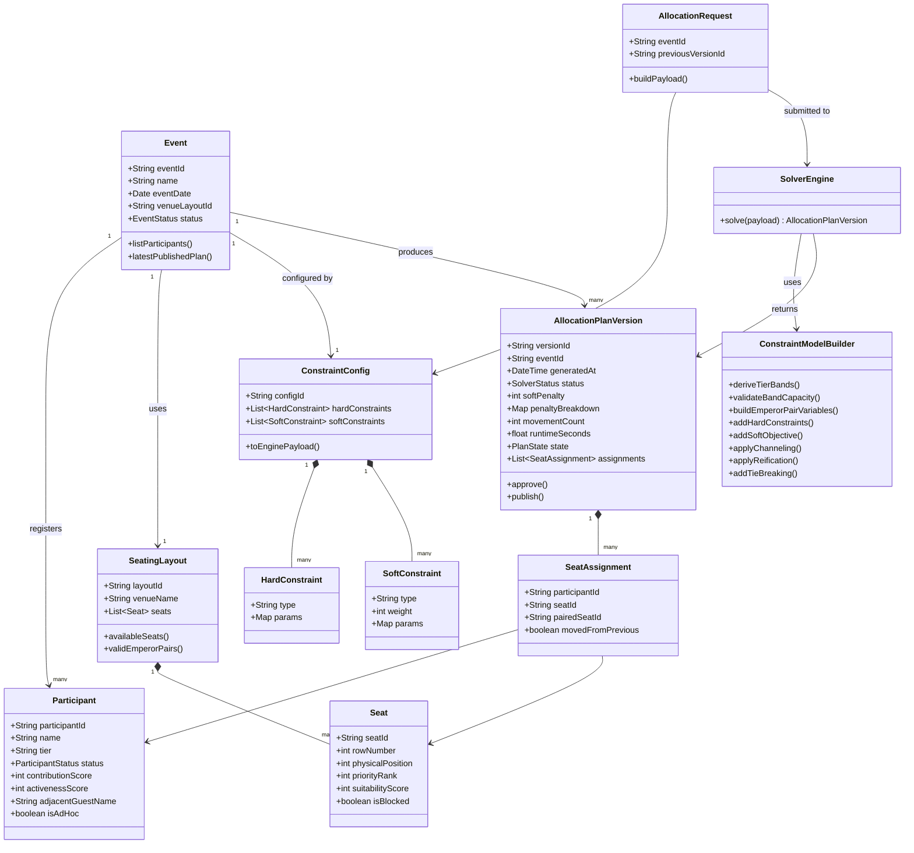

*Figure 3.5: Class diagram of the seating allocation system (tier, physical position, priority rank, Emperor pairing, and penalty breakdown made explicit).*

**Entity Relationship Diagram.** Figure 3.6 defines the persistent data structure. The ERD is a standalone design artifact — it does not alter the other diagrams — but it fixes the storage schema for events, participants, layouts, seats, constraint configurations, plan versions, and assignments, including the reference from a plan version to its predecessor that enables movement minimization during reallocation.

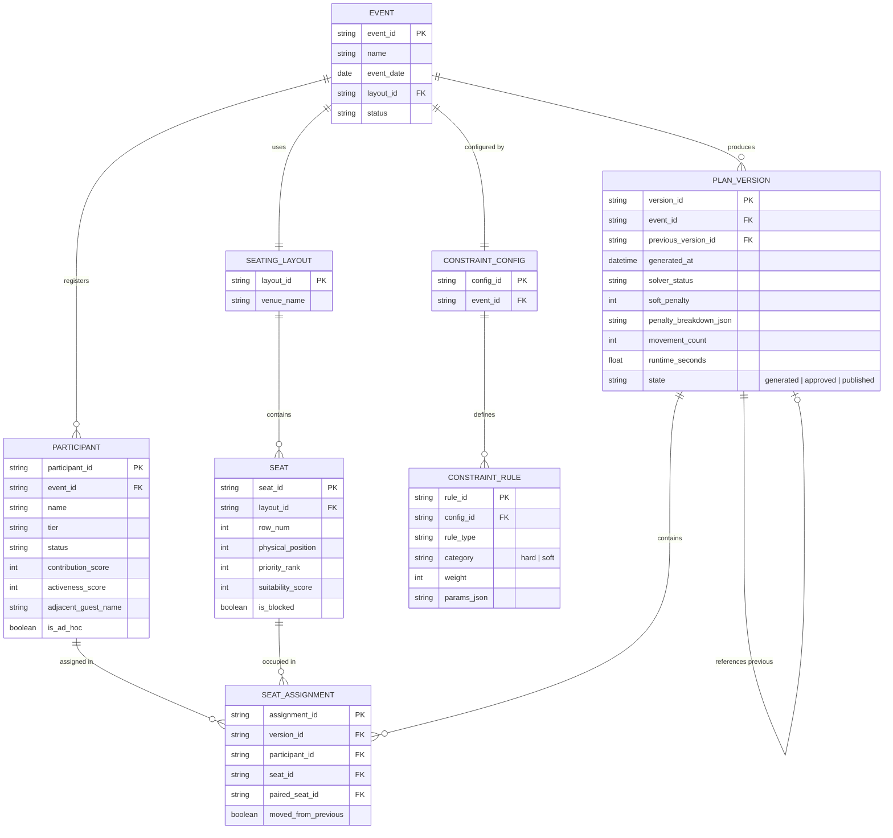

*Figure 3.6: Entity relationship diagram of the allocation data model.*

**Sequence Diagram.** Figure 3.7 traces the interaction for plan generation and publication, showing the change of state of the plan-version object as it passes from request through solving to review and publication, including the error path when the solver reports an infeasible model or exhausts its time budget.

```mermaid
sequenceDiagram
    actor Admin
    participant UI as Admin Module (Next.js)
    participant Svc as Service Component (AWS SDK)
    participant L as AWS Lambda (Python 3)
    participant CP as CP-SAT Solver (OR-Tools)
    participant DB as DynamoDB / S3
    actor P as Participant

    Admin->>UI: configure constraints, select participants
    Admin->>UI: click Generate Plan
    UI->>Svc: allocation request (event, config, previous version)
    Svc->>L: invoke(JSON payload)
    activate L
    L->>L: validate payload, derive tier bands &<br/>check band capacity
    L->>L: build constraint model<br/>(variables, hard rules, soft objective)
    L->>CP: solve(model, max_time_in_seconds)
    activate CP
    CP-->>L: solution + solver status
    deactivate CP
    alt status = OPTIMAL or FEASIBLE
        L-->>Svc: seating plan JSON + metrics
        Svc->>DB: store PLAN_VERSION (state = generated)
        Svc-->>UI: version ready
        UI-->>Admin: display plan + quality metrics
    else status = INFEASIBLE / UNKNOWN / timeout / invalid payload
        L-->>Svc: structured JSON error<br/>(status, conflicting-rule hints)
        Svc-->>UI: error result
        UI-->>Admin: report failure; suggest relaxing rules<br/>or adjusting seat range
    end
    deactivate L
    Admin->>UI: approve & publish
    UI->>Svc: publish(versionId)
    Svc->>DB: update state = published,<br/>set latest-published reference
    P->>UI: open seat lookup
    UI->>DB: fetch latest published assignment
    DB-->>UI: seat number + map reference
    UI-->>P: display assigned seat and seating map
```

*Figure 3.7: Sequence diagram for plan generation, publication, and participant lookup, with explicit failure path.*

**Function-Level State Diagram.** Figure 3.8 describes the state changes of a single allocation job inside the solver function, from payload validation through model construction and solving to the terminal statuses reported by CP-SAT.

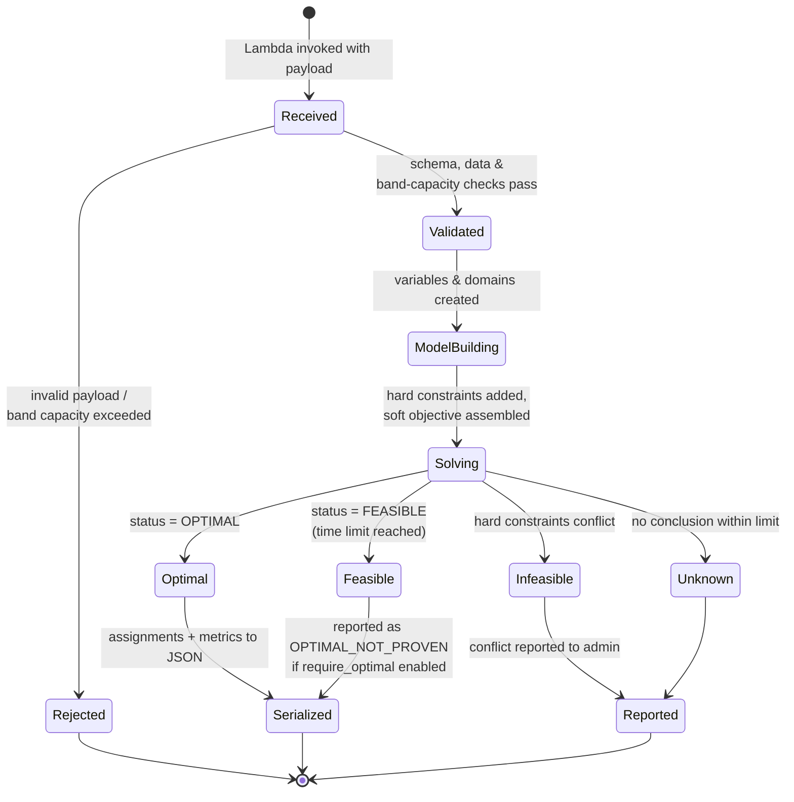

*Figure 3.8: Function-level state diagram of one allocation job.*

**Activity Diagram — Seating Plan Generation.** Figure 3.9 details the internal activity of the *Generate seating plan* use case, from payload validation through model construction and solving to independent validation and versioned storage. The diagram realizes three commitments made elsewhere in this report: the pre-model capacity check that rejects infeasible demand with a structured explanation before the solver is ever invoked (H0, Section 3.5); the construction of decision variables for eligible combinations only, so that out-of-zone, blocked, and aisle-straddling placements can never appear in any solution; and the standing rule that a plan is never reported optimal unless the solver proves it, with every accepted solution re-checked by the independent validator.

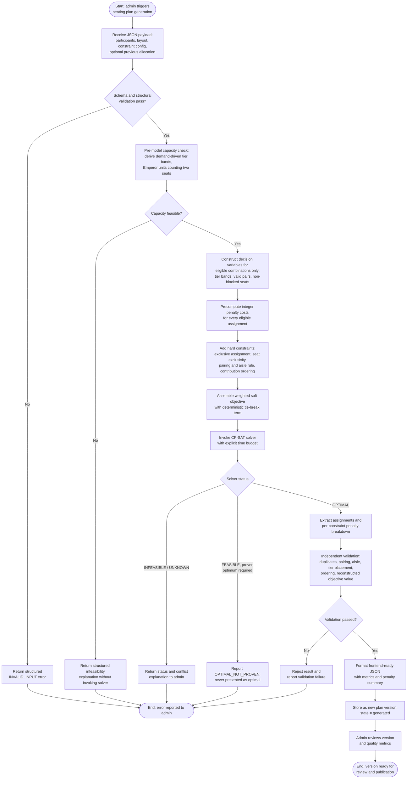

*Figure 3.9: Activity diagram of the seating plan generation use case, including pre-model capacity validation, eligibility-restricted model construction, solver-status handling, and independent validation.*

**Activity Diagram — Dynamic Reallocation.** Figure 3.10 details the internal activity of the dynamic reallocation workflow — the scope emphasis of this project — showing how ad-hoc participants and on-event-day changes are absorbed by local repair first, with progressive neighbourhood expansion and organizer-invoked full regeneration only as a fallback.

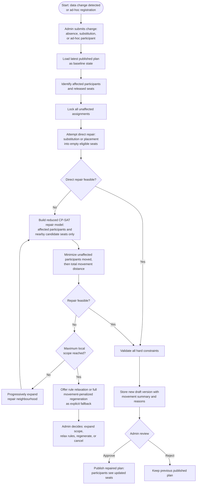

*Figure 3.10: Activity diagram of controlled dynamic reallocation as incremental repair with progressive neighbourhood expansion.*

### 3.3 Methods and Technologies Used for Seating Allocation

Table 3.1 lists the methods and technologies actually used in the development of the seating allocation system; only adopted items are included. Justification follows the table, together with an analysis of the deployment risks introduced by the serverless architecture and the data-protection obligations arising from processing real participant data.

**Table 3.1: Methods and Technologies Adopted**

| Method / Technology | Role in the Project |
|---|---|
| Constraint Programming (CP) with hard and weighted soft constraints | Core method: models event seating rules as a Constraint Optimization Problem. |
| Google OR-Tools CP-SAT solver | Solver executing the constraint model and reporting solution status. |
| Python 3 | Implementation language of the solver function. |
| AWS Lambda | Serverless deployment target of the solver function. |
| AWS SDK (from the Next.js service component) | Invocation channel passing JSON payloads to Lambda and receiving results. |
| Next.js / React (TypeScript) | Existing CSR platform frontend hosting the admin module and participant lookup. |
| Amazon DynamoDB and Amazon S3 | Persistence of allocation metadata and versioned seating-plan JSON respectively. |
| SST Framework | Infrastructure-as-code provisioning of Lambda, DynamoDB, and S3 resources. |
| GitHub Issues and Projects | Work tracking within the Netizen eXperience buddy repository under the SCRUM process. |

**Constraint Programming with hard and soft constraints** is used because the seating problem is defined by rules of two natures: rules that must never be violated and preferences that should be optimized. CP represents both natively — hard constraints restrict the feasible space, while weighted soft constraints enter the objective as penalties — allowing the same engine to guarantee validity and to grade quality (Schiex et al., 1995; Rossi et al., 2006). **Google OR-Tools CP-SAT** is used because it accepts integer decision variables, Boolean indicators, conditional (if-then) constraints through reification and channeling, and an optimization objective, and because it reports explicit solver statuses — optimal, feasible, infeasible, model invalid, unknown — that the system surfaces as part of allocation quality (Google, n.d.-a; Google, n.d.-b). Beyond the vendor documentation, the selection is grounded in the primary technical literature: CP-SAT's lazy-clause-generation architecture — constraint propagation with SAT-style conflict-driven clause learning (Stuckey, 2010), augmented with linear-programming relaxation bounds and a portfolio of parallel search workers (Perron & Didier, 2023) — is precisely the class of solver designed to prove optimality on integer models of this problem's scale, which bespoke if-else logic, greedy construction, or metaheuristics cannot do. **Python 3** is used as the solver-function language because OR-Tools offers first-class Python support and because Python's expressiveness suits rapid, testable constraint-model construction. **AWS Lambda** is used because the engine executes on demand — only when an administrator generates or regenerates a plan — so a serverless function avoids maintaining an always-on API server, scales automatically, and processes JSON event payloads natively (Amazon Web Services, n.d.-a); the **AWS SDK** provides the documented invocation path from the existing platform's Next.js service component with payload delivery and result retrieval (Amazon Web Services, n.d.-b). **DynamoDB and S3** are used for persistence consistent with the collaborator's platform: DynamoDB holds event, participant, and allocation metadata including the latest-published reference consulted by the participant lookup, while S3 stores each generated seating plan as a versioned JSON document supporting traceability and reallocation referencing. **SST** provisions these resources as code, keeping the FYP's infrastructure reproducible inside the collaborator's environment. **GitHub Issues and Projects** operationalize the SCRUM tracking described in Section 3.1.

**Serverless deployment risks and mitigations.** Adopting AWS Lambda introduces four material constraints that the methodology addresses explicitly rather than discovering at integration time. *(i) Execution time ceiling.* Lambda enforces a hard maximum execution duration (15 minutes), and interactive use — particularly on-event-day regeneration — demands responses far faster than that. The solver is therefore always invoked with an explicit `max_time_in_seconds` budget (default 60 seconds for the target problem scale, tuned during evaluation), set well inside both the Lambda timeout and the platform's request expectations. When the budget expires before optimality is proven, CP-SAT returns FEASIBLE rather than OPTIMAL; under the project's standing rule, such a result is reported as `OPTIMAL_NOT_PROVEN` when the organizer has required a proven optimum, and never presented as optimal. *(ii) Cold-start latency.* The OR-Tools native library adds tens of megabytes to the deployment artifact, lengthening cold starts. Cold-start duration is measured empirically during the proof-of-concept phase; if it materially affects the on-event-day workflow, mitigations in order of preference are container-image packaging, provisioned concurrency for the event-day window, and a lightweight warm-up ping from the admin module. *(iii) Payload limits.* Synchronous Lambda invocation caps request and response payloads (6 MB); at the target scale (≈200 participants) plan JSON remains far below this, but the design routes any oversized artifact through S3 with the invocation carrying object references, so the architecture does not silently break at larger scales. *(iv) Memory sizing.* CP-SAT's presolve and portfolio workers benefit from memory and vCPU allocation, which in Lambda scale together; the memory setting is treated as a tunable benchmarked in Section 3.6 rather than a default accepted blindly.

**Data protection.** The system processes personal data of real community members — names, contribution and activeness scores, and statuses — bringing it within the scope of Malaysia's Personal Data Protection Act 2010. Three design commitments follow. First, *data minimization at the engine boundary*: the allocation payload sent to Lambda carries pseudonymous participant identifiers and the numeric attributes required by the constraints; display names remain in the host platform and are joined to results only at presentation time. Second, *access control and version isolation*: participant lookup exposes to each participant only their own assignment from the latest *published* version — unpublished draft versions are never visible outside the admin module — and administrative access rides on the host platform's existing authentication. Third, *retention*: versioned plan documents in S3 are retained for the traceability window agreed with the collaborator and the organizer, aligned with the event lifecycle rather than indefinitely. These commitments are recorded here as methodology because they constrain the payload schema and storage design, not merely operations.

### 3.4 Seating Allocation Optimization Lifecycle

The proposed seating allocation engine follows a structured optimization lifecycle that explains how human-readable seating rules are transformed into a generated, validated seating plan. The lifecycle comprises six steps, shown in Figure 3.11. The first three steps are methodology-time activities carried out during requirement engineering and design under the constraint-validation protocol of Section 3.1 — each newly confirmed or corrected rule re-enters the lifecycle at step 1 — while the last three execute inside the engine on every generation run.

The first step is **constraint listing**. Raw business rules are collected from the event context through the stakeholder discussions, site observation, and historical-layout analysis described in Section 3.7. Examples from the PJKIT case study include: each participant receives exactly one allocation unit, blocked seats must never be assigned, an Emperor registration occupies one of the venue's valid within-row seat pairs and never straddles the centre aisle, tiers are seated in contiguous demand-derived bands ordered Emperor → Merit → Bodhi with shared boundary rows and no empty numbered seat, and participants with higher contribution or priority should receive more suitable seats. The working listing is maintained in Appendix A.

The second step is **constraint mapping**. This step acts as the bridge between human rules and programmable logic. Each listed rule is classified as either a hard constraint or a weighted soft constraint, and the participant and seat data fields it requires are identified — for participants, fields such as `contribution_tier`, `contribution_amount_rm`, `participant_category`, `requires_accessible_seat`, `events_joined_last_2_years`, and `previous_seat_ids`; for seats, fields such as `row_number`, `physical_position`, `priority_rank`, `zone`, `is_accessible`, and `is_blocked`. The mapping step also decides the modelling strategy used for each rule, drawing on the techniques of Section 2.3: structural domain reduction (creating decision variables only for eligible combinations), exact per-row equalities, integer penalty scoring, reification, or channeling.

The third step is **mathematical formulation**. The mapped rules are converted into decision variables, integer constraints, Boolean indicators, and an objective function. Because CP-SAT accepts only integer models, every cost is computed or scaled as an integer, each soft-constraint component is normalized to a common 0–100 range by its theoretical maximum so the configured weights compare like for like, and the objective combines the weighted normalized penalties with a deterministic tie-breaking term that can never override them. The resulting formal model is stated in Section 3.5 and maintained as the machine-readable document `docs/mathematical_model.json`.

The fourth step is **pre-model validation and solver execution**. Before any solving, the engine validates the payload against its JSON Schemas, checks total seat demand against assignable capacity, and derives the demand-driven tier bands, rejecting impossible inputs with structured error documents without ever invoking the solver. For valid inputs the CP-SAT model is built over eligible combinations only and solved within an explicit time budget; the solver returns an explicit status, and only a proven OPTIMAL result is accepted as success when a proven optimum is required.

The fifth step is **evaluation, independent validation, and review**. The numerical solution is converted back into human-readable seating information, and an independent validation module — working purely from the serialized output, never from solver internals — re-checks every hard rule: duplicate seats, Emperor pairing and aisle compliance, band placement, exclusivity, and derivation, contribution ordering, accessibility, blocked seats, and reconstruction of the reported objective value. The result is evaluated through indicators comprising solver status, hard-constraint satisfaction, total weighted soft-constraint penalty with its per-constraint breakdown, movement count, and runtime.

The final step is **production output**. The generated seating plan is returned as structured, frontend-friendly JSON — for both success and error outcomes — which is then used to render seating maps, support admin review, store generated versions, and display the latest approved seat assignment to participants.

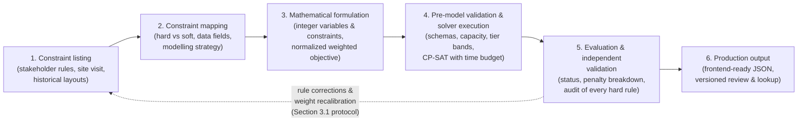

*Figure 3.11: The seating allocation optimization lifecycle, from rule collection to production output, with the stakeholder feedback loop of the constraint-validation protocol.*

### 3.5 Preliminary Mathematical Formulation of the Seating COP

This section states a preliminary formal model of the seating allocation problem, to be elaborated into the full machine-readable model document (`docs/mathematical_model.json`) as a named FYP deliverable. The formulation makes precise the constraints described in prose in Sections 1.4.4 and 2.3, and demonstrates that the PJKIT rules are expressible as an integer constraint model of the kind CP-SAT accepts.

**Sets and parameters.**

- $P = P_E \cup P_M \cup P_B$: the participants, partitioned by tier into Emperor, Merit, and Bodhi; in the default scenario $|P_E|=86$, $|P_M|=24$, $|P_B|=12$.
- $S$: the seats of the 16×16 layout (256 seats). Each seat $s$ has a row $r(s) \in \{1,\dots,16\}$, a physical position $\mathit{pos}(s) \in \{1,\dots,16\}$, a priority rank $\mathit{rank}(s)$ following the mirrored centre-out pattern in which the seat immediately right (east) of the aisle ranks best and the right seat outranks its mirrored left seat at every distance step, and a blocked flag. The venue carries a structural blocked block of 24 seats in the centre of rows 6–9 (rows 6 and 8: positions 5–12; rows 7 and 9: positions 5–6 and 11–12), observed identically in the community's 2023 and 2024 layouts, leaving 232 assignable seats. Physical position and priority rank are distinct attributes and are never interchanged.
- $Q \subset S \times S$: the valid Emperor seat pairs — within-row adjacent position pairs $(1,2), (3,4), \dots, (15,16)$ over every row, excluding pairs containing a blocked seat; the pair $(8,9)$ is structurally excluded because the centre aisle separates positions 8 and 9. Each valid pair carries a pair priority, centre-out east first: $(9,10)$ highest, then $(7,8)$, $(11,12)$, $(5,6)$, $(13,14)$, $(3,4)$, $(15,16)$, $(1,2)$.
- $\mathit{band}(t)$: the contiguous block of rows occupied by tier $t$, derived from demand before model construction — rows are consumed front to back in tier precedence order Emperor → Merit → Bodhi (the Emperor tier by valid-pair capacity, the single-seat tiers by non-blocked seat capacity), and a boundary row may be shared between two adjacent tiers so the numbered section is packed with no empty seat (the remaining assignable rows form the free-seating section, which is not modelled). Illustrative default: Emperor rows 1–13, Merit rows 13–14, Bodhi rows 14–15, with free seating behind. Bands are recomputed for every event's demand; they are not fixed venue zones.
- For each participant $p$: contribution score $c(p)$, activeness score $a(p)$, eligibility status, accessibility requirement, and — during reallocation — the previous seat $\mathit{prev}(p)$ (null when no previous allocation exists).

**Decision variables.** Variables are created only for eligible combinations, which encodes several hard rules by construction:

- $x_{p,s} \in \{0,1\}$ for each Bodhi/Merit participant $p$ and each non-blocked seat $s$ with $r(s) \in \mathit{band}(t(p))$: 1 iff $p$ is assigned seat $s$.
- $y_{e,q} \in \{0,1\}$ for each Emperor participant $e$ and each valid pair $q \in Q$ whose two seats are non-blocked and whose row lies in $\mathit{band}(\text{Emperor})$: 1 iff $e$'s two-seat unit is assigned pair $q$.

Blocked seats, out-of-band placements (hence band-ordering violations), ineligible statuses, non-side placements for accessibility-requiring participants, and aisle-straddling pairs therefore have *no corresponding variable* and can never appear in any solution.

**Hard constraints.**

- (H1) Each Bodhi/Merit participant occupies exactly one seat: $\sum_{s} x_{p,s} = 1$ for all $p \in P_B \cup P_M$.
- (H2) Each Emperor participant occupies exactly one valid pair: $\sum_{q} y_{e,q} = 1$ for all $e \in P_E$.
- (H3) Each seat has at most one occupant, counting both seats of every assigned pair: $\sum_{p} x_{p,s} + \sum_{e}\sum_{q \ni s} y_{e,q} \le 1$ for all $s \in S$.
- (H4) Within-tier contribution ordering: defining the integer row variable $\rho_p = \sum_s r(s)\, x_{p,s}$ (and analogously over pairs for Emperor participants), for every same-tier pair $p, p'$ with $c(p) > c(p')$: $\rho_p \le \rho_{p'}$.
- (H5, structural) Tier-band placement: every allocation lies inside its tier's demand-derived band, so every Emperor row precedes the first Merit row and every Merit row precedes the first Bodhi row; a boundary row may host the tail of one tier and the head of the next, so the numbered section packs with no empty seat; enforced by variable construction over $\mathit{band}(t)$.
- (H6, configurable) Front-to-back packing: within the numbered section, rows fill front to back with no empty seat; since demand is known, each row's unit count is fixed and encoded as an exact per-row equality. Centre-out fill: on each side of each row the occupied seats form one contiguous block starting at the aisle, encoded as monotone occupancy inequalities outward from the aisle over physical positions. Both rules are derived from the historical layouts and remain configurable pending stakeholder sign-off.
- (H0, pre-model validation) Capacity is checked before model construction — total registered seat demand (Emperor units counting two seats) against the 232 assignable seats, then the fit of the demand-derived bands within the hall's rows including per-band side-seat capacity for accessibility needs; a violation is returned as a structured infeasibility explanation without invoking the solver.

**Objective.** Minimize the weighted sum of integer soft-constraint penalties:

$$\min \; w_1 \cdot \mathit{Pen}_{\text{priority}} + w_2 \cdot \mathit{Pen}_{\text{activeness}} + w_3 \cdot \mathit{Pen}_{\text{zone}} + w_4 \cdot \mathit{Pen}_{\text{move}} + \varepsilon \cdot T$$

where $\mathit{Pen}_{\text{priority}}$ accumulates the mismatch between each participant's contribution rank and the priority rank of the assigned seat (or pair); $\mathit{Pen}_{\text{zone}}$ accumulates configurable category-to-zone suitability costs; $\mathit{Pen}_{\text{move}}$ counts reified movement indicators $m_p = 1 \iff$ the assigned seat differs from $\mathit{prev}(p)$, and is identically zero when no previous allocation exists; and $T$ is a deterministic tie-breaking term with its coefficient $\varepsilon$ scaled such that $\varepsilon \cdot T_{\max}$ is strictly smaller than one unit of the smallest weighted penalty, guaranteeing that tie-breaking selects among optima but never trades away objective value. Because the four raw penalty components live on incomparable natural scales (movement distances reach several hundred while rank mismatches top out near fifteen), each component is first *normalized* to the integer range 0–100 by its theoretical maximum — computed with integer round-half-up arithmetic — before the weights are applied, so the configured weights compare like for like; both the raw and normalized values are reported in the output for auditability. All weights $w_k$, penalty coefficients, normalized costs, and $\varepsilon$-scaled terms are integers, as CP-SAT requires. Every extracted solution is additionally re-validated by an independent checker (duplicate seats, pairing validity, aisle rule, band placement and derivation, contribution ordering, side-of-hall accessibility, blocked seats, and reconstruction of the reported objective value) before it is accepted.

**Reallocation as a reduced repair model.** For Objective 2, the same formulation is instantiated in restricted form rather than re-solved globally. The published plan supplies the baseline: unaffected participants' assignments are fixed at $\mathit{prev}(p)$ — equivalently, their decision variables are eliminated and their seats removed from other participants' domains — and variables are created only for the affected participants and the candidate seats of the current repair neighbourhood. The objective hierarchy is re-weighted for stability: the penalty for moving an unaffected participant drawn into the repair strictly dominates every ordinary preference term, followed by total movement distance, and only then by the seating-preference penalties of the full model. Because far fewer variables are created — a handful of participants and candidate seats rather than the full event — the repair solve is substantially smaller and faster than initial generation, which matters for on-event-day use. If the restricted model is infeasible, the neighbourhood is expanded progressively (same row, then adjacent rows, then the same tier band); the movement-penalized full model above remains the terminal, organizer-invoked fallback, so incremental repair inherits the full model's guarantees whenever escalation reaches it.

### 3.6 Evaluation Methodology

This section defines how the system's success will be measured, connecting each objective from Section 1.3 to metrics, datasets, baselines, a run protocol, and explicit success criteria. The evaluation design exists now — during planning — so that the engine is built against falsifiable targets rather than evaluated ad hoc after the fact.

**Datasets.** *(a) Deterministic synthetic dataset:* a generated set of exactly 122 participant profiles (86 Emperor, 12 Bodhi, 24 Merit — mirroring the Emperor-dominated composition of the real 2024 event) with contribution scores, activeness scores, and statuses produced from a fixed random seed, together with the generated 16×16 floor plan carrying the venue's seat-priority pattern and structural blocked centre block — fully reproducible by any assessor. *(b) Change-scenario fixtures:* derived variants of the synthetic dataset representing reallocation triggers — the addition of 1, 5, and 10 ad-hoc participants; withdrawals; and substitutions — each paired with a previously "published" allocation to serve as the movement reference. *(c) Real event data:* anonymized PJKIT participant data obtained through the collaborator for final validation, subject to the data-protection commitments of Section 3.3.

**Baselines.** Three automated baselines will be implemented for comparison during the evaluation phase (FYP 2, per the schedule in Section 4.3): random allocation, first-come-first-served (registration order), and greedy priority-based allocation (participants sorted by contribution, each assigned the best available rule-eligible seat). Manual allocation is treated as a qualitative baseline via the organizer's historical plans where available. The genetic-algorithm approach remains a literature benchmark outside the implementation scope (Section 2.4).

**Metrics.** For every generated plan: (1) solver status (OPTIMAL / FEASIBLE / INFEASIBLE / UNKNOWN, with FEASIBLE reported as OPTIMAL_NOT_PROVEN when a proven optimum was required); (2) hard-constraint satisfaction, established not by trusting the solver but by the *independent validation module* re-checking duplicates, Emperor pairing and aisle compliance, band placement, exclusivity, and derivation, contribution ordering, accessibility, blocked seats, and the reconstructed objective value; (3) total weighted soft penalty *and its per-constraint breakdown*; (4) in reallocation scenarios, the number of unaffected participants moved (the primary disruption measure), the movement count and total movement distance relative to the reference plan, and whether the change was absorbed without full regeneration; (5) wall-clock runtime measured with a monotonic high-resolution timer, plus CP-SAT's own solver statistics; and (6) peak memory where instrumentation is available. No metric is ever reported from a placeholder — every figure in the evaluation derives from an actual executed run.

**Protocol.** Each configuration is executed as a **10-run benchmark** with deterministic seeds, reporting mean and standard deviation of runtime and confirming that solution quality is identical across runs (as determinism requires). Baselines run on identical inputs. Reallocation scenarios are evaluated three ways per fixture: with the incremental repair mechanism (locked baseline, reduced model, progressive expansion); with a movement-penalized full re-solve; and with the movement penalty disabled (a from-scratch re-solve). This three-way comparison measures directly, rather than asserts, both the movement reduction attributable to the penalized objective and the additional stability and runtime gains attributable to incremental repair — the empirical counterpart of the arguments made in Sections 1.4.5 and 2.1.

**Success criteria per objective.**

- **Objective 1 (allocation engine):** on the default 122-participant scenario, the engine returns status OPTIMAL within the 60-second solver budget; the independent validator confirms zero hard-constraint violations, a numbered section of exactly 208 seats packed with no empty seat (the remaining 24 assignable seats being free seating), valid Emperor pairs only, and correct band and ordering placement; and the engine's weighted soft penalty is strictly lower than that of every automated baseline in all 10 runs once the baselines are implemented in the evaluation phase.
- **Objective 2 (dynamic reallocation):** in every change-scenario fixture, the change is accommodated — all ad-hoc and replacement participants receive valid seats — with zero hard-constraint violations confirmed by the independent validator; the number of unaffected participants moved under incremental repair is no greater than under the movement-penalized full re-solve, and both are strictly lower than under the non-penalized re-solve; in the single-ad-hoc scenario no more than 10% of unaffected participants are moved, with zero moved when a direct placement exists (targets to be confirmed with stakeholders during validation); the repair runtime is lower than the full re-solve runtime; and the proportion of fixtures resolved without falling back to full regeneration is reported as the full-regeneration avoidance rate.
- **Objective 3 (participant lookup):** functional tests confirm that every participant's lookup returns the correct seat from the latest *published* version for 100% of participants, and that no unpublished version is ever exposed through the participant route.

**Threats to validity.** Construct validity is addressed by the stakeholder constraint-validation protocol (Section 3.1) — the metrics measure the community's actual rules only if the modelled constraints do. Internal validity is protected by the independent validator and deterministic seeds. External validity is limited by the single case study; the configurable constraint layer is the designed mitigation, and generalization to other organizers is explicitly future work.

### 3.7 Preliminary Works

Several preliminary activities have been completed during the planning phase, establishing the requirement base and de-risking the core engine.

**Requirement engineering with the collaborator and stakeholders.** A series of discussions was held with the industry supervisor (Netizen eXperience Tech Lead) to define and bound the FYP scope, confirming the division between the core engine contribution and the supporting platform modules. Through the supervisor as intermediary, requirement-gathering discussions were conducted with PJKIT stakeholders covering the current seating workflow, the participant attributes that drive seating decisions — including the Emperor/Bodhi/Merit tier structure, the two-seat nature of Emperor registrations, and the contribution-ordering expectation — and the event-day change scenarios (absences, substitutions, and ad-hoc registrations) that the reallocation module must absorb.

**Site visit and physical observation.** A site visit to PJKIT was conducted to observe the venue and the current manual workflow for preparing the seating map. The observation confirmed the seating layout structure — 16 rows of 16 seats, the centre aisle between positions 8 and 9, and blocked areas — the use of printed seating charts and lists as the participant-facing channel, and the practical friction points at the venue that motivate Problem Statement 3.

**Analysis of historical seating layouts.** The organizer's actual seating charts for the 2023 and 2024 events were obtained and analysed cell by cell. The analysis established, from primary data rather than testimony alone: the 16×16 seat grid with the centre aisle between positions 8 and 9; the recurring structural blocked block in the centre of rows 6–9 (24 seats, identical in both years); the Emperor-majority composition of recent events (87 merged-pair units in 2024); the display convention in which an Emperor pair with no guest name is shown as one merged cell carrying the primary participant's name while a pair with a named guest shows two names; and the community's practice of packing every row outward from the centre aisle and filling rows front to back with no empty seat — the direct evidence base for the front-to-back packing and centre-out fill structural rules and for the demand-derived tier-band model (ordered Emperor → Merit → Bodhi, with shared boundary rows).

**Constraint listing draft.** Based on the stakeholder discussions, site observation, and historical-layout analysis, a draft constraint listing was produced, cataloguing candidate rules in plain language and classifying each as a prospective hard constraint or weighted soft constraint (Appendix A). The listing now includes the PJKIT-specific structural rules — Emperor two-seat pairing with the aisle exclusion, demand-derived tier-band placement (ordered Emperor → Merit → Bodhi, with shared boundary rows) and pre-model capacity validation, within-tier contribution ordering, side-of-hall accessibility placement, and the front-to-back packing and centre-out fill rules derived from the historical layouts (which superseded two soft-rule candidates initially adopted from the spectator-allocation literature; Muñoz et al., 2005) — alongside the generic validity and preference rules. This draft is the working input to the constraint-mapping and mathematical-formulation stages of the engine lifecycle (Section 3.4) and is being validated iteratively with the collaborator under the SCRUM cadence and the constraint-validation protocol of Section 3.1.

**Platform repository access.** Access to the Netizen eXperience event-management platform repository (the buddy repository) has been granted, enabling study of the existing codebase, service-component structure, and integration points in preparation for the integration phase, and hosting the GitHub Issues and Project board used for work tracking.

**Proof-of-concept development.** Based on the drafted constraint logic, development of a proof-of-concept (PoC) solver has commenced. The PoC implements an initial subset of the drafted constraints in Python 3 with OR-Tools CP-SAT over sample participant and layout data, with the purpose of validating that the drafted rules — including the Emperor pair variables and the band-eligibility variable construction of Section 3.5 — can be expressed as integer constraint models and that the solver returns interpretable statuses and assignments. The PoC also serves as the measurement vehicle for the Lambda cold-start and memory-sizing questions raised in Section 3.3. Lessons from the PoC feed directly into the full engine design presented in Section 3.2 and the formulation in Section 3.5.

---

## Chapter 4: Conclusion and Future Work

### 4.1 Conclusion

This report has presented the planning-phase work of a Final Year Project that addresses a genuine and recurring operational problem: the manual allocation of seats for large-scale assembly events. The background established that seating allocation is a multi-criteria combinatorial problem whose solution space grows explosively with participant numbers, and that the case-study organization, PJ Kwan Inn Teng, currently manages events of 100–200 participants — in a 256-seat venue (232 assignable after its structural blocked centre block) governed by demand-derived tier bands, two-seat Emperor allocation units, an aisle that breaks adjacency, and contribution-ordering rules — using spreadsheets, printed charts, and PDF listings. The pain points are concrete: manual allocation is slow and inconsistent between allocators and cannot be objectively justified against the community's own priority rules; late data changes and ad-hoc registrations force disruptive, error-prone rework of nearly finished plans; and participants queue at the venue to retrieve seats from printed lists that may already be outdated. Without the research and development undertaken in this project, these consequences persist and worsen as event attendance grows.

The contribution of this project is a configurable, constraint-based seating allocation system whose core is a solver engine that models real event rules — including the case study's distinctive two-seat pairing, aisle, demand-derived tier-band, and ordering rules formalized in Section 3.5 — as a Constraint Optimization Problem solved by Google OR-Tools CP-SAT and deployed as a Python 3 function on AWS Lambda, invoked with JSON payloads from the Netizen eXperience CSR platform. Around this engine, the system provides organizer-controlled generation, versioned review and publishing, configurable rules over PJKIT's domain attributes, controlled dynamic reallocation that incrementally repairs the published plan — seating ad-hoc participants while leaving unaffected participants in place wherever possible — and a participant-facing lookup of the latest published seat. The literature review demonstrated that neither commercial tooling nor the published seating-allocation literature offers this combination — exact, declaratively configurable, status-reporting, and stability-aware — and the methodology chapter set out the Agile SCRUM working arrangement with its constraint-validation protocol, the business-level and technical designs, the justified technology selections with their deployment-risk and data-protection analyses, a preliminary mathematical formulation, a falsifiable evaluation methodology with baselines and per-objective success criteria, and the preliminary work that grounds the plan in verified reality.

The expected outcomes are correspondingly twofold. For the seating engine: a working Lambda-based allocation service returning rule-consistent, priority-aware plans as structured JSON, with configurable constraints and measurable quality indicators — solver status, independently validated hard-constraint satisfaction, soft-constraint penalty with per-constraint breakdown, movement count, and runtime — evaluated against defined baselines under a 10-run benchmark protocol. For the integration: the engine operating within the collaborator's CSR platform through an admin seat-allocation dashboard and a public participant lookup, ready for PJKIT to use in a real event. Together these outcomes deliver practical value to the organizer — faster, consistent, justifiable seating — and academic value through the applied modelling and evaluated solution of a real-world combinatorial problem as a constraint optimization task.

### 4.2 Future Work

The work following this report proceeds along the roadmap already validated with the collaborator. For the remainder of FYP 1, the focus is the finalization of the requirement specification, validation of the drafted constraints (including the fill rules derived from the historical layouts) against the PJKIT business use case, and elaboration of the preliminary formulation in Section 3.5 into the complete machine-readable model document. In FYP 2, the first half concentrates on development of the CP-SAT solver-function prototype, the incremental reallocation module — a reduced repair model over the affected participants and a bounded seat neighbourhood, with progressive expansion and the movement-penalized full re-solve retained as fallback and comparison baseline — and deployment of the solver function to AWS Lambda with cold-start and memory benchmarking; the second half concentrates on integration with the Netizen eXperience CSR platform through the admin seat-allocation dashboard and the public-facing participant lookup, followed by execution of the evaluation methodology of Section 3.6 — baseline comparison, the 10-run benchmark, reallocation-scenario measurement, and validation on real event data. Beyond the FYP timeline, identified extensions include evaluation against a genetic-algorithm benchmark, richer venue layouts, and generalization of the constraint configuration to other organizers on the platform.

### 4.3 Project Timeline (Gantt Chart)

The complete 28-week schedule spanning FYP 1 (Weeks 1–14) and FYP 2 (Weeks 15–28) is presented in Figure 4.1. Consistent with the Agile SCRUM methodology of Section 3.1, the schedule is expressed as **time-boxed two-week sprints** rather than long, phase-gated task bars: each sprint carries a goal and closes with a demonstrable increment reviewed at the biweekly demo, and requirements are refined continuously across sprints. The two academic checkpoints (FYP 1 presentation, FYP 2 submission) remain fixed milestones.

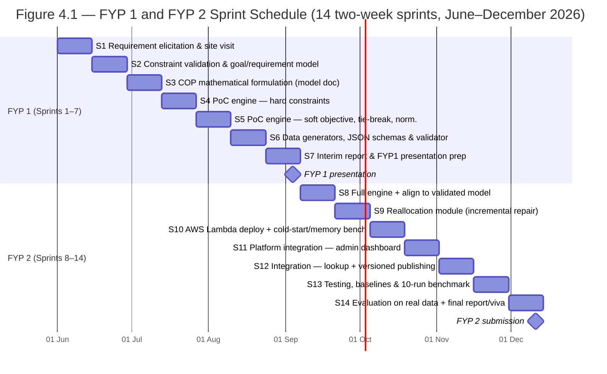

*Figure 4.1: Sprint-based project schedule aligned to the Agile SCRUM methodology (14 two-week sprints; calendar dates indicative, sprint numbering authoritative). Sprint 8 includes aligning the prototype to the validated model of Appendix A.*

---

## References

Amazon Web Services. (n.d.-a). *What is AWS Lambda?* AWS Documentation. Retrieved June 2026, from https://docs.aws.amazon.com/lambda/latest/dg/welcome.html

Amazon Web Services. (n.d.-b). *Invoke — AWS Lambda API reference*. AWS Documentation. Retrieved June 2026, from https://docs.aws.amazon.com/lambda/latest/api/API_Invoke.html

Cvent. (n.d.). *Event diagramming and seating*. Retrieved June 2026, from https://www.cvent.com

Google. (n.d.-a). *CP-SAT solver*. Google for Developers — OR-Tools. Retrieved June 2026, from https://developers.google.com/optimization/cp/cp_solver

Google. (n.d.-b). *Channeling constraints*. Google for Developers — OR-Tools. Retrieved June 2026, from https://developers.google.com/optimization/cp/channeling

Hoang, K. D. (2022). *Dynamic continuous distributed constraint optimization problems* [Doctoral dissertation, Washington University in St. Louis].

Ipsen, A., Cashmore, M., Fielding, K., Marchesotti, N., Zehtabi, P., Magazzeni, D., & Veloso, M. (2026). *Beyond manual planning: Seating allocation for large organizations*. arXiv:2602.05875. https://arxiv.org/abs/2602.05875

Muñoz, V., Montaner, M., & López, B. (2005). *Seat allocation for massive events based on region growing techniques*. Universitat de Girona.

Oryx Digital Ltd. (n.d.). *Using a genetic algorithm for table seating*. PerfectTablePlan. Retrieved June 2026, from https://www.perfecttableplan.com

Perron, L., & Didier, F. (2023). The CP-SAT-LP solver (invited talk). In *Proceedings of the 29th International Conference on Principles and Practice of Constraint Programming (CP 2023)* (Article 3). Schloss Dagstuhl – Leibniz-Zentrum für Informatik. https://doi.org/10.4230/LIPIcs.CP.2023.3

Rossi, F., van Beek, P., & Walsh, T. (Eds.). (2006). *Handbook of constraint programming*. Elsevier.

Schiex, T., Fargier, H., & Verfaillie, G. (1995). Valued constraint satisfaction problems: Hard and easy problems. In *Proceedings of the 14th International Joint Conference on Artificial Intelligence (IJCAI-95)* (pp. 631–639). Morgan Kaufmann.

Schwaber, K., & Sutherland, J. (2020). *The Scrum guide: The definitive guide to Scrum — The rules of the game*. Scrum.org. https://scrumguides.org

Stuckey, P. J. (2010). Lazy clause generation: Combining the power of SAT and CP (and MIP?) solving. In A. Lodi, M. Milano, & P. Toth (Eds.), *Integration of AI and OR techniques in constraint programming for combinatorial optimization problems* (CPAIOR 2010, LNCS 6140, pp. 5–9). Springer. https://doi.org/10.1007/978-3-642-13520-0_3

Sun, S. (2020). Mathematical model of seat arrangement in large gymnasium. *IOP Conference Series: Materials Science and Engineering*, *806*, 012013. https://doi.org/10.1088/1757-899X/806/1/012013

WeddingWire. (n.d.). *Seating chart tool*. Retrieved June 2026, from https://www.weddingwire.com

Williams, H. P. (2013). *Model building in mathematical programming* (5th ed.). Wiley.

Zola. (n.d.). *Wedding seating chart maker*. Retrieved June 2026, from https://www.zola.com

> *Note: Verify each URL and access date against the sources actually consulted before submission, and complete any missing publication details required by APA 7. The Ipsen et al. (2026) arXiv identifier and date reflect the metadata on the retrieved preprint; confirm the final published version before the final report.*

---

## Appendices

### Appendix A: Draft Constraint Listing (Planning-Phase Working Draft)

The following listing records the rules gathered from PJKIT stakeholder discussions, site observation, and the analysis of the organizer's 2023 and 2024 seating charts, in plain language with their prospective classification. Rules C10–C14 record the case-study-specific structural rules; C15–C16 are structural packing rules derived from the historical layouts (superseding two soft-rule candidates initially adopted from the spectator-allocation literature, Muñoz et al., 2005, which the layouts contradicted) and remain configurable pending stakeholder sign-off; C17 records the side-of-hall accessibility-placement rule. This draft is under iterative validation with the collaborator per the protocol in Section 3.1.

| # | Rule (plain language) | Prospective Classification |
|---|---|---|
| C1 | Each participant is assigned exactly one allocation unit (one seat; one valid seat pair for Emperor registrations). | Hard |
| C2 | Each seat is occupied by at most one participant (both seats of an assigned Emperor pair count as occupied). | Hard |
| C3 | Blocked or unavailable seats must not be assigned. | Hard |
| C4 | Assignments must fall within the valid seat range of the event layout. | Hard |
| C5 | Only participants of eligible status may be seated. | Hard |
| C6 | Participants with higher contribution/priority scores should receive seats of higher priority rank. | Soft (weighted) |
| C7 | Participants with higher activeness scores should be favored within their tier. | Soft (weighted) |
| C8 | Participants should be seated in zones suitable for their category (within-tier suitability preference). | Soft (weighted) |
| C9 | Upon reallocation, unaffected participants retain their previous seats by default; unavoidable movement is minimized in number and then in distance (movement minimization; penalty is zero when no previous allocation exists). | Soft (weighted) |
| C10 | An Emperor registration occupies exactly two adjacent seats forming one of the venue's valid within-row pairs; when no adjacent guest name is provided, both seats display the primary participant's name. | Hard |
| C11 | No Emperor pair may straddle the centre aisle: positions 8 and 9 never form a pair. Physical adjacency is determined by physical seat position, never by priority rank. | Hard |
| C12 | Tier-band placement: tiers occupy contiguous, demand-derived row bands ordered Emperor → Merit → Bodhi from the front of the hall; a boundary row may be shared between two adjacent tiers (when one tier ends partway along a row, the next continues in it) so the numbered section packs with no empty seat; band capacity (with Emperor units counting two seats) is validated before model construction. | Hard |
| C13 | Within each tier, a participant with a higher contribution score is never seated in a later row than a participant with a lower score. | Hard |
| C14 | Among plans of equal weighted penalty, a deterministic tie-breaking rule selects a canonical plan; the tie-break term is scaled so it can never override any weighted penalty. | Modelling rule (objective) |
| C15 | Front-to-back packing: the numbered section fills front to back with no empty seat (the remaining assignable rows form the free-seating section). | Hard (configurable; from historical layouts, pending stakeholder sign-off) |
| C16 | Centre-out fill: each side of a row fills outward from the centre aisle, so no gap appears between the aisle and an outer occupied seat. | Hard (configurable; from historical layouts, pending stakeholder sign-off) |
| C17 | A participant who requires an accessible seat is placed at a side/edge seat of the hall (for an Emperor unit, a pair at the side), for ease of access. | Hard |

**Reference layout facts (default scenario):** 16 rows × 16 seats = 256 seats; centre aisle between physical positions 8 and 9; structural blocked centre block of 24 seats (rows 6 and 8: positions 5–12; rows 7 and 9: positions 5–6 and 11–12), leaving 232 assignable seats; Emperor pair priorities by position, centre-out east first — (9,10) highest, then (7,8), (11,12), (5,6), (13,14), (3,4), (15,16), (1,2); 86 Emperor + 12 Bodhi + 24 Merit registrations form a numbered section of 208 seats packed with no empty seat, the remaining 24 assignable seats being free seating; the illustrative demand-derived bands are Emperor rows 1–13, Merit rows 13–14, Bodhi rows 14–15.

### Appendix B: Illustrative Engine Output (JSON Structure)

```json
{
  "eventId": "EVT-2026-001",
  "versionId": "V-004",
  "previousVersionId": "V-003",
  "solverStatus": "OPTIMAL",
  "metrics": {
    "hardConstraintsSatisfied": true,
    "independentValidationPassed": true,
    "softPenalty": 32,
    "penaltyBreakdown": {
      "priority": 18,
      "activeness": 6,
      "zoneSuitability": 8,
      "movement": 0
    },
    "movementCount": 3,
    "runtimeSeconds": 1.8
  },
  "assignments": [
    { "participantId": "P001", "seatId": "R01-S09", "pairedSeatId": "R01-S10", "movedFromPrevious": false },
    { "participantId": "P087", "seatId": "R14-S09", "pairedSeatId": null, "movedFromPrevious": false },
    { "participantId": "P099", "seatId": "R15-S12", "pairedSeatId": null, "movedFromPrevious": true }
  ]
}
```

### Appendix C: Glossary

**Constraint Optimization Problem (COP)** — a constraint satisfaction problem extended with an objective function, whose solutions are graded and optimized rather than merely accepted or rejected. **Hard constraint** — a rule every valid plan must satisfy. **Soft constraint** — a weighted preference contributing a penalty to the objective when violated. **Reification** — linking the truth of a logical condition to a Boolean variable. **Channeling** — constraints linking layers of decision variables (for example, seat identifier to row, position, and zone). **Lazy clause generation** — the solving paradigm underlying CP-SAT, combining constraint propagation with SAT-style conflict-driven clause learning. **Solver status** — the outcome class reported by CP-SAT: optimal, feasible, infeasible, model invalid, or unknown; a feasible-but-unproven result is reported as OPTIMAL_NOT_PROVEN when a proven optimum was required. **Tier** — a participant's contribution class at PJKIT (Emperor, Merit, or Bodhi), seated in that precedence order from the front of the hall. **Tier band** — the contiguous block of rows a tier occupies, with boundaries derived from the event's tier demand rather than fixed venue zones; bands are ordered Emperor → Merit → Bodhi and a boundary row may be shared between two adjacent tiers, so the numbered section is packed with no empty seat. **Numbered vs. free seating** — the front numbered section is allocated by the system to exactly the registered demand; the free-seating section behind it (the remaining assignable rows) is not solved. **Emperor pair** — the two-seat allocation unit occupied by an Emperor registration, restricted to valid within-row position pairs and never straddling the centre aisle; with no guest name provided, both seats display the primary participant's name (the merged cell of the manual charts). **Physical position vs. priority rank** — a seat's location within its row versus its desirability ranking; adjacency rules use the former, preference rules the latter. **Ad-hoc participant** — a participant registering after plan publication, including on the event day. **Incremental repair** — the reallocation strategy that treats the published plan as the baseline state, modifies only affected assignments and a bounded neighbourhood of candidate seats, and expands the repair scope progressively only when a local repair is infeasible, with full regeneration reserved as an organizer-invoked fallback. **Affected / unaffected participants** — the classification driving incremental repair: affected participants (absent, replacement, or ad-hoc participants, plus occupants of candidate seats drawn into the repair) may be reassigned; unaffected participants remain fixed by default. **Movement minimization** — the reallocation objective that minimizes first the number of unaffected participants moved and then the total movement distance, penalizing assignments that differ from the previously published plan; formally a single-step switching-cost objective (Hoang, 2022).
