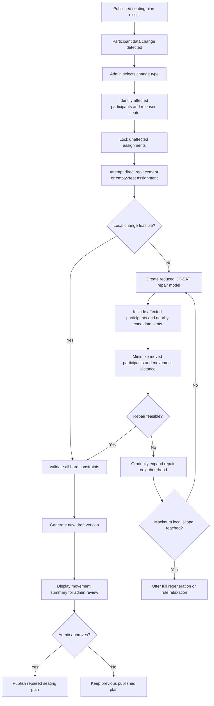

The examiner’s feedback changes Objective 2 from **“generate another whole seating plan with movement minimization”** into a more specific **incremental repair problem**.

Your current report already identifies absence, substitution, group changes, ad-hoc registration, and preservation of the published plan as the intended reallocation context.  The examiner is asking you to make the distinction much clearer:

## 1. Difference between Objective 1 and Objective 2

| Aspect             | Objective 1: Initial Plan Generation                   | Objective 2: Controlled Dynamic Reallocation                      |
| ------------------ | ------------------------------------------------------ | ----------------------------------------------------------------- |
| Starting condition | No seating plan exists yet                             | A published seating plan already exists                           |
| Main input         | All participants, all seats, all rules                 | Previous plan plus a small participant-data change                |
| Decision scope     | Every participant can be assigned to any eligible seat | Primarily affected participants and a limited set of nearby seats |
| Main goal          | Generate the best complete seating plan                | Repair the existing plan with minimum disruption                  |
| Complexity         | Large global optimization problem                      | Smaller incremental/local optimization problem                    |
| Typical timing     | Before the event                                       | Close to or during the event                                      |
| Main priority      | Overall allocation quality                             | Preserve stability while accommodating the change                 |
| Output             | First complete seating plan                            | New reviewable version derived from the published plan            |

Therefore, Objective 2 should not be described as simply “running the same Generate Seating Plan function again.”

It should be presented as:

> **A controlled incremental seat-reallocation mechanism that repairs the existing published plan after an ad-hoc participant change, while preserving unaffected participants’ assignments whenever possible.**

---

# 2. Recommended Refined Objective 2

> **Objective 2:** To develop a controlled incremental reallocation mechanism that accommodates ad-hoc participant absences, substitutions, and group changes by modifying only affected seat assignments and a limited surrounding seating area, while preserving the previously published assignments of unaffected participants as much as possible.

This wording clearly separates it from Objective 1.

You can retain the versioning and review idea in the explanation:

> The repaired seating result is stored as a new reviewable version and only replaces the existing published plan after administrator approval.

---

# 3. Core Behaviour of Dynamic Reallocation

The application should treat the existing published seating plan as the **baseline state**.

When a participant change occurs, the system should:

1. Load the latest published seating plan.
2. Identify the change type.
3. Identify the directly affected participants and seats.
4. Preserve or lock all unaffected assignments initially.
5. Release only the affected seats.
6. Attempt to place the changed or replacement participants into the available affected seats.
7. If this is not feasible, gradually include a small number of nearby participants or seats.
8. Minimize the number and distance of seat movements.
9. Return a new draft version with a clear movement summary.
10. Allow the administrator to review and publish the repaired plan.

The key idea is:

> **Repair locally first; expand only when necessary; regenerate globally only as a last resort.**

---

# 4. Scenario 1: A Participant Is Suddenly Absent

## Example

Participant `P102` was assigned Seat `B-05` but informs the organizer on the event day that they will not attend.

## Expected application behaviour

1. Admin marks `P102` as absent.
2. The system loads the latest published seating plan.
3. Seat `B-05` is released.
4. All other participant assignments remain unchanged.
5. The system checks whether an ad-hoc participant is waiting for a suitable seat.
6. If an eligible participant exists, the system may assign that person to `B-05`.
7. If no participant requires the seat, it remains empty.
8. A new draft version is generated.
9. The admin reviews and publishes it if necessary.

## Expected result

* `P102` is removed.
* No unrelated participant is moved.
* The previous plan remains almost completely unchanged.

This is the simplest dynamic case and may not require running the full solver. It can be handled as a direct local repair followed by constraint validation.

---

# 5. Scenario 2: An Absent Participant Is Replaced by Another Registered Person

## Example

Participant `P102` cannot attend. Registered participant `P215` will replace them.

## Expected application behaviour

The system should first attempt a **direct substitution**:

1. Remove `P102` from Seat `B-05`.
2. Check whether `P215` is eligible for Seat `B-05`.
3. Validate:

   * participant tier or category;
   * seat zone;
   * participant status;
   * whether the seat belongs to a special pair;
   * relevant priority or grouping rules.
4. If all hard constraints are satisfied, assign `P215` directly to `B-05`.
5. Preserve every other participant’s seat.
6. Generate a new reviewable version.

## If the replacement is not compatible

Suppose `P102` was a Merit participant, but `P215` belongs to Bodhi and must sit in the Bodhi zone.

The system should:

1. Keep unaffected participants fixed.
2. Search for an empty eligible seat in the Bodhi zone.
3. Attempt a local swap if needed.
4. Move the smallest possible number of participants.
5. Prefer movement within the same row or zone.
6. Return the repaired plan and movement count.

The application might display:

```text
Replacement participant: P215
Previous participant: P102
Direct seat replacement: Not possible
Reason: Category-zone mismatch

Additional participants moved: 1
Affected seats: B-05, D-08
```

This makes the reallocation explainable to the organizer.

---

# 6. Scenario 3: A Group Is Replaced by Another Registered Group

## Example

Group `G-A`, containing four participants, withdraws. Group `G-B`, also containing four registered participants, replaces them.

## Expected application behaviour

The system should first attempt a **block-for-block substitution**:

1. Release all seats previously occupied by `G-A`.
2. Check whether the released seats form a valid group block.
3. Check whether `G-B` satisfies the same zone and eligibility requirements.
4. Assign `G-B` to the same released seat block if feasible.
5. Preserve all other assignments.

## If the replacement group has a different size

Suppose `G-A` contains four participants but `G-B` contains six participants.

The system should:

1. Reserve the four released seats.
2. Search for two nearby eligible seats.
3. Include only participants located near that seat block in the local repair model.
4. Minimize:

   * the number of existing participants moved;
   * the distance they are moved;
   * separation among members of `G-B`.
5. Keep the rest of the seating plan fixed.

The solver should not reconsider all 100–200 participants unless the local search becomes infeasible.

---

# 7. Scenario 4: An Ad-Hoc Participant Arrives on the Event Day

## Example

A valid registered participant arrives unexpectedly and must be seated.

## Expected application behaviour

The system should use an escalation strategy.

### Level 1: Direct placement

Search for an empty seat that satisfies all hard constraints.

### Level 2: Local swap

If no suitable empty seat is available, check whether one nearby participant can be moved to another empty eligible seat.

### Level 3: Small neighbourhood repair

Allow the solver to reconsider a limited set, for example:

* the ad-hoc participant;
* participants in the same category;
* participants in the relevant row or zone;
* nearby empty seats;
* a small number of neighbouring assignments.

### Level 4: Expanded repair

If no solution exists, gradually expand the affected neighbourhood.

### Level 5: Full regeneration fallback

Only when all incremental repair attempts fail should the system offer a complete regeneration.

The application should never silently trigger a whole-plan change during the event.

It should inform the administrator:

```text
Local repair was not feasible within the selected zone.

Options:
1. Expand repair to adjacent rows
2. Relax group adjacency preference
3. Generate a complete new seating plan
4. Cancel the change
```

---

# 8. Affected and Unaffected Participants

The application should classify participants into two sets.

## Affected participants

These may be changed by the local reallocation:

* absent participant;
* replacement participant;
* ad-hoc participant;
* members of a substituted group;
* participants occupying nearby candidate seats;
* participants involved in a required swap.

## Unaffected participants

These should remain fixed unless the local model cannot find a feasible solution:

* participants outside the affected row or zone;
* participants whose seat has no relation to the change;
* participants already notified or already seated;
* participants protected by administrator-defined lock status.

This distinction is central to Objective 2.

---

# 9. How CP-SAT Can Support Incremental Reallocation

Objective 2 can still use CP-SAT, but the model should be much smaller than the initial-generation model.

## Initial plan model

For Objective 1, variables may be created for:

```text
Every eligible participant × every eligible seat
```

For 100 participants and 120 seats, this can produce thousands of possible participant-seat decision variables.

## Incremental repair model

For Objective 2, variables are created only for:

```text
Affected participants × candidate seats in the repair neighbourhood
```

For example:

* 1 replacement participant;
* 3 nearby participants;
* 6 candidate seats.

The repair model may involve only 4 participants and 6 seats rather than the entire event.

This is why the reallocation process should be computationally simpler and faster.

---

# 10. Recommended Reallocation Objective

The local repair model should prioritize stability before normal seating preferences.

A suitable objective hierarchy is:

1. Satisfy all hard constraints.
2. Minimize the number of unaffected participants moved.
3. Minimize the total movement distance.
4. Satisfy group adjacency.
5. Preserve participant priority and seat suitability.
6. Apply deterministic tie-breaking.

Conceptually:

```text
Minimize:
very_high_weight × number_of_unaffected_participants_moved
+ high_weight × total_seat_movement_distance
+ group_separation_penalty
+ priority_seat_mismatch_penalty
+ other_soft_constraint_penalties
```

The movement penalty for unaffected participants should be much higher than ordinary seating-preference penalties.

For example, moving an unaffected participant should not be accepted merely to improve another participant’s seat priority slightly.

---

# 11. Seat Locking and Progressive Relaxation

The application should support three assignment states:

| State    | Behaviour                                                 |
| -------- | --------------------------------------------------------- |
| Locked   | Assignment cannot change during local repair.             |
| Movable  | Assignment may change if required.                        |
| Affected | Assignment must be reconsidered because its data changed. |

Initially:

* unaffected participants are locked;
* changed participants are affected;
* empty eligible seats are available.

If the solver reports infeasibility, the application can progressively unlock nearby participants.

```text
Attempt 1:
Changed participants + empty seats only

Attempt 2:
Unlock participants in the same row

Attempt 3:
Unlock participants in adjacent rows

Attempt 4:
Unlock participants in the same zone

Attempt 5:
Offer full-plan regeneration
```

This provides a clear technical distinction from the initial solver function.

---

# 12. Review Screen Behaviour

After local reallocation, the application should not immediately replace the published plan. It should display a change summary.

## Suggested information

* trigger type;
* previous plan version;
* affected participants;
* previous seat and new seat;
* number of unaffected participants moved;
* movement distance;
* hard-constraint validation result;
* soft-constraint penalty;
* solver status;
* runtime;
* reason for each movement.

Example:

| Participant | Previous Seat | New Seat | Reason                            |
| ----------- | ------------: | -------: | --------------------------------- |
| P102        |          B-05 |  Removed | Absent                            |
| P215        |             — |     B-05 | Replacement participant           |
| P044        |          C-07 |     C-08 | Moved to maintain group adjacency |

The admin can then:

* approve and publish;
* reject the result;
* expand the repair area;
* adjust constraints;
* request complete regeneration.

---

# 13. Recommended Application Workflow



---

# 14. Success Criteria for Objective 2

Objective 2 should be evaluated separately from Objective 1.

Suitable success measures include:

| Metric                                          | Intended Meaning                                                                        |
| ----------------------------------------------- | --------------------------------------------------------------------------------------- |
| Affected participant accommodation rate         | Whether the absence, replacement, group change, or ad-hoc case is successfully handled. |
| Number of unaffected participants moved         | Main disruption measure.                                                                |
| Percentage of unaffected participants preserved | Stability of the published plan.                                                        |
| Total seat movement distance                    | Magnitude of the changes.                                                               |
| Local repair runtime                            | Whether the result is produced quickly enough for event-day use.                        |
| Hard-constraint violations                      | Must remain zero.                                                                       |
| Full-regeneration avoidance rate                | How often changes are handled without regenerating the complete plan.                   |

A strong evaluation comparison would be:

```text
Local incremental repair
versus
Full seating-plan regeneration with movement penalty
versus
Full regeneration without movement penalty
```

The local approach should demonstrate:

* shorter runtime;
* fewer active decision variables;
* fewer moved participants;
* similar or acceptable constraint quality.

---

## Final Interpretation

The examiner’s intended meaning is:

> Objective 1 creates the seating plan. Objective 2 repairs an already published seating plan.

Objective 2 should therefore focus on **delta-based processing**, where the input is not the full event alone but:

```text
Previous published plan
+ participant-data change
+ affected seat area
```

The preferred technical design is a **reduced CP-SAT repair model with progressive neighbourhood expansion**. Unaffected participants remain fixed by default, and the system only expands the repair scope when the immediate change cannot be resolved locally. Full regeneration remains available, but only as a final fallback rather than the normal implementation of dynamic reallocation.
