# `seat_solver` Code Overview

This document explains every module in [`src/seat_solver/`](../src/seat_solver/), shows each module's execution flow as a Mermaid diagram, and ends with a dependency graph linking all the files together.

## The big picture

The package implements one pipeline: load JSON inputs → validate them → convert participants into allocation units → precompute integer costs → build a CP-SAT model → solve to proven `OPTIMAL` → extract and re-audit the solution → emit frontend-friendly JSON. Each stage lives in its own module, and only `solver.py` knows about all of them.

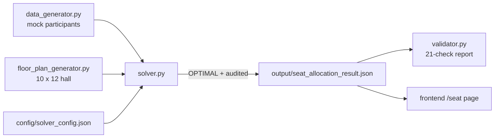

---

## `__init__.py`

Package marker only. Declares `__version__ = "0.1.0"`; no logic.

---

## `models.py`

The typed data layer shared by every other module. Defines frozen dataclasses for all domain objects and the JSON load/save helpers, so file I/O and parsing never leak into the algorithmic modules.

Key contents:

| Item | Role |
|---|---|
| `Participant` | One primary registration record (tier, contribution, flags, previous seats). |
| `Seat` / `FloorPlan` | Physical seat (`physical_position` for adjacency, `priority_rank` for desirability — deliberately separate) and the seat collection with lookup helpers (`seat_by_id`, `seats_in_row`). |
| `TierConfig` / `SolverConfig` | Parsed `solver_config.json`: tier boundaries, weights, cost matrices, movement parameters, Emperor pair priorities, `enforce_front_fill`, `enforce_middle_fill`, `normalize_penalties`, tie-break scale, CP-SAT parameters. |
| `PreviousAllocation` | `participant_id → seat_ids` mapping from the previous event. |
| `read_json` / `write_json` / `load_*` | All file I/O for the package. |
| `InputDataError` | Raised when a JSON document cannot be parsed into a model. |

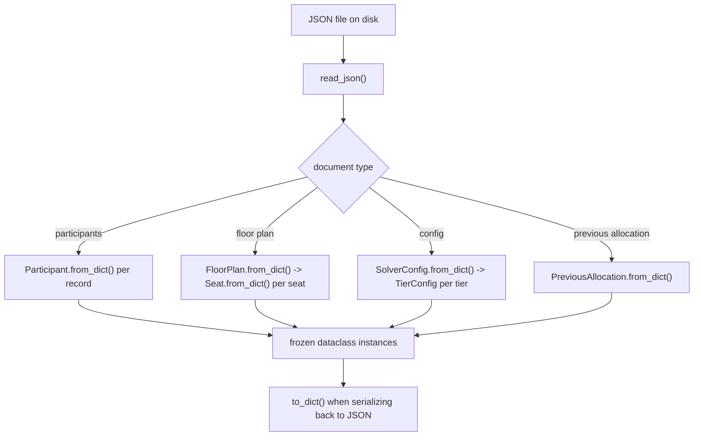

---

## `floor_plan_generator.py`

Deterministically generates the 10-row × 12-seat hall. Encodes the three spatial rules: the mirrored priority pattern `[12,10,8,6,4,2,1,3,5,7,9,11]` (right side outranks the mirrored left seat), the four zones (`LEFT_OUTER`, `LEFT_CENTER`, `RIGHT_CENTER`, `RIGHT_OUTER`), and the tier row zones (Emperor 1–2, Bodhi 3–5, Merit 6–10). Seats at positions 1, 6, 7, 12 are accessible; no seat is blocked by default.

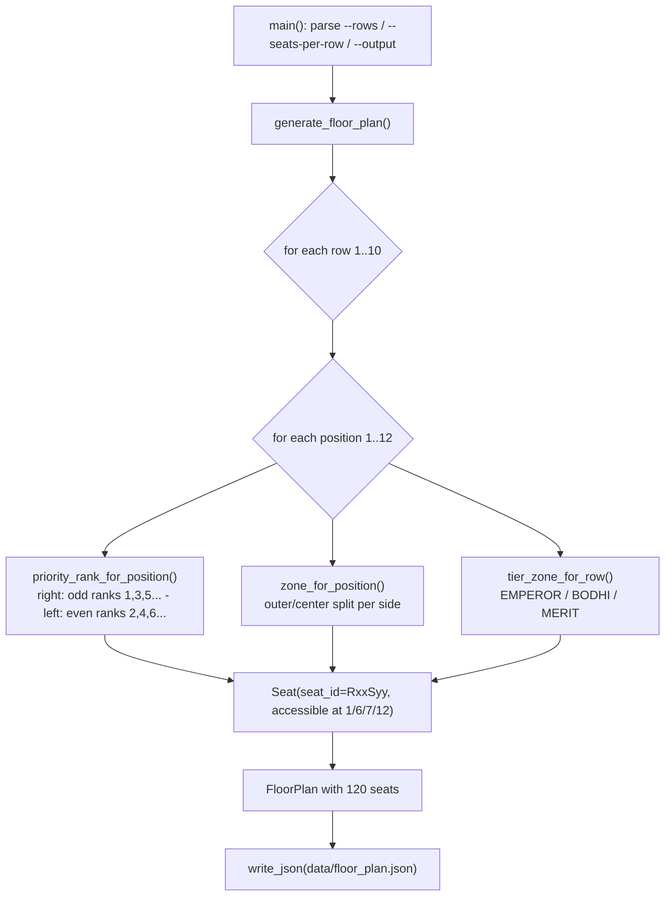

---

## `data_generator.py`

Generates the fixed 100-record synthetic dataset (8 Emperor, 32 Bodhi, 60 Merit → exactly 108 seats demanded) plus a consistent `previous_allocation.json`. All randomness flows through one seeded `random.Random(20260707)`, so output is byte-identical between runs.

The previous allocation is built to satisfy **every hard constraint** so a zero-movement regeneration is always feasible: seats fill in contribution order (which also satisfies front-fill), then a same-row repair pass swaps accessibility-requiring participants onto accessible seats (same-row swaps cannot break contribution ordering), and finally a deterministic ~70% subset keeps its seats.

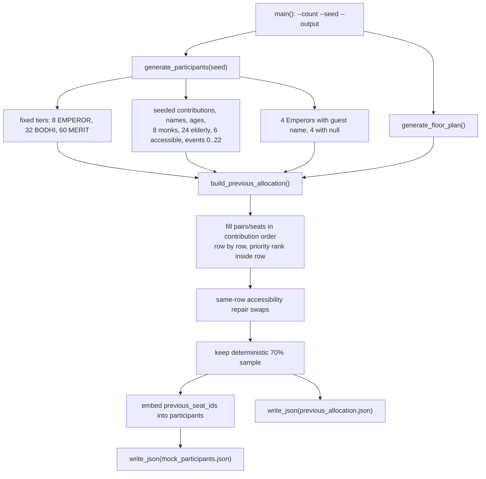

---

## `preprocessing.py`

Everything that must happen **before** the CP-SAT model exists: structural input validation, capacity checks, valid-pair enumeration, allocation-unit construction, and the front-fill row targets. Hard constraints HC4 (tier zones), HC8 (accessibility), and HC9 (blocked seats) are enforced *structurally* here — ineligible combinations simply never become variables.

Key contents:

- `validate_inputs()` — duplicate ids, tier/contribution consistency, unknown seats, previous-allocation seat reuse → `StructuredError("INVALID_INPUT")`.
- `build_valid_pairs()` — enumerates the pair set `K` from `emperor_pair_priorities` inside Emperor rows; refuses aisle-crossing pairs (HC7) and skips blocked seats.
- `check_capacity()` — HC11: total demand vs available seats, per-tier zone capacity, and accessible-seat/pair supply vs demand → `CAPACITY_EXCEEDED` / `TIER_CAPACITY_EXCEEDED`.
- `build_allocation_units()` — converts each participant into a `SingleUnit` (eligible seats) or `EmperorUnit` (eligible pairs).
- `compute_row_fill_targets()` — HC13: because tier demand is known up front, each zone row's occupancy is fully determined by filling rows front-to-back; returns `{tier: {row: required_count}}`.

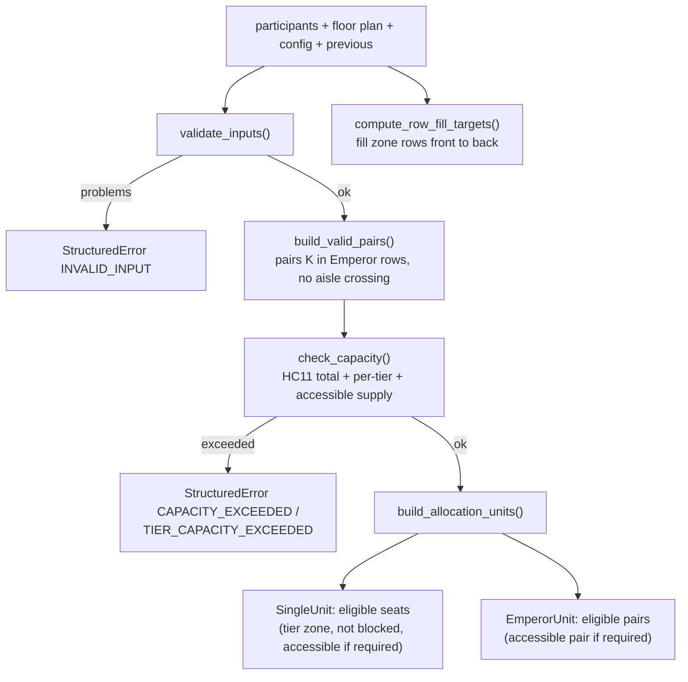

---

## `cost_calculator.py`

Precomputes the four soft-constraint costs as non-negative integers (HC12: nothing floating-point ever reaches the model) and implements **penalty normalization**.

- `desired_priority_rank()` — SC1 target: accessible/monk → 1, elderly → 3, general → 8; lowest applicable rank wins.
- `activity_target_rank()` — SC4: maps `events_joined_last_2_years` onto ranks 1..12 with integer round-half-up arithmetic.
- `movement_cost_single()` / `movement_cost_pair()` — SC3: zero for the previous seat/pair or when no previous allocation exists, otherwise `fixed + row_weight·Δrow + column_weight·Δcolumn`.
- `compute_component_maxima()` — theoretical maximum raw cost per component (priority 11, zone 16, movement 139, activeness 11 for the default scenario).
- `PenaltyScaler` — rescales each raw cost to `0..100` by its maximum (`(2·100·raw + max) // (2·max)`, round half up), so the four weights act on comparable quantities. Pass-through when `normalize_penalties` is off.
- `CostBreakdown` — raw components plus `normalized_components()`, `weighted_components()` (= weight × normalized), `weighted_total()`.
- `CostCalculator` — caches config/floor-plan/previous context and produces a `CostBreakdown` per eligible (unit, seat) or (unit, pair) candidate.

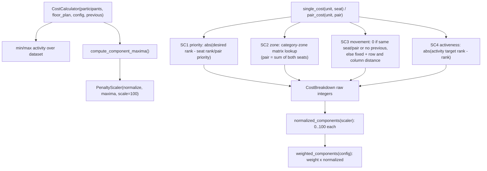

---

## `cp_sat_model.py`

Builds the pure-integer CP-SAT model from the preprocessed units and costs. Returns a `ModelBundle` carrying the model plus every lookup needed later for extraction and auditing (variables, cost breakdowns, tie-break terms, eligible counts).

Constraint encoding:

- **HC1/HC2** — `AddExactlyOne` over each unit's variables.
- **HC3** — `AddAtMostOne` over each seat's occupant variables (pair variables appear under both of their seats).
- **HC5** — contribution ordering via boundary variables: sort each tier's distinct contribution values descending; between consecutive levels add `row(higher) ≤ b ≤ row(lower)`; transitivity gives the full ordering without ordering equal contributors.
- **HC13** — front-fill: exact equalities `Σ assignment vars on zone row r == target(r)` from `compute_row_fill_targets()`.
- **Objective** — `Minimize(Σ var · (SCALE · weighted_cost + tie_break))` where `tie_break = unit_rank · option_index`. The builder computes the exact maximum achievable tie-break total and refuses to run if it reaches `main_objective_scale`, which proves the tie-break can never override a main-penalty difference (and makes the optimum a unique canonical layout).

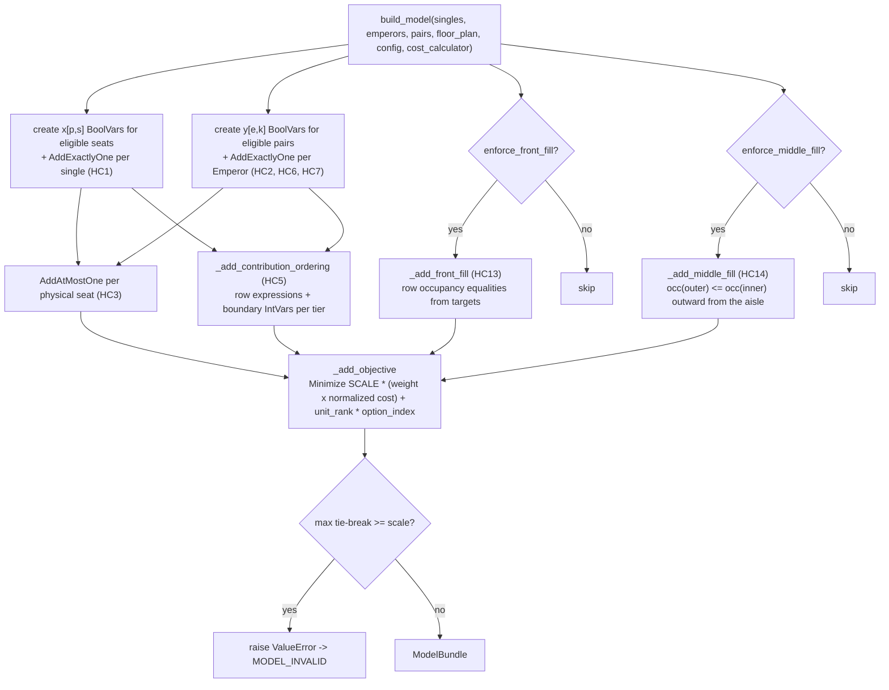

---

## `solver.py`

The orchestrator and single public entry point: `solve_seat_allocation(participants, floor_plan, config, previous_allocation=None) → dict`. It always returns a JSON-serializable document — success **only** when CP-SAT proves `OPTIMAL` *and* the extracted solution survives independent re-auditing and JSON Schema validation; every other outcome becomes a structured error (`INVALID_INPUT`, `CAPACITY_EXCEEDED`, `TIER_CAPACITY_EXCEEDED`, `OPTIMAL_NOT_PROVEN`, `INFEASIBLE`, `MODEL_INVALID`, `SOLVER_UNKNOWN`, `OUTPUT_VALIDATION_FAILED`).

Notable details:

- Status mapping: `FEASIBLE` is never accepted (returns `OPTIMAL_NOT_PROVEN`); only `OPTIMAL` proceeds.
- Objective audit: recomputes `SCALE · main_penalty + tie_break` from the extracted assignments and requires it to equal `solver.ObjectiveValue()`.
- Hard-constraint audit: rebuilds all violation counters **from the serialized result document itself** (via `validator.compute_hard_constraint_validation`) rather than trusting solver internals.
- Collects real solver statistics (wall/user time, conflicts, branches, variable and constraint counts, approximate peak RSS via optional `psutil`).

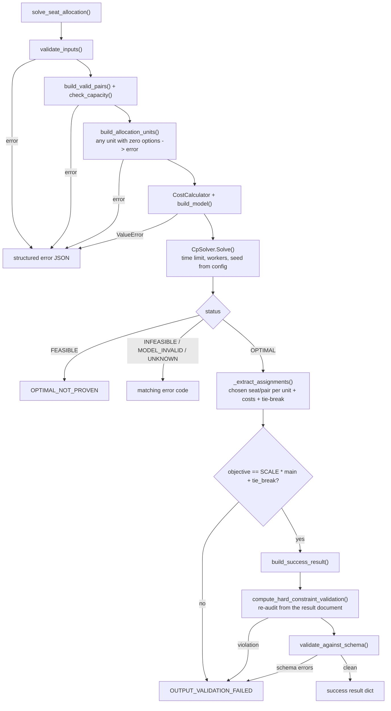

---

## `result_formatter.py`

Turns extracted solutions into the frontend-friendly result document (and builds error documents). Contains no solver logic — only presentation:

- `ExtractedAssignment` — one solved unit (participant, seats, chosen pair, `CostBreakdown`, tie-break value, effective previous seats, derived `moved` flag).
- `_display_names()` — Emperor pairs show the primary participant on the better-ranked seat and the guest (or the primary name again when the guest is null) on the other seat.
- `build_success_result()` — assembles `input_summary`, `weights`, `constraint_config` (front-fill flag, normalization scale, component maxima), `solver` stats, the three-layer `penalty_summary` (unweighted / normalized / weighted + tie-break), the per-row floor-plan section with occupancy status, sorted per-assignment payloads with full penalty breakdowns, `empty_seat_ids`, and the hard-constraint block.
- `build_error_result()` — the structured error envelope that stays renderable by the frontend.

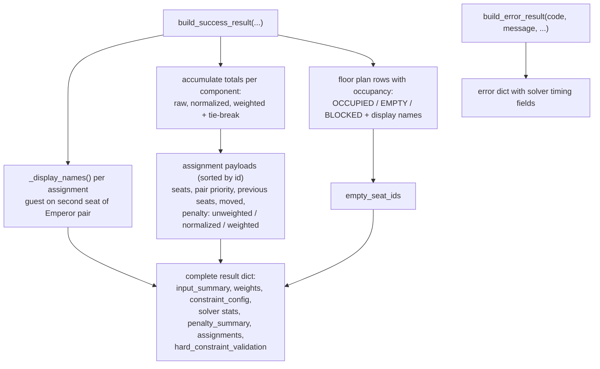

---

## `validator.py`

Independent validation that works **purely from the serialized result dictionary** — never from solver internals — so the same code audits a fresh solve and powers `cli validate` on a file from disk.

- `validate_against_schema()` — JSON Schema validation against `schemas/` (locatable via the `SEAT_SOLVER_SCHEMA_DIR` env var).
- `compute_hard_constraint_validation()` — recounts duplicates, tier-zone, adjacency, aisle, accessibility, blocked-seat, contribution-ordering, and front-fill violations from the document.
- `count_front_fill_violations()` — HC13 audit: an earlier zone row with an empty available seat while a later row is occupied is a violation (returns 0 when the run had front-fill disabled, read from `constraint_config`).
- `count_middle_fill_violations()` — HC14 audit: walking outward from the centre aisle on each side of each row, an occupied seat found after an empty seat is a violation (returns 0 when the run had middle-fill disabled, read from `constraint_config`).
- `validate_result()` — the 21-check report (C01–C21): counts (100 processed / 108 occupied / 12 empty), uniqueness, per-tier seat counts, pair adjacency and aisle rules, tier zones, contribution ordering, accessibility, blocked seats, penalty-layer consistency (normalized values recomputed from `component_maxima`), objective reconstruction, schema conformance, `OPTIMAL` status, zero gap, and front-fill.

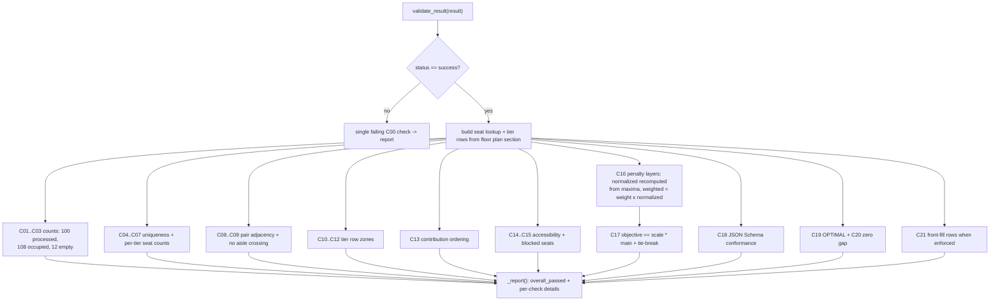

---

## `cli.py`

The command-line interface with two subcommands. Expected failures (unreadable files, invalid input, solver failures) are written as structured JSON error documents and reported through the exit code — never as uncaught tracebacks.

- `solve` — loads participants, floor plan, config, and the optional previous allocation; runs `solve_seat_allocation`; writes the result; exit 0 only on success.
- `validate` — loads a result file, runs `validate_result`, writes the 21-check report; exit 0 only when every check passes.

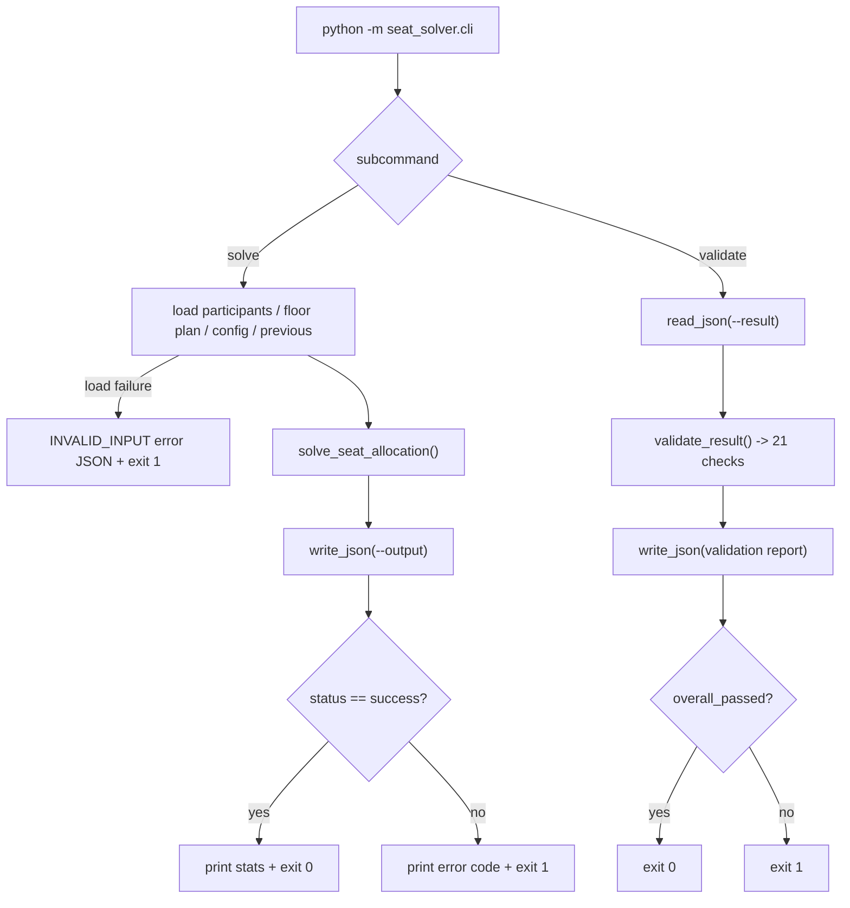

---

## `benchmark.py`

Runs the complete solve pipeline N times (default 10) on freshly loaded inputs and writes `output/performance_report.json`. Timing uses `time.perf_counter` around each whole run; per-run CP-SAT statistics come from that run's actual solver response — nothing is estimated or reused. Aggregates min/max/mean/median/p95 wall time, objective values, bounds, conflicts, branches, and approximate peak RSS, and fails (exit 1) if any run is not `OPTIMAL`.

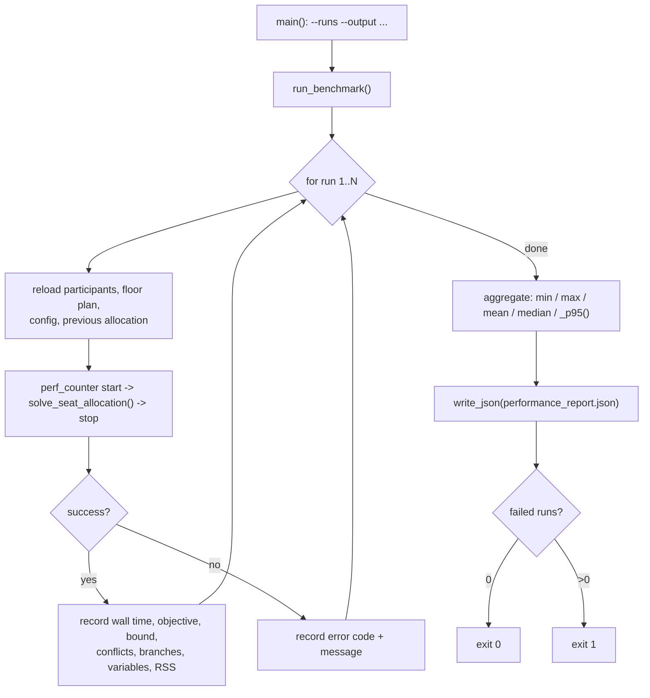

---

## Module dependency graph

Arrows point from the importing module to the module it imports. `models.py` is the shared foundation; `solver.py` is the only module that composes the whole pipeline; `ortools` and `jsonschema` are the only third-party dependencies and are isolated to three files.

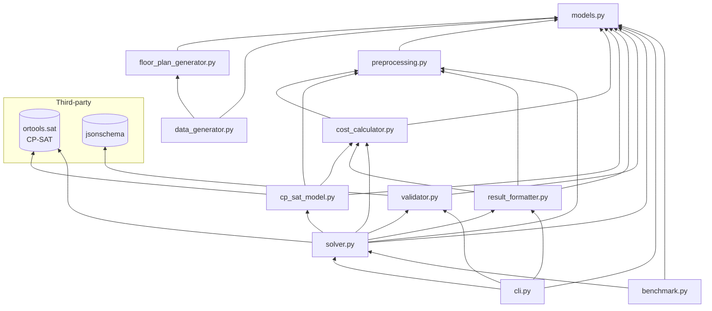

Reading the graph bottom-up: the generators produce input data; `preprocessing` and `cost_calculator` prepare validated units and integer costs from `models` objects; `cp_sat_model` turns them into a CP-SAT model; `solver` orchestrates everything and hands results to `result_formatter` and `validator`; `cli` and `benchmark` are the two entry points on top.
