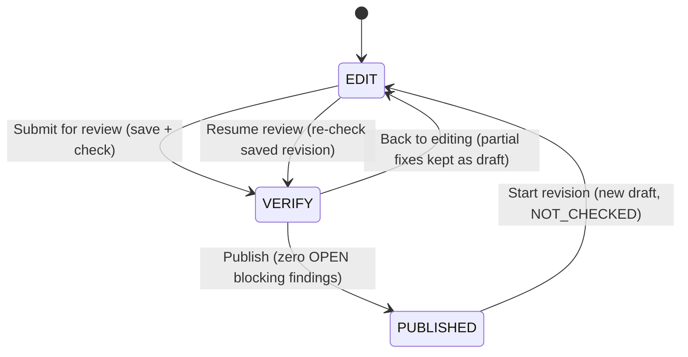

# Safeguard verification screen — implementation plan

Status: **Implemented on `codex/seating-safeguards-review`.**
The original `codex/seating-safeguards` branch predates the current dashboard. This implementation starts from the current paid-seat-retention branch and retains its styling and paid-seat rules.

Implementation notes:
- `production/verification.py` performs pure structural validation and C12/C13/C15/C16 checks; `WorkspaceStore` serializes checks, acknowledgements and publication with SQLite transactions.
- `workspace_reviews` stores review status, seen findings and acknowledgements per event/base plan. Immutable published plan snapshots include `safeguard_review` with actor, timestamp, findings and acknowledgement notes. Public projections omit these fields.
- `workspace_check` without a state checks and persists the saved revision. With a state it provides read-only feedback after review entry. `workspace_ack` changes one current finding's status to `ACKED` or `OPEN`, with an optional note. All commands require the current workspace revision and event-scoped authenticated admin/staff access.
- The verification screen serializes autosave/check/ack requests, discards obsolete check responses, groups findings by actor with related findings collapsed, and rechecks on resume. Keyboard move controls supplement drag-and-drop. Mixed-size moves preserve all registrations or offer a return to the holding dock.
- C12 preserves the existing production **seat precedence** rule (including priority within a row), rather than weakening it to row-only precedence. Hints simulate both moved registrations against C12/C13; unrelated existing issues may remain. Forward hints choose the higher-priority actor; candidate ties prefer fewer entanglements. Backward-move hints are not generated.
- Paid seats remain mandatory regardless of attendance: there is no “mark absent” bypass. Gap finding IDs include the gap seat as well as the rule and registration so a newly created gap is not silently acknowledged.
- `IN_PROGRESS` means a resumable review, including an all-clear review awaiting publication. `PASSED` is recorded upon successful publication; a new saved revision of a published plan starts `NOT_CHECKED` with fresh acknowledgements.
- Validation: Python lifecycle, integrity, privacy, hint and latency tests; frontend move/chain-swap, dashboard entry and grouping tests; TypeScript and ESLint. Browser checks use a separate temporary SQLite database.

Supersedes the sequential alert-dialog review flow described in `seating-safeguard-separation.md` (that document remains the audit record of the C13 finding-explosion problem this design fixes).

---

## 1. Problem statement

The previous safeguard implementation surfaced business-rule findings (C12/C13/C15/C16) as sequential pop-up dialogs requiring per-finding confirmation. With the reproduced C13 case (51 pairwise findings from 28 registrations, one registration in 26 conflicting pairs), staff faced a wall of identical, unactionable alerts — click fatigue, no spatial context, no resolution guidance.

The replacement: a **dedicated verification screen** entered after "Submit for review", showing the seating plan with flagged seats highlighted, an issue list sidebar with resolution hints, direct drag-and-drop fixing, and live re-verification — publishable only when no blocking finding remains open.

## 2. Rule taxonomy and severity

| Rule | Meaning | Severity | Blocking? | Overridable? |
|---|---|---|---|---|
| C12 | Tier seat precedence (cross-tier) | 🔴 Red | Yes | Yes, one-click, note optional |
| C13 | Contribution row ordering (within tier) | 🔴 Red | Yes | Yes, one-click, note optional |
| C15 | Empty available seat before an occupied row | 🟡 Yellow | No | Acknowledge |
| C16 | Centre-out packing gap | 🟡 Yellow | No | Acknowledge |
| Unseated registration | Eligible participant with no seat | Hard gate | Blocks *entry* to the screen | No — resolve in edit mode |

Rationale: C13 is a real social offense at PJKIT (bigger donor behind a smaller donor) hence red, but the final decision maker is the staff's human consideration, hence overridable with an **optional** note (per current business practice — notes are not mandatory). Packing rules are quality advisories. Invalid placements (C3/C4/C17, overlaps) never reach this screen — `workspace_save` already hard-rejects them.

## 3. Flow and state machine



- **Entry gate (client-side)**: "Submit for review" is disabled while any eligible registration in the saved state has empty `seat_ids`, with the reminder "N participants unseated — assign every paid registration before review." The server re-verifies the persisted revision at entry; the server wins on mismatch.
- **Entry gate (server-side)**: `workspace_check` on the persisted revision; findings + `review_status = IN_PROGRESS` persisted.
- **Resume**: re-entering the dashboard with `review_status = IN_PROGRESS` shows a recovery popup ("Safeguard review in progress — 4 of 7 handled") with a Resume button. Stale findings are never shown — entry always triggers a fresh check.
- **Back to editing**: two-way exit; partial fixes are kept as draft (autosave). Re-entry re-checks automatically.
- **After PASSED**: any subsequent edit returns the status to `IN_PROGRESS` on the next check. The persisted flag is resume UX only — it never gates publish by itself.

## 4. Verification screen layout

```
┌────────────────────────────────────────────────────────────┐
│ Header: mode pill "Verification" · saved status · exit     │
├───────────────────────────────────────────┬────────────────┤
│                                           │ Review issues  │
│   Seating map (same HallMap component)    │ (sidebar)      │
│   - standing 80% dim on non-involved      │ ┌────────────┐ │
│     seats, names legible                  │ │ progress   │ │
│   - flagged seats: severity tint          │ │ + filters  │ │
│   - selected card: pulse + border +       │ ├────────────┤ │
│     spotlight dim on others               │ │ issue card │ │
│   - direct drag-and-drop, no confirm      │ │ issue card │ │
│     dialog; undo/redo in memory           │ │ …          │ │
│                                           │ ├────────────┤ │
│                                           │ │ Publish CTA│ │
└───────────────────────────────────────────┴────────────────┘
```

- The sidebar occupies the **same spatial slot** as the edit-mode holding dock (muscle memory preserved), but is unmistakably a different mode via header and content.
- **Dock is disabled** in verification (option B). It is naturally empty at entry because unseated registrations block entry. A size-mismatched swap attempt triggers the escape hatch (§6).
- **Bidirectional linkage**: clicking an issue card scrolls (never zooms) the map to center the actor seat, pulses involved seats 2s, then holds a persistent severity-colored border; clicking a bordered seat raises and highlights its card.
- **Highlight expansion**: selecting a card expands the highlight set to involved seats **plus server-named swap-candidate seats** (§7). The frontend only ever highlights seat IDs the server named.
- **Loading overlay** (existing component) is transient and blocking only: initial entry check and publish action. It never covers the map during normal editing — the live check refreshes findings in place (dimmed count + spinner in the sidebar header).

## 5. Checking architecture — two tiers

No separate Lambda or endpoint. The check lives in the existing production service (`seat_solver.production`), exposed as a new `workspace_check` command on the existing `/api/workspace` adapter, alongside `workspace_save` / `workspace_publish`.

Cost basis (from `data/production_request.json`): 96 participants (56 Emperor, 24 Merit, 16 Bodhi) → Σ nᵢ² ≈ 3.9k same-tier pair comparisons; hint generation adds a bounded scan per finding. Total well under 100ms server-side; latency is dominated by HTTP + adapter overhead.

1. **Feedback check (live)**: after each direct commit, debounced ~800ms–1s, the *unsaved state payload* is sent to `workspace_check`; findings update live. The map interaction never waits on it.
2. **Authoritative gate (publish)**: `workspace_publish` revalidates the **persisted** revision (existing invariant: publication never trusts browser payloads). Zero OPEN blocking findings is re-verified server-side at publish regardless of UI state.

Delta semantics on re-check: resolved findings vanish, new pairs appear with a "New" badge, acked pairs stay suppressed (§8).

## 6. Editing in verification mode

- **Direct commit**: drag-and-drop applies immediately (no preview dialog). Undo/redo stack in memory only; undoing a fix resurrects the finding on the next debounced check.
- **Autosave**: server-side via debounced `workspace_save` (NOT localStorage). Rationale: publication reads persisted state; resume needs server-side findings/acks/status anyway; localStorage would split-brain the revision. A stale-write rejection mid-session surfaces as a gentle "someone else saved — reload to continue" banner.
- **Size-mismatch mitigation (3 layers)** — the pair↔single swap wall:
  1. **Drag-time valid-target affordance**: while dragging, valid drop targets are pre-computed client-side (pairs → adjacent same-side 2-seat groups per `approved_pairs`; singles → single seats) and visually indicated; invalid targets show a not-allowed cursor. Prevents most dead-end drops before they happen.
  2. **Auto-proposed chain swap**: on a mismatched drop, instead of erroring, propose the chain: displaced occupant → the actor's vacated seats. Shown as a compact preview ("Swap 林淑賢(pair) ↔ 李俊婷(single): both move") with one-click Apply (undoable). May create C15/C16 yellows — acceptable, they are advisory and visible. (Optional later backport to edit mode.)
  3. **Escape hatch (option B)**: if the chain is impossible (e.g. no valid destination for the displaced occupant), show "This rearrangement needs the holding dock — go back to editing" with a one-click **Back to editing** button that preserves the in-progress review state and returns to the exact seat context.
  - Context note: tier ordering makes Emperor-pair-vs-single-Merit swaps rare, but within-Emperor fixes (56 Emperors competing for rows 1–~14) will hit size friction occasionally — the mitigation targets exactly that.

## 7. Finding payload and resolution hints (API contract)

The card text "move X forward to row N or swap with Y" is generated **server-side**; the frontend never reimplements rule logic. `workspace_check` returns:

```jsonc
{
  "review_status": "IN_PROGRESS",
  "findings": [
    {
      "finding_id": "C13:P004:P002",          // rule_id + sorted participant IDs
      "rule_id": "C13",
      "severity": "RED",                       // RED | YELLOW
      "participants": [                        // both sides, full context
        { "participant_id": "P004", "display_name": "黃嘉怡", "contribution_amount_rm": 5300,
          "contribution_tier": "EMPEROR", "seat_ids": ["R09-S03"], "row_number": 9 },
        { "participant_id": "P002", "display_name": "張文軒", "contribution_amount_rm": 5100,
          "contribution_tier": "EMPEROR", "seat_ids": ["R03-S05","R03-S06"], "row_number": 3 }
      ],
      "involved_seat_ids": ["R09-S03", "R03-S05", "R03-S06"],
      "resolution_hint": {
        "actor_participant_id": "P004",        // who should move (fewer entanglements)
        "action": "MOVE_FORWARD | SWAP_WITH | FREE_SEAT",
        "target_rows": [3],
        "swap_candidates": [                   // ≤5, each simulated clean
          { "participant_id": "P002", "display_name": "張文軒", "seat_ids": ["R03-S05","R03-S06"], "row_number": 3 }
        ],
        "message": "Move 黃嘉怡 forward to row 3, or swap with 張文軒 (row 3).",
        "locked_conflict": false
      },
      "status": "OPEN"                         // OPEN | RESOLVED | ACKED (ACKED persisted server-side)
    }
  ],
  "summary": { "open_blocking": 2, "open_advisory": 1, "acked": 3, "resolved": 1 }
}
```

**Swap-candidate semantics (d)**: candidates are same-tier, seated, contribution ≤ actor's, in rows strictly better than the actor's row; limited to ≤5 nearest by row distance; each candidate is simulated against C12/C13 before being suggested (the check is pure, so simulation is cheap). If no clean candidate exists, the hint degrades to `FREE_SEAT`: "Move X forward to row N (requires freeing a seat)" — the case where the §6 escape hatch matters most. When both directions are viable, the actor is the participant with fewer entanglements (fewer findings involving them).

## 8. Acknowledgement model

One unified per-finding status: `OPEN | RESOLVED | ACKED`.

- **Red**: one-click **Override** → ACKED (optional expanding note field; no confirm dialog). **Yellow**: one-click **Acknowledge** → ACKED.
- **Persistence key**: `(rule_id, sorted participant IDs)`. Acks survive resubmits; a fix that creates a *new* pair yields a *new* finding (not auto-acked); undo that restores the original disorder stays suppressed (key matches).
- **Revocable** from the card (returns to OPEN).
- Notes are free-text, optional, stored in the DB and written into the **publication audit record** (finding, action taken, actor, timestamp, note). Never rendered on venue display or print output.
- At publish time, acked items are **not** shown (all-clear state shows banner + Publish CTA only).

## 9. Issue sidebar

- **Sticky header**: progress indicator ("4 of 7 handled" + segmented bar: resolved / acked / open, colored by severity), filter chips (All / 🔴 / 🟡 / rule type), Publish CTA.
- **Publish CTA**: computed from **live findings** — enabled only when `open_blocking == 0`. Advisory (yellow) findings never block publish. The persisted `review_status` never gates the CTA by itself.
- **Cards** (severity-first, then row order): severity stripe, rule tag, both participants (names, contribution amounts, rows), resolution-hint sentence, actions: `Locate` (scroll + highlight), `Override`/`Acknowledge`, revoke. Expandable for full participant detail.
- **Progress definition**: "handled" = RESOLVED ∪ ACKED.

## 10. Data model changes

- Workspace gains persisted `review_status: NOT_CHECKED | IN_PROGRESS | PASSED` and an acks store keyed by `(rule_id, sorted participant IDs)` with `{ status, note?, actor, changed_at }`.
- Publication audit record gains the review section (findings at publish time, actions taken, notes).
- Autosave reuses `workspace_save` (revision bump + stale-write protection). No localStorage.

## 11. Out of scope / documented limitations

- **Concurrency**: SQLite serializes mutations; revision checks reject stale saves. There is no collaborative editing or long-lived staff lock.
- **Lock feature**: ignored for now (hints never target a locked registration; `locked_conflict` field reserved).
- **Undo across reload**: not persisted (audit trail covers history).
- **Lambda deployment**: relevant only to the ~60s solver generation step, a separate existing task — not to the check.

## 12. Acceptance criteria

1. Entry gate: "Submit for review" disabled with unseated count; server rejects entry check when unseated exist on the persisted revision.
2. C13 reproduction scenario: 51 pairwise findings collapse to ≤28 registration-first cards; each card names both participants with amounts and rows and a concrete hint.
3. Fixing the root-cause move and re-checking clears all derived pairs; new pairs appear with "New" badge; acked pairs stay suppressed.
4. Override (red, note optional) and Acknowledge (yellow) are one-click, revocable, persist across resubmits, and appear in the publication audit record.
5. Publish is impossible while any OPEN blocking finding exists — enforced by the live CTA *and* the server-side publish revalidation.
6. Direct-commit editing with in-memory undo; autosave persists partial fixes; resume popup recovers an in-progress review after reload.
7. Size-mismatched drop never dead-ends: affordance prevents it, chain swap resolves it, or the escape hatch exits to edit mode preserving review state and seat context.
8. Map: standing 80% dim with legible names; card select pulses + borders involved seats and expands to server-named swap candidates; scroll-only navigation; loading overlay only on entry/publish.
9. All-clear state shows banner + enabled Publish CTA; acked items hidden at publish time.
10. Check latency: `workspace_check` responds well under 1s for the 96-participant production dataset; live check never blocks map interaction.
